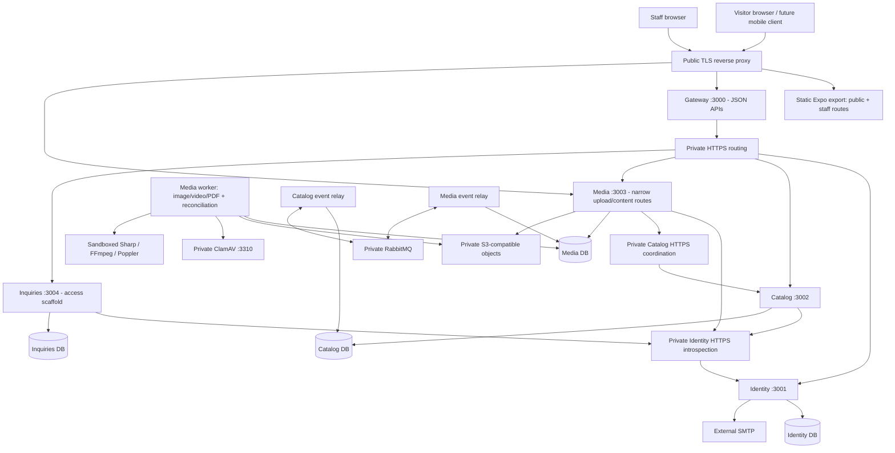

# Golden Lift — Production Deployment Readiness & Hosting Assessment

Assessment date: **2026-10-08 (Asia/Baghdad)**. Scope: the actual working tree in `C:\Projects\Golden_Lift`, including existing uncommitted work. Git HEAD: `7a29f79bcde3790ed927267d616337cdf09c988e`; HEAD alone does not identify this working-tree snapshot.

This is an assessment, not a deployment or implementation. Only this requested report was added. No packages were installed, migrations applied, databases changed, containers built, or infrastructure deployed. Secrets and local credential files were not copied into this report.

**Evidence labels:** Verified = inspected source/configuration or a check executed for this assessment; Historical = a dated repository report, not rerun here; Estimate = a planning assumption requiring measurement; Not verified = requires a deployment/provider/device test. “Ready” below means the relevant implementation exists, not that production operation has been certified. Source references use repository-relative paths and line numbers; numbers can drift after subsequent edits.

## A. Executive summary

**Golden Lift has substantial working application code, but is not ready for a production launch through the supplied deployment files.** The public catalog and administration interfaces exist in one Expo Router web application. Five NestJS/Express services exist: Gateway, Identity, Catalog, Media and Inquiries. Four services own separate PostgreSQL databases; Gateway owns none. Products, category administration, dynamic attributes, staff accounts/sessions and a real media pipeline are implemented. Inquiry business workflows and native Android/iOS applications are not implemented.

The web application exports a client-rendered SPA. It needs static hosting with route fallback, not a production Node frontend server. It is neither Next.js nor Vite. Search-oriented prerendering, locale-specific URLs and product social metadata are missing. Static hosting is technically compatible, but does not solve those SEO gaps. [E01–E04, E20–E22]

The smallest sensible launch architecture is **one Linux VPS, private S3-compatible object storage, and independent off-server backups**. Keep the service boundaries even when everything runs on one host. Start planning at **4 vCPU, 8 GiB RAM and 80–120 GiB SSD**, then validate under representative uploads and traffic. This is a conservative estimate, not a measured minimum. ClamAV and video/PDF processing make a tiny 1–2 GiB VPS a poor fit. A second application server and Kubernetes are not justified by current requirements.

Important launch blockers:

1. No production Compose configuration, reverse proxy/TLS configuration, restart/health policies, production secrets delivery or deploy/rollback pipeline exists.
2. Production code requires HTTPS for internal service URLs, private S3 for Media, SMTP for Identity, and isolated Linux media workers. A basic HTTP-only Compose network or filesystem-only VPS deployment will not satisfy startup gates.
3. Host-only staff cookies conflict with putting authenticated uploads on a separate Media subdomain. Route uploads through the same public API host; do not assume CORS shares cookies between hosts.
4. Current schema provisioning needs a reviewed production path for the latest Catalog classification schema; the generic setup tool and some historical documents retain older schema assumptions.
5. Real RabbitMQ, cloud storage/signatures, Linux sandbox/cgroups, production SMTP, recovery and load acceptance remain unverified.
6. Dependency advisory verification failed during this assessment; no clean vulnerability result is claimed.

These are deployment/design gaps and verified configuration incompatibilities. This review did not establish an exploitable production vulnerability. [E05–E19, E23–E27]

## B. Verified architecture

### 1. Repository structure, stack and applications

The repository is a private npm-workspaces monorepo: `apps/*`, `packages/*`, `services/*`. `apps/storefront` contains the public and staff web presentation. Shared packages include contracts, platform infrastructure, API clients, catalog UI, i18n, tokens, icons and UI. Services have service-local composition/presentation/infrastructure/application/domain folders (Gateway has no artificial business domain). `database/sql` holds reviewed schemas/migrations and grants; `database/scripts` holds local management/migration tools. `infrastructure/containers` has two Docker recipes. `scripts` holds custom build/dev/check tools; `tests` and service/package tests hold regression coverage. [E01, E04]

| Application/process | Framework | Runtime | Build command from repository root | Start command | Current status |
| --- | --- | --- | --- | --- | --- |
| Public catalog | Expo 57.0.26, Expo Router 57.0.24, React 19.2.3, React Native Web 0.21.2; Metro | Browser; Node only during build/dev | `npm run storefront:build` | Serve `apps/storefront/dist` with SPA fallback; `npm run storefront:preview` is local only | Implemented browsing/search/filter/product/category screens; contact content placeholder; SEO incomplete |
| Admin / Super Admin dashboard | Same application; Tamagui 2.7.7, TanStack Query 5.104.1, React Hook Form 7.89.0, Zod 3.25.76 | Browser | Same export | Same static files, `/admin` and `/super-admin` routes | Implemented staff auth/accounts/content/media/configuration; not a separate deployed app |
| Gateway | NestJS 12.1.2, Express adapter | Node 24 | `npm run build` | `npm run start --workspace @golden-lift/gateway` | Implemented allowlisted public/staff proxy and OpenAPI; no DB |
| Identity | NestJS 12.1.2; Prisma 7.10.0; pg 8.23.1; Nodemailer 10.0.14 | Node 24 | `npm run build` | `npm run start --workspace @golden-lift/identity` | Staff/session/action-token/account implementation; SMTP acceptance pending |
| Catalog | NestJS 12.1.2; Prisma 7.10.0; pg 8.23.1 | Node 24 | `npm run build` | `npm run start --workspace @golden-lift/catalog` | Public catalog, category tree/classification, dynamic attributes, product administration and media coordination |
| Media API | NestJS 12.1.2; Prisma 7.10.0; AWS SDK 3.1146.0 | Node 24 | `npm run build` | `npm run start --workspace @golden-lift/media` | Resumable uploads, private storage/library, authorized delivery and retention implemented |
| Inquiries | NestJS 12.1.2; Prisma 7.10.0 | Node 24 | `npm run build` | `npm run start --workspace @golden-lift/inquiries` | DB/readiness and staff-access endpoint; submission/management/notifications pending |
| Media processing | Sharp 0.35.5; external FFmpeg/FFprobe, Poppler and ClamAV | Linux Node/native tools in production | `npm run build`; separately construct worker image | `npm run worker --workspace @golden-lift/media` | One executable with image/video/PDF lanes and reconciliation; production isolation unverified |
| Media event relay | amqplib 2.2.0; signed contracts/outbox/inbox | Node 24 | `npm run build` | `npm run events --workspace @golden-lift/media` | Production RabbitMQ path implemented; local HTTP alternative is development-only |
| Catalog media relay | Same transport | Node 24 | `npm run build` | `npm run events:media --workspace @golden-lift/catalog` | Required for Media READY/security/retirement coordination |
| Android / iOS | No native app target/build pipeline | Not implemented | None | None | `app.json` declares only `web`; React Native dependencies do not prove native applications exist |

Evidence: [E01–E04, E11–E14, E20–E22]. Workspace service `build` commands compile that workspace only; use the root build to generate all four Prisma clients and build shared dependencies in order. Root `npm start` is a development orchestrator, not a production start command. Root `npm run build` does **not** export the frontend. [E01, E23]

Runtime pin: `>=24.21.0 <25`, with `.nvmrc` and the API image selecting 24.21.0. TypeScript is 6.0.3 with strict boundary/compiler rules. React Native is 0.86.3. npm and `package-lock.json` are used; no dedicated Turbo/Nx build orchestration is present. `.npmrc` enforces exact saving and engine compatibility; npm itself has no explicit package-manager version pin. The inspected host has Node 24.21.0 and npm 11.19.0. Native Node Argon2 is used, so arbitrary older Node versions are unsuitable. [E01, E02, E16, E23]

### 2. Service communication and minimum backend dependencies

Verified synchronous calls use HTTP `fetch`: Gateway → owning services; Catalog/Media/Inquiries → Identity for live staff checks; Media → Catalog for association/usage/delivery authorization. Production URL validators require HTTPS. Nest's listeners are ordinary HTTP; HTTPS must therefore terminate on a configured public/private proxy or TLS sidecar whose certificates Node trusts. There is no implemented internal TLS provisioning. [E05, E08, E15, E18]

Catalog and Media have signed event relays, PostgreSQL outbox/inbox state and RabbitMQ confirm/consumer logic. Durable direct exchange, quorum queues and a dead-letter exchange/queue are declared. The configured production transport needs RabbitMQ; neither Redis nor Kafka is needed. Production explicitly rejects the local HTTP relay. PostgreSQL is the authority for processing jobs; media workers poll/claim leases, renew them every 30 seconds and reconcile every 30 seconds. No WebSocket/SSE service, Redis cache, payment dependency or general cron scheduler was found in inspected service/package source. Identity mail dispatch is bounded in-process asynchronous work, **not a durable mail queue**. [E11–E14, E17]

Five API processes plus one worker and two relays is the default **eight Node processes**, before proxy, database, scanner and broker. Worker concurrency defaults to one lane for each of IMAGE, VIDEO and PDF in the same process; it is not automatically three separate containers. Additional worker processes are an operational choice and add connections/resources. [E12–E14]

APIs have no required local business files in the production S3/SMTP profile. Business services nevertheless depend on durable database state. RabbitMQ has durable queue state. Workers need disposable bounded scratch; local filesystem Media and local mailbox are development state. The Identity rate limiter and pending mail set are process-local state that disappears on restart. [E06, E10–E17]

This diagram combines implemented components with the **proposed, currently missing TLS routing layer**. Four logical DBs can share one PostgreSQL instance without merging ownership. All backend components can share one VPS subject to resource limits and accepted downtime; private object storage remains external under the current production gate.

| Port/dependency | Existing use | Production exposure |
| --- | --- | --- |
| 3000 / 3001 / 3002 / 3003 / 3004 | Gateway / Identity / Catalog / Media / Inquiries defaults | Private network only; proxy exposes Gateway and selected Media paths |
| 3102 / 3103 | Loopback development Catalog/Media event relays | Do not expose/use in production |
| 55432 | Local PostgreSQL tool | Not public; production may use standard 5432 internally |
| 3310 | ClamAV default TCP | Private, no public access |
| 5672 or 5671 | Conventional RabbitMQ AMQP or TLS AMQP endpoint chosen in broker URL | Private; broker version/ports must be specified by deployment |
| 8081 / 8082 | Expo development / exported local preview | Not production listeners |
| 443 / 80 | Proposed TLS/redirect/ACME edge | Public; optional restricted SSH 22 for operators |

Only the frontend, public API/staff login routes, authorized Media upload/content surfaces need Internet access. Introspection, Catalog internal coordination, business service listeners, PostgreSQL, scanner and broker management must be inaccessible publicly. [E05, E08, E11, E14, E18, E21]

### 3. Database assessment

**Verified:** PostgreSQL, four service-owned databases and Prisma 7.10.0 schemas/generated clients. `PrismaPg` reuses each process's `pg.Pool`; interactive transactions supply transaction-scoped repositories/outbox operations. Catalog uses bounded complete-transaction retries and SERIALIZABLE writes, while Identity retains its own isolation/locking rules. Advanced integrity is implemented in reviewed SQL, including deferred constraint triggers, privacy/retention guards and runtime grants. Prisma migration deployment/schema synchronization is not the authority here. [E06–E09]

PostgreSQL **18 is the repository's intended/tested target**: CI installs 18 and local tools default to its binaries. No cross-version acceptance establishes that 16/17 are safe substitutes; no exact production patch is pinned. Catalog requires `pg_trgm` (`database/sql/02_catalog.sql:6`). UUID generation uses PostgreSQL `gen_random_uuid`; no mandatory Redis, PostGIS or separate vector database was found.

Fresh production entrypoints must be reviewed from current source:

| Owning database | Current fresh SQL entry | Notes |
| --- | --- | --- |
| Identity | `database/sql/01_identity.sql` | Includes shared operations schema |
| Catalog | `database/sql/25_category_catalog_fresh.sql` | Composes latest admin/media/dynamic baseline, classification expansion/cutover; fresh empty databases only |
| Media | `database/sql/18_media_core_fresh.sql` | Baseline + Media core |
| Inquiries | `database/sql/04_inquiries.sql` | Schema does not imply an implemented inquiry application |

Apply owning grants afterward using `07_permissions_template.sql`; use privileged migration/provisioning identities separate from runtime. These are source-derived candidate entries, **not newly tested production commands**. The generic `db.mjs` service map uses Catalog `20_catalog_media_legacy_fresh.sql`; its marker/table assumptions retain v1.1 terminology. It does not install the latest category classification by itself. Do not blindly run the old generic “all” workflow as a production installer. Existing databases need the migration-specific reviewed mapping/backfill/validation/cutover sequence, not fresh SQL replay. `category-catalog.mjs`, `media-core.mjs` and `admin-core.mjs` supply explicit migration tools. [E07, E09]

Seeds: six root categories can be seeded for an empty catalog; they are business initialization, not proof of full content. Super Admin has a separate explicit bootstrap executable. Demo seeding is development-only and must not become production product/contact data. Category/type/group configuration and approved media must be provisioned before publishing products. Startup checks runtime ownership and schema existence but does not migrate. Readiness generally probes `SELECT 1`, so a green probe does not prove latest schema compatibility; some Catalog use cases explicitly check classification cutover. [E06, E07, E19]

Connection budget (configured ceiling, not simultaneous measured usage):

| Process group | Default pools × max 5 | Per-database ceiling |
| --- | --- | --- |
| Identity API | 1 × 5 | Identity 5 |
| Catalog API + relay | 2 × 5 | Catalog 10 |
| Media API + worker + relay | 3 × 5 | Media 15 |
| Inquiries API | 1 × 5 | Inquiries 5 |
| Gateway | 0 | 0 |
| **Total** | **7 pools** | **35 connections**, plus migrations, monitoring, backups and operator reserve |

`DATABASE_POOL_MAX` defaults to 5, may be set 1–50 per process, and replicates multiply ceilings. At 50 the same topology permits 350 connections. Do not scale replicas/pools independently of PostgreSQL capacity. There is no PgBouncer deployment. For V1, built-in pools are sufficient candidates; adding a pooler is optional and must preserve interactive transactions, session/transaction semantics and timeouts. [E05, E06, E12–E14]

Backup code creates four custom-format `pg_dump` files in `.local/backups`; no scheduler/offsite transfer is supplied. A local coordinated Media dump/restore and object-copy harness exists. Historical category migration evidence also records a restored-copy migration. Neither establishes a complete cloud disaster-recovery procedure. [E24, E27]

A same-VPS PostgreSQL instance is reasonable for V1 if private, persistent, monitored and backed up offsite. Risks: host failure takes all services down; workers can compete for CPU/disk/RAM; migrations retain complex triggers/grants; sequential per-DB dumps are not automatically one cross-service snapshot; soft deletion/outbox/attempt history grows; readiness may accept incomplete schemas. No current DB-size or production throughput measurement was taken.

### 4. Media and file storage

| Question | Verified answer |
| --- | --- |
| Current storage implementations | Private filesystem under `.local/media/private` by default; configurable S3 adapter. The local setup/validation profile uses filesystem, not a hosted bucket. No production account was inspected. |
| Container persistence | No volumes are declared. Filesystem bytes in a writable container layer would disappear on recreation; no such production arrangement is approved. S3 objects survive container replacement if the bucket/credentials/retention remain intact. |
| S3 support | AWS SDK S3 client with configurable endpoint, region, path-style option and default credential chain. Stores parts, sealed inputs and outputs with write-once keys/conditional PUTs. |
| Production storage | `NODE_ENV=production` requires `MEDIA_STORAGE=s3`, coordination credential and `MEDIA_S3_IMMUTABLE_POLICY_VERIFIED=true`; the flag is an operator attestation, not automatic provider verification. |
| Upload path | Numbered bounded parts through the Media API after live ADMIN/Origin/CSRF checks; no browser-to-bucket upload, provider-native multipart signing or direct CDN upload is advertised. |
| URL generation | Gateway/Media JSON authorization checks Catalog context and asset security/readiness. Returns either a configured Media-origin content URL or a short-lived signed S3 GET URL. Original URLs are not general public bucket links. |
| Delivery | `MEDIA_DELIVERY=stream` streams through Media, including HEAD/single ranges/ETag checks; `s3` delivers directly through signed storage URLs after authorization. Defaults to stream even with S3 storage unless changed. |
| Optimization | Sharp produces WebP thumbnail/card/detail/large at maximum edges 320/640/1280/2048, avoids enlargement, normalizes orientation/color, strips derivative metadata and reuses small-image outputs. No AVIF output or frontend responsive `srcset` found. |
| Video | FFmpeg/FFprobe inspect supported MP4/MOV H.264/HEVC with bounded streams/duration/frame rates; output progressive H.264/AAC MP4 with faststart plus JPEG poster. No HLS/DASH adaptive ladder. |
| PDF | Scanner + Poppler validation; encrypted/unsupported PDFs rejected, first-page PNG preview. Public raster preview is denied under current policy; original PDF downloads require explicit eligible technical-source context. Ordinary product PDF attachment does not automatically grant brochure download. |
| Retention | Soft-deleted assets, quarantine inputs, old generations and accepted originals remain retained. No normal hard-delete/purge/lifecycle policy is implemented. Scratch cleanup does not remove retained bytes. |
| Credentials | Server-side AWS credential chain, environment-configured credentials/tokens; no storage secrets in Expo variables. Actual production permissions/encryption/rotation are unverified. |

Evidence: [E10–E13, E18, E25]. The largest input limits (also the defaults) are **image 20 MiB/40 megapixels; video 250 MiB/600 seconds; PDF 30 MiB/200 pages**. Parts are at most 8 MiB, maximum 100 supported parts. Per-Admin active sessions default 3, global 100, upload expiry 60 minutes, pending jobs 1,000, reservation budget 10 GiB and retry attempts 5. Output ceilings are separate: 40 MiB images, 300 MiB video, 10 MiB PDF preview per processing policy. Configure ClamAV stream limits/timeouts and proxy body/time limits to match the largest accepted input and each 8 MiB part; stock scanner/proxy defaults cannot be assumed sufficient. [E10, E13]

**Cloudflare R2 compatibility — conditional candidate, not accepted production provider.** Source supports a custom S3 endpoint without an adapter rewrite: choose `MEDIA_STORAGE=s3`, bucket, the account endpoint, appropriate region (typically `auto` for R2), credential-chain access keys, and optionally path-style configuration. Null object versions are already represented in code. R2 documents support for the used PUT/GET/HEAD/range/conditional primitives, but not S3 bucket versioning/Object Lock APIs. Its separate bucket-lock feature documents protection against overwrite and deletion, including indefinite retention. These facts make a configuration-only integration plausible; they do not validate this exact streamed SDK request path. [S01, S02; E10, E11]

Use private buckets and restricted object credentials unable to change locks/bucket administration. Prove duplicate-key rejection, unconditional replacement/deletion denial, lock coverage for **parts/originals/outputs**, checksum/readback, retries after an interrupted PUT, signing/response-header behavior and range playback before setting the attestation flag. R2 token documentation does not establish AWS-equivalent per-header conditional-write policy enforcement; bucket locks may provide the required immutable outcome, but equivalence to the repository's documented policy needs explicit review. If equivalent controls cannot be demonstrated, choose an accepted S3 provider or implement/review an enforcement adapter. Do not relax the production gate just to use R2. [S01–S03; E25]

`media.goldenlift.com` can front authorized Media streaming through a TLS proxy. **It cannot simply become a public bucket** without bypassing Catalog authorization/privacy/revocation. R2 presigned URLs work on its S3 API hostname, not custom domains; signed URLs cannot be made custom-domain URLs by replacing the hostname. A private custom-domain delivery gateway/Worker would be additional implementation and acceptance work. Default no-store delivery also prevents claiming an implemented public media CDN. [S04, S05; E11, E18]

#### Storage estimates

Planning model, decimal GB: 6 images/product × (3 MB retained original + 1 MB total selected variants) = 24 MB; 20% of products have one video × (80 MB original + 60 MB playback/poster) = 28 MB/product averaged; 30% have one PDF × (5 MB original + 1 MB preview) = 1.8 MB/product. Total ≈ **54 MB/product** before upload staging/older generations/soft-deleted content. Round to **80 MB/product** for modest retained history and staging. These are assumptions, not repository product measurements.

| Products | Current originals + selected outputs | Initial budget including moderate retained history | Practical allocated planning range |
| --- | --- | --- | --- |
| 100 | 5.4 GB | 8 GB | 10–20 GB |
| 500 | 27 GB | 40 GB | 50–100 GB |
| 1,000 | 54 GB | 80 GB | 100–200 GB |

At one video per product, the same model rises to about 166 MB/product before history. At maximum file limits or frequent reprocessing it is much larger. Immutable originals/parts/history can grow indefinitely: this budget is **initial allocation**, not a storage cap or long-term bound. Quota reservations are not a disk-capacity forecast. Backup copies require additional storage. A simple monthly media-transfer model is visitors × pages × images/page × delivered image size, plus played videos; e.g. 300 visitors/day × 5 pages × 6 images × 0.15 MB × 30 days ≈ 40.5 GB/month plus video. No CDN hit ratio should be deducted until authorized caching is implemented and measured.

### 5. Public website, SEO and performance

The Expo configuration is `web.output="single"`: one exported SPA shell, data fetched in browser via TanStack Query. It requires neither SSR nor a Node frontend listener **as implemented**. Individual category/product routes exist as UUID paths, but source does not provide server-rendered product HTML, route-specific prerendering, locale paths, canonical/hreflang links, structured product data, sitemap or Open Graph/Twitter product tags. Browser titles are updated by effects after fetch; this is useful presentation, not proof of reliable crawler/social preview output. [E02, E20]

Arabic, English and Sorani (`ar/en/ckb`) translations and RTL/LTR handling exist. Locale is initialized to Arabic, persisted in browser localStorage, and changes `html.lang/dir`. API requests include locale and support translation fallback. Routes remain the same regardless of locale; there is no independently indexable `/en/...` or `/ckb/...` routing. Language operation exists; multilingual SEO is incomplete. [E20–E22]

Images use selected Media profiles, lazy/eager loading and async decode. Video preloads metadata. Query defaults use 30-second stale time and 5-minute garbage collection. Local font assets are bundled and startup waits for font loading. These improve experience but are not measured Core Web Vitals. Public API and media authorization responses use no-store; signed media URLs use private/no-store. No implemented edge catalog cache, responsive srcset, public derivative CDN, production cache rules or Lighthouse/load results were established. [E08, E11, E20–E22]

Frontend API defaults are `http://localhost:3000` and Media `http://localhost:3003`; these are overridable **build-time** `EXPO_PUBLIC_*` values. Production must explicitly export in `api` mode with HTTPS public origins. Changing a server environment variable after deployment does not change the compiled browser bundle. Demo mode is explicit, not an automatic error fallback. [E03, E21]

Cloudflare Pages can host the export: configure root build, `apps/storefront/dist`, Node/npm compatibility and SPA deep-link fallback. Pages documents automatic SPA fallback when there is no top-level `404.html`; inspect the actual export and configure fallback as needed. Vercel can also serve static output with rewrites. Neither host supplies the existing long-lived APIs, native workers, PostgreSQL or broker automatically. Same-VPS static serving is equally compatible. **Recommendation for minimum launch complexity:** serve the static export from the same VPS edge, optionally proxied through Cloudflare for static assets; move the public export to Pages if CDN deployment benefits justify another deployment surface. SEO remains separate frontend work whichever provider is used. [S06, S07; E02, E21]

### 6. Docker and deployment readiness

| Item | Classification | Evidence / practical implication |
| --- | --- | --- |
| API Docker recipe | Partially ready | Multi-stage Node build and non-root final image; not built/started in this assessment. Requires per-service args/env. [E23] |
| Media worker recipe | Partially ready | Explicit template, requires reviewed base/package versions, built Linux artifacts, cgroups and sandbox validation. [E23] |
| Worker root build context | Missing | Template copies `node_modules` and `dist`; root `.dockerignore` excludes both. Direct use with the repository-root context cannot supply those artifacts. Need a defined separate artifact context or reproducible multi-stage build. [E23] |
| Complete production Compose | Missing | No Compose file found; DB/broker/scanner/proxy/worker/relay/secrets/volumes not wired together |
| One-command production deployment | Missing | `npm start` is development; no production installer/orchestrator |
| Automatic restarts / boot startup | Missing | No Compose/systemd restart policy |
| HTTP live/ready endpoints | Partially ready | Implemented; DB probes do not cover worker progress, scanner, S3, broker or full schema readiness; Gateway requires all four upstreams. [E08, E19] |
| Container/supervisor health checks | Missing | Dockerfile contains no HEALTHCHECK; no deployment health policy |
| Graceful shutdown | Partially ready | Nest SIGINT/SIGTERM hooks; pool/client closure; worker abort and relay cleanup; Identity drains pending mail. Actual stop deadlines not tested. [E08, E12, E14, E17] |
| DB / broker volumes | Missing | No volume configuration; both require durable storage |
| Production Media persistence | Partially ready | S3 adapter exists; bucket policy/provider acceptance pending; scratch must be bounded/disposable |
| Container hardening | Partially ready | USER node / secret exclusions; no orchestrated read-only filesystem, capability drops, PID/CPU/RAM limits or validated user-namespace policy |
| Reverse proxy / HTTPS / certificate renewal | Missing | No Nginx/Caddy/TLS configuration found |
| CI checks | Partially ready | GitHub Actions defines npm checks and PostgreSQL 18 regressions; hosted runs not verified. No worker/provider/browser production acceptance. [E26] |
| CI automatic deployment | Missing | No publish/deploy registry/SSH/rollout/rollback workflow |
| Logs / monitoring | Partially ready / Missing | Structured stdout and DB idle errors exist; no shipped collection/rotation/dashboards/alerts configuration |
| Kubernetes / service mesh / Redis / Kafka | Not required | No demonstrated V1 requirement |

Do not label the repository “Docker-ready” as a whole. It has container building blocks and application lifecycle code, not an accepted production deployment system. Verify Linux native dependencies, workspace symlinks/pruning, Prisma generated artifacts, trusted CA material, and image startup for every executable before calling images ready.

### 7. Security and production configuration

| Control | Verified source behavior | Remaining production risk / acceptance |
| --- | --- | --- |
| HTTPS | Production validates HTTPS internal service, staff and Media origins; SMTP requires TLS | TLS listeners/proxy/certificates/trust/renewal absent. Use authenticated TLS internally; never set development mode as a workaround. [E05, E10, E15] |
| CORS / Origin | Exact approved origins; credentials allowed; disallowed supplied Origin gets 403; staff mutations require Origin and session-bound CSRF | Configure exact public/admin origins throughout Gateway and owning services. CORS is not authentication. Browser preflight/body/upload acceptance required. [E08, E15] |
| Session/token handling | Random 32-byte opaque tokens, SHA-256 digests, HMAC CSRF; not frontend JWT/localStorage bearer sessions | Production session flow must be tested across chosen hosts. Native clients need a reviewed Origin/cookie/CSRF strategy. [E15, E16] |
| Cookies | `__Host-gl_staff`, Secure in production, HttpOnly, SameSite=Strict, Path=/; no Domain attribute | API/Media hostname split breaks authenticated direct uploads. SameSite does not share a host-only cookie. [E15, E18, E22] |
| Password hashing | Native Argon2id, 19,456 KiB, two passes, p=1; bounded concurrency and dummy verification | Validate host capacity and Node runtime; no MFA implementation established. [E16] |
| Rate limiting | Bounded process-local auth limiter, account/action buckets plus `socket.remoteAddress` buckets | Behind Gateway/proxy, Identity sees intermediary address; per-IP budget aggregates callers. Resets on restart; not distributed or general API/upload DDoS protection. Implement trusted edge limiting and validate existing budgets. [E17] |
| Input validation | Controller allowlists/contract validation; frontend Zod; 64 KiB JSON bodies; bounded binary parts | Not a full fuzz/penetration test; configure separate route-level upload size/time/rate limits. [E08, E18] |
| Authorization | Live Identity session introspection + owning use-case role policies; ADMIN content and SUPER_ADMIN account policies are non-hierarchical | SUPER_ADMIN is not a universal content-admin override. Preserve exact roles; internal credential/network restrictions need production verification. [E15, E19] |
| Private endpoints | Gateway allowlist excludes arbitrary/internal routes and strips untrusted actor headers | Reverse proxy must not expose `/internal` or raw service root. [E08, E18] |
| Environment/secrets | Production env required; local secret fallbacks disabled; service-specific DB identities validated; examples contain placeholders | No production secret manager/access/rotation implementation. Env injection can be managed via protected secret files/system facilities; avoid secrets in images/logs/frontend. [E03, E05, E15, E23] |
| Upload security | Mandatory scanner, magic/extension validation, decoded/resource limits, private immutable keys, restricted public originals | Linux bwrap and cgroup isolation not accepted; configure scanner signatures/stream limits and update native codecs. Do not use privileged workers just to enable user namespaces. [E10–E13, E25] |
| Errors/log exposure | Safe HTTP filter, request IDs, status/timing JSON; no URLs/cookies/bodies in standard request log; SMTP debug disabled | Proxy access/error logs could reveal signed URL query strings. Sanitize these and action-link fragments; audit all future sinks. [E08, E17] |
| Security headers | HTTP nosniff/no-store; Media content has restrictive sandbox CSP | Frontend CSP, HSTS, framing/referrer/permissions policies not configured by deployment files. Validate CSP against actual Expo/styles/fonts before enforcement. [E08, E18] |
| PostgreSQL network/roles | Local tool listens loopback, SCRAM passwords, owning runtime credentials, no runtime DELETE/TRUNCATE/migration privilege | Production networking/SSL/volume/host firewall not provisioned; never publicly expose DB. [E06, E07, E09] |
| Containers | API/worker USER node; ignored secret directories | No deployed resource limits/capability/seccomp/read-only verification; template build incompatibility remains. [E23] |
| Audit records | Identity staff events and business outbox records exist alongside HTTP logs | No unified tamper-resistant operational audit export/retention/alerts. Outbox is not a complete security log. [E09, E19] |
| Dependencies | Exact dependency manifests and lockfile present | `npm audit --omit=dev --ignore-scripts --json` failed reaching advisory endpoint; advisories **Not verified**, not zero. No production SBOM/native package scan executed. |

**Verified incompatibilities:** separate-host direct upload cookie loss; root worker-context artifact exclusions; HTTP internal URLs/filesystem production storage/local relay rejected; generic setup not latest classification. **Possible risks requiring tests:** provider request compatibility, sandbox escape resistance/configuration, dependency CVEs, proxy rate-limit behavior, cloud restoration consistency and performance. This distinction should be preserved by downstream architects.

## C. Recommended minimum infrastructure

Use one supported Linux x86-64 VPS initially (ARM requires native/image acceptance before cost comparison), with Docker Compose or equivalent explicit supervision. Estimated starting allocation: 4 vCPU, 8 GiB RAM, 80–120 GiB SSD. Include:

- Public TLS/static reverse proxy; separate private HTTPS routes for service communication, with managed trusted certificates.
- Five API containers, one resource-limited Media worker, Catalog and Media relay containers.
- PostgreSQL 18 instance with four DBs, owning/runtime roles and persistent storage; reviewed SQL migration job run separately from APIs.
- One persistent RabbitMQ instance with compatible quorum/dead-letter semantics and restricted credentials. Single-node quorum queues are durable but not highly available.
- ClamAV daemon and signature updater, restricted network access and configured input stream/time limits.
- Private S3-compatible storage with accepted write-once/retention/access behavior; recommend signed delivery initially to avoid API video bandwidth and private preview cookie complications.
- Independent backup destination, scheduled encrypted DB/object/config backups, restoration runbook and drill.
- Firewall, external uptime alerting, host/container/job/broker/storage monitoring and log rotation.
- Production SMTP provider with verified sender domain and delivery tests.

This preserves bounded contexts without separate VPSs per microservice. Do not remove the Inquiries process casually: Gateway readiness currently aggregates all four upstreams, even though Inquiry workflows are pending. Altering that dependency would be a reviewed scope/code decision. [E19]

## D. Best hosting architecture and compatibility

**Recommended topology:** same-VPS static frontend and backend, optional Cloudflare proxy for static assets/DNS, private object storage and offsite backups. This minimizes deployment surfaces and permits same-host authenticated Media routing. Cloudflare Pages for the public frontend is a compatible optional improvement, not required infrastructure. Select Hetzner vs DigitalOcean only after fresh pricing, operator preference and latency tests from Erbil/Iraqi access networks. No provider is declared cheapest, fastest or currently provisioned.

| Option | Compatibility and required changes | Deployment / maintenance | Scaling / operational risks | Cost components |
| --- | --- | --- | --- | --- |
| Hetzner Cloud + Compose | Suitable Linux VM model; no provider-specific app rewrite. Must create the deployment/proxy/migration/backup configuration and satisfy production gates | Moderate initial work; operator owns OS, DB, broker/scanner, updates, recovery | Single host failure; shared CPU variability; storage/worker contention; native sandbox acceptance | VM, IPv4/volumes, backup/snapshots, transfer, objects/requests, SMTP, domains, operations |
| DigitalOcean VPS | Same architectural fit/required work; Droplet does not replace implemented broker/worker/DB ownership | Same operational responsibilities; managed DB is optional extra, not required for launch | Same one-host risks; optional managed services add costs and permissions/migration acceptance | Droplet, backups/volumes/IP/transfer as applicable, object store, optional managed DB, SMTP, domains |
| Cloudflare Pages + VPS | Export is compatible; public API stays VPS. Configure build/output/fallback/domains/public env; keep staff API/upload host coherent. No required frontend framework rewrite for current SPA | Additional frontend deployment/account/config surface; VPS maintenance unchanged | CDN accelerates static assets, not uncached authorized APIs/media automatically; separate-origin acceptance; SEO still incomplete | VPS/backend dependencies + Pages plan/limits if applicable + objects/backups/domain/SMTP |
| Vercel frontend + VPS | Static export with SPA rewrite and correct build-time env; no Next.js server required | Similar split deployment; verify commercial-use plan and build/transfer limits | Does not run native Media pipelines/DB/broker; no automatic SSR/SEO conversion | Applicable Vercel plan/build/transfer + full VPS/object/backup/SMTP/domain costs |
| One VPS for all compute and static frontend | Best minimal operations fit; configuration work required; no business service merge | One app deployment surface; maintain all stateful dependencies yourself | One failure domain; use worker quotas and independent recovery. **All storage on that VPS is incompatible with existing production Media gate** | VM + external private objects + independent backup + SMTP/domain; optional CDN/DNS |

Hetzner's official location list and DigitalOcean's region-selection guidance should guide candidate testing, not substitute for Iraqi ISP measurements. [S08, S09] Prices and commercial terms must be externally verified at purchase time; this report does not quote or invent monthly prices. Provider changes generally affect infrastructure/credentials, not domain/application code; immutable object policy and recovery behavior still require fresh acceptance.

## E. Expected resource requirements

Estimates assume release artifacts are built in CI rather than on the production VPS; one instance of each API/relay and one worker with three default lanes; PostgreSQL, RabbitMQ and ClamAV colocated; signed object delivery; low public request concurrency initially. Product count alone cannot predict CPU/RAM. Video frequency, input resolution, concurrent uploads and public media bytes dominate uncertainty.

| Scenario | vCPU | RAM | Local SSD allocation (includes DB allowance; excludes retained object store) | DB planning allowance | Object storage planning range | Likely bottlenecks / one VPS |
| --- | --- | --- | --- | --- | --- | --- |
| A: 100–500 products, low traffic/few staff | 4 preferred; 2 only after serial/bounded workload tests | 8 GiB preferred; 4 GiB only after measured reductions | 80–120 GiB | 5–10 GiB provisioned allowance, not predicted actual data | 10–100 GB initial | Native processing CPU, scanner RAM, upload bandwidth/scratch; one VPS reasonable |
| B: 500–2,000 products, hundreds/day | 4–8 | 8–16 GiB | 120–200 GiB | 10–25 GiB allowance | 50–400 GB | Concurrent processing, DB locks/pools, signed-delivery requests and transfer; one VPS usually plausible, measure |
| C: several thousand, more traffic/mobile | 8–16 as a starting capacity study | 16–32 GiB | 200–400 GiB | 25–100 GiB allowance | 0.4–2+ TB with history/video | Media/DB contention and bandwidth; one larger VPS may suffice, separate worker/DB only for measured contention or availability requirements |

DB allowances include room for indexes, audit/outbox/attempt history and growth; actual catalog rows could be far smaller. No warehouse/payment data is assumed. Disk allowances reserve OS/images/log rotation, DB/WAL, temporary dumps and approximately 10–20 GiB bounded worker scratch/headroom at launch; size scratch from accepted concurrent pipelines and raster output, not input size alone. Do not double-add the DB allowance to the local SSD column. Object backup capacity is additional to object storage in the table.

Illustrative launch RAM budget: APIs + relays roughly 1–2 GiB; worker/native peaks 0.5–2 GiB; ClamAV roughly 1–2 GiB; PostgreSQL roughly 1–1.5 GiB; RabbitMQ roughly 0.3–0.8 GiB; OS/proxy/monitoring roughly 0.5–1 GiB. Ranges overlap and can exceed 8 GiB when uncontrolled: enforce budgets, queue work, monitor RSS/OOM/swap and tune using real data. These are estimates, not benchmarks or official component minimums. Swap is an emergency buffer, not worker capacity.

Scale on evidence: sustained CPU/RAM pressure, API latency under concurrent native processing, pool waits/lock contention, queue age, disk fill and recovery targets. More products alone does not justify more servers. If compute must be separated, worker isolation is a natural first step; shared contracts/storage/DB ownership already permit it.

## F. Required changes before deployment, by priority

### P0 — Launch gates

1. Produce and accept reproducible Linux API/worker/relay images and a complete supervision/Compose definition; resolve worker build-context exclusions; verify generated Prisma/native artifacts. Include persistent DB/broker state, scratch quotas, resource limits, restart/backoff and deployment health checks.
2. Implement public and private HTTPS routing, certificate trust/renewal, firewall and private listener restrictions. Preserve HTTPS validation rather than weakening it.
3. Select/test private object storage and immutable controls; restrict credentials, establish retention/backup coverage and validate real signing/range/upload/retry behavior. Do not set the verification flag before acceptance.
4. Establish a current reviewed fresh/migration path and grants for PostgreSQL 18. Validate fresh/upgrade parity, latest classification, deferred constraints, runtime permissions and seed/bootstrap against a disposable production-like database.
5. Resolve authenticated Media host routing. A configuration solution is same public API host for JSON login and upload parts; proxy binary/content paths directly to Media without sending them through Gateway's JSON proxy. Use signed S3 delivery for private previews initially; test browsers on final domains.
6. Supply distinct production service/CSRF/event/DB/storage/SMTP credentials securely. Accept SMTP sender/TLS/invitation/reset flows and real broker/scanner/worker processing. Capture exact native/broker versions.
7. Implement encrypted offsite backup scheduling, object inventory/manifests and complete cross-service restoration procedure; execute an independent restore before launch.
8. Run advisory/image/native scans, full release checks, real PostgreSQL/HTTP regressions, production-mode startup/shutdown, dependency outage and representative media/load tests. No new production acceptance is established by this report.

### P1 — Launch quality and operations

1. Add frontend security headers, appropriate static cache policy, auth/abuse limits at trusted edge, log scrubbing/rotation, external uptime alerts and queue/job/DB/storage dashboards. Validate intermediary-IP rate-limit behavior.
2. Ship versioned artifacts, deployment automation/approval policy, backward-compatible schema rollout and rollback runbook. Track applied SQL/version/checksums accurately instead of relying on stale generic markers.
3. Replace contact/about demonstration/placeholder content with approved company content; verify all three languages, RTL and real brochure policy/technical-source access. Define inquiry scope honestly.
4. If search/social discovery is a launch requirement, implement prerender/SSR or another explicit crawler-output strategy with locale routes, canonical/hreflang, metadata/structured data/sitemap and invalidation. This is code work; moving a SPA to Vercel/Pages is insufficient.
5. Establish mail failure handling/resend procedures; scheduled reset mail is not durable across crashes. Add durable delivery only if reliable automatic retry is required by accepted business requirements.

### P2 — Growth scope

Implement native mobile applications and mobile auth contract acceptance, inquiry business workflows and any approved technical-sheet administration gaps separately. Consider responsive images/CDN delivery only with preserved context authorization and revocation limits; add HLS or multiple nodes only after measured need. Do not introduce payments, checkout or inventory infrastructure for this V1.

## G. Deployment plan — proposed, not executed

1. Confirm domain ownership, approved content/features, downtime/RPO/RTO and budget. Measure candidate VPS/object-store network paths from Iraqi connections.
2. Freeze a release commit **including today's intended working-tree changes**. Execute reproducible clean dependency installation/build/checks in isolated CI; export the SPA in API mode with final HTTPS URLs. Scan full build and runtime dependencies/native images.
3. Build and validate Linux images and orchestration in staging. Verify bwrap/user namespaces/cgroup ceilings without privileged-container bypasses, ClamAV signatures/stream limits and FFmpeg/Poppler formats.
4. Provision one VPS, private networks/volumes/firewall/SSH controls, object buckets/policies, SMTP and independent backup destination. This step is future deployment work requiring its own authorization, not performed here.
5. Provision four DBs and fixed owner/runtime roles. Apply current reviewed fresh SQL or reviewed upgrade path with stop/backup/validation gates, grants and schema fingerprints; never run runtime credentials as migrators. Bootstrap Super Admin without logging the password; initialize approved catalog configuration/content.
6. Configure private HTTPS service routes/trust and distinct secrets per process. Start PostgreSQL, broker and scanner, then APIs, relays and worker under supervision; verify dependency readiness and actual job/event progress rather than HTTP probes alone.
7. Configure the public edge: static SPA/fallback, Gateway JSON allowlist, exact binary/content Media routes, `/internal` denial, rate/body/time/header/log policies. Publish frontend export; configure same-host API/Media upload origins and signed object delivery.
8. Test final-domain Admin login/invite/reset/session/CSRF/revocation and role policies; real image/video/PDF uploads, processing, retained originals, previews/ranges and publication/block/retirement. Test three-language public browsing and approved PDF-download contexts, deep links and refresh navigation.
9. Run concurrent browse/upload/transcode, pool/lock/queue/OOM/disk tests and adverse dependency/restart scenarios. Record p95 latency/error rate/job age/peak memory and decide whether sizing is adequate.
10. Enable offsite backups/monitoring; restore all four databases plus object manifest into an isolated clean environment, verify hashes/grants/staff/content policies and measure recovery time. Rehearse failed-release rollback with schema compatibility.
11. Set DNS/TLS, run external acceptance, then switch traffic during an approved launch window. Retain previous static export/images/config and compatible migration backups; monitor closely after cutover.

## H. Estimated cost components to price externally

No numerical provider quote is supplied. Obtain current region/plan-specific monthly and annual estimates for:

| Component | Pricing inputs |
| --- | --- |
| VPS | vCPU/RAM/SSD plan, CPU sharing, IPv4, extra volumes, region, tax/currency, support |
| VPS backups/snapshots | Frequency/retention/volume coverage and restore/download charges; snapshots are not the sole DB backup |
| Object storage | GB-month including originals/parts/history/quarantine, request counts, retrieval, replication/lock/retention behavior |
| Bandwidth | VPS public video/streaming egress; VPS↔object downloads/readback/scanning; storage delivery egress; included transfer and overages |
| Independent backups | DB dump + object-copy growth/retention, encryption/key custody, inventory/read requests and restore transfer |
| Frontend/CDN | Optional Pages/Vercel commercial plan, build quotas/transfer/logging and any optional Worker/custom private delivery logic |
| DNS/domain | Domain registration/renewal/privacy, optional DNS/WAF/support; example domains are not confirmed owned |
| TLS | Usually automated certificate issuance; include management/renewal effort and any chosen paid/private CA service |
| SMTP | Sending allowance, domain authentication, provider monitoring/support |
| Monitoring/logging | External uptime, alert channels, retained log volume/metrics and any paid retention |
| Operations | Setup, patching/security review, migrations, restore drills, incident response and on-call coverage |
| Future mobile | Developer-store accounts, signing/build services and native development; not current hosting dependencies |

Monthly total = compute + recurring infrastructure/provider usage + operations. Annual total = 12 × recurring estimates + annual domain/store/support charges + one-time setup/migration work. State whether tax, exchange rates, overages and operator labor are included. Compare costs using both stream and signed-delivery profiles; authorization-driven no-store traffic can materially change transfer/request totals.

## I. Domains, networking, recovery and open questions

### Domain design

| Example name | Feasible use | DNS / routing considerations |
| --- | --- | --- |
| `goldenlift.com` | Static public SPA | A/AAAA to VPS, or provider-specific managed frontend records; TLS; deep-link fallback |
| `admin.goldenlift.com` | Same export's `/admin` and `/super-admin` presentation | A/AAAA/CNAME to chosen frontend; redirect root to `/admin` rather than silently rendering public home; staff link URL includes `/admin/` |
| `api.goldenlift.com` | Gateway JSON plus narrowly proxied Media upload/content paths | A/AAAA to edge; host-only staff cookie is issued here; exact allowed origins; never proxy internal paths publicly |
| `media.goldenlift.com` | Optional authorized public Media streaming alias | A/AAAA to Media edge; direct R2 custom domain is not compatible with private presigned delivery. Full separate authenticated media host needs reviewed auth/routing code changes |

Recommended launch build variables: `EXPO_PUBLIC_API_URL=https://api.goldenlift.com`, `EXPO_PUBLIC_MEDIA_ORIGIN=https://api.goldenlift.com`, `EXPO_PUBLIC_APP_DATA_MODE=api`; Media runtime `MEDIA_PUBLIC_ORIGIN=https://api.goldenlift.com`, `MEDIA_STORAGE=s3`, `MEDIA_DELIVERY=s3`; Identity staff URL `https://admin.goldenlift.com/admin/`. These are **proposed placeholder configuration values**, not instructions executed or confirmed domain registrations. Internal HTTPS service URLs must point to private routes, not public full-service exposure.

At the edge, route the exact `/api/v1/admin/media/uploads/<uuid>/parts/<number>` POST path directly to Media; Gateway does not implement binary forwarding. If stream delivery is selected, route approved `/.../variants/<profile>/content` GET/HEAD paths to Media too. Other JSON paths go through Gateway. Preserve Cookie, Origin, CSRF and request ID and apply tighter route policies. CORS credentials permit staff requests from the admin host, but cookies stay on the API host. The `__Host-` cookie cannot be changed to `.goldenlift.com` with a Domain attribute while retaining its valid prefix semantics. [E15, E18, E22]

Cloudflare DNS/proxy is compatible with public static/API HTTP surfaces, provided authenticated/API/Media authorization responses remain uncached and edge upload limits/timeouts are accepted. Cache versioned static assets with bounded retention; avoid forcing API/media cache hits that bypass fresh authorization. Use strict TLS to the origin and managed certificate renewal. Private service HTTPS need not be public Cloudflare records. Expose only 443, 80 as needed and operator-restricted SSH; keep every backend dependency private. For SMTP, add provider-specified SPF/DKIM/DMARC records; do not invent provider DNS values. Cloudflare-specific object delivery limits and plan costs need acceptance/pricing.

### Backup, reliability and maintenance recommendation

Current implementation: local four-DB custom dumps, disposable Media coordinated recovery script, historical restored-copy Catalog migration. There is no implemented production offsite schedule/PITR/whole-system restore runbook or automated rollback. Historical evidence must not be described as a new cloud recovery test. [E24, E27]

Inexpensive initial strategy (recommended targets to confirm): encrypted nightly full dumps of all four databases plus after major content/migration changes; copy to a separate off-server account/destination, keep 7 daily/4 weekly/3 monthly restore sets. A 24-hour DB RPO may be acceptable only if the business agrees; use more frequent dumps or continuous WAL archiving/PITR for tighter recovery needs. Object copies should be incremental at least daily and immediately protect critical accepted uploads where practical. Include original/part/output/quarantine/retained generations, object identity/hash inventory, schema/release fingerprints, role/grant reconstruction and encrypted configuration/key recovery. Provider durability/locking is not independent backup.

For cheap coherent backup sets, pause writers/workers/relays in a short scheduled maintenance window, drain in-flight jobs, take all DB dumps and inventory/copy required immutable objects, then resume. Sequential snapshots during active cross-service mutations can disagree; an always-online consistent scheme requires an explicitly tested replay/reconciliation/WAL design. Immutable media makes copying easier but does not prove DB/object correspondence. Broker topology/permissions must be reproducible; preserve broker state or test recovery/replay from outbox/inbox rather than assuming queues are disposable.

Test restoration in an isolated environment before launch and at least quarterly: rebuild roles/schema/config, restore all DBs, verify exact object identities/hashes and selected/retained generations, check public privacy/retirement, replay/reconcile safely, then verify auth and real browsing. Keep backups inaccessible to runtime app credentials, alert on failed/stale backups and sample restore regularly. Establish measured RTO; no numerical recovery guarantee is currently supportable.

Monitor external reachability/TLS expiry, per-service latency/errors, database pool/locks/WAL/disk, broker dead letters/queue age, outbox lag, processing lease age/failures, scanner availability/signature age, storage operations and host CPU/RAM/OOM. Logs should rotate locally with modest offsite retention, exclude secrets/signed query strings and retain request IDs. The operator owns OS/container/PostgreSQL/broker/scanner/native security updates, regression checks and maintenance windows. Rollback should use prior immutable app/static artifacts with compatible SQL; destructive schema rollback/data restoration is a separately rehearsed recovery operation. One VPS means maintenance and failure affect every compute service; independent backups and recoverability reduce impact but do not provide high availability.

### Open questions requiring business/operator input

1. What monthly/annual budget includes operator maintenance, and who owns patching/incidents?
2. What maximum downtime and acceptable data loss (RTO/RPO) are acceptable, including after content uploads?
3. Which example domains are owned, and must the admin/API/media remain separate hostnames externally?
4. How many images/videos/PDFs per product, typical lengths/sizes, upload frequency and expected daily/peak visitors?
5. Is multilingual search-engine indexing/social preview quality a launch requirement, and what company/contact/brochure content is approved?
6. Are inquiry submission workflows/native mobile apps required at initial launch, or explicitly later scope?
7. Are indefinite retained/deleted/quarantine objects acceptable legally/commercially, and are there location or provider restrictions for business data/backups?

All repository-answerable technical questions have been addressed above; provider account status, actual production endpoints, pricing, measured Iraqi latency and workload statistics remain unknown.

## J. Production readiness checklist and evidence

### Checklist

| Requirement | Status | Completion evidence needed |
| --- | --- | --- |
| Public/admin frontend implementation | Ready | Existing SPA source; final content acceptance separate |
| Fresh release frontend export on final env | Not Verified | Clean CI export/artifact inspect + deep-link/browser tests; historical builds only |
| Backend build tooling | Ready | Root generation/build sequence exists |
| Fresh release Linux backend/images | Not Verified | Clean build, native/workspace/Prisma runtime smoke for all entrypoints |
| Strict type / architecture / formatting | Ready | Executed and passed this assessment |
| Real DB/HTTP/security regression on release | Not Verified | Rerun disposable PostgreSQL 18 and HTTP/process tests |
| Current schema migrations / grants | Partially Ready | SQL/migration tools exist; accepted production installer/current fresh/upgrade parity required |
| Seeds and Super Admin bootstrap | Partially Ready | Tools exist; production approved content/bootstrap procedure pending |
| Production environment / secret delivery | Partially Ready | Validators/examples exist; final secure injection and rotation pending |
| API Docker recipe | Partially Ready | Template exists; Linux image build/start acceptance pending |
| Worker build / sandbox / quotas | Partially Ready | Source checks exist; artifact context and host isolation acceptance pending |
| Production Compose / restarts / volumes | Missing | Complete deployment definition + recreate/reboot checks |
| Internal/public HTTPS and renewals | Missing | TLS edge/private certificates/trust/renewal tests |
| DNS / example domain ownership | Not Verified | Registrar/control and final records |
| Authentication / role / CSRF implementation | Ready | Source present; final-domain browser/process acceptance pending |
| Split-host media authentication | Partially Ready | Same API-host path routing or reviewed code change; upload acceptance |
| Media processing implementation | Ready | Actual adapters/policies/worker source present; historical local native evidence |
| Private production object storage / R2 | Not Verified | Actual bucket controls/SDK/signing/range/retry/retention tests |
| RabbitMQ production transport | Partially Ready | Implemented; actual broker version/ACL/quorum/restart/replay acceptance |
| ClamAV production operations | Partially Ready | Adapter exists; daemon/signatures/limits/monitoring acceptance |
| SMTP production delivery | Not Verified | Final SMTP account/domain/TLS/invite/reset tests |
| Public/API abuse protection and proxy limits | Partially Ready | Auth limiter exists; edge controls/trusted IP behavior pending |
| Frontend security headers/cache policy | Missing | Final proxy/provider configuration and browser validation |
| Dependency / image / native advisories | Not Verified | Audit endpoint failed; full scan before release |
| Application logs | Partially Ready | JSON stdout exists; shipping/rotation/redaction/retention pending |
| Monitoring / actionable alerts | Missing | External uptime plus dependency/job/storage/host alerts |
| Backups | Partially Ready | Local dump tools; encrypted independent scheduling/inventory pending |
| Whole-system restore testing | Not Verified | Local/historical tests limited; full cloud restore and measured RTO pending |
| Deployment automation / rollback | Missing | Versioned deployment/registry/health-gated rollout/rollback procedures |
| Load / concurrency / resource sizing | Not Verified | Browse + upload + codec + dependency-failure measurements |
| Multilingual UI/API | Ready | ar/en/ckb and RTL/fallback source; final content/device acceptance pending |
| Multilingual SEO / route metadata | Missing | Locale URLs/prerendered output/canonical/hreflang/social metadata |
| Native mobile / native API compatibility | Not Verified | Native apps missing; Origin/cookie/CSRF and device/build acceptance absent |
| Inquiry business workflows | Missing | Access scaffold only; explicitly scope out or implement |
| Commerce/payment/inventory infrastructure | Not required | Outside described V1 scope |

### Checks executed for this assessment

| Check | Result | Limit |
| --- | --- | --- |
| Repository file inventory, source/config/SQL/workflow inspection, Git status/HEAD | Completed | Working tree already contained extensive unrelated changes; they were preserved |
| `node --version`, `npm --version` | 24.21.0 / 11.19.0 | Host toolchain, not proof of remote/provider availability |
| `npm run typecheck` | PASS | Backend + frontend no-emit compilation using existing installed/generated files |
| `node scripts/check-boundaries.mjs` | PASS: 223 source files | Architecture rules, not runtime deployment certification |
| `npm run format:check` | PASS | Existing configured source/config format scope |
| `npm audit --omit=dev --ignore-scripts --json` | FAILED: advisory endpoint request error | No vulnerability result; build/dev dependencies and native packages also need review |
| Production builds, containers, migrations, integration/load/browser/cloud recovery tests | Not executed | Assessment-only request; avoided artifact regeneration, database/provider mutations and deployment |

Historical examples inspected: `documentation/validation/functional-integration-2026-10-07T09-11-19-370Z.json` explicitly excludes S3/production SMTP/Linux/hosted acceptance; `documentation/validation/product-create-fix-2026-10-07T16-49-54-772Z.json:113` records owning backup/restored-copy migration; `documentation/validation/live-demo-2026-10-07.json:31` marks that demo restore untested. Older architecture milestone paragraphs describe now-completed Media/Admin work; current source and dated newer evidence take precedence. No historical test is reported as newly executed.

### Repository evidence index

| ID | Relevant source locations | Supports |
| --- | --- | --- |
| E01 | `package.json:6`, `package.json:9`, `package.json:15`, `package.json:43`, `package.json:64`; `.npmrc:1`; `tsconfig.base.json:6` | Runtime/workspaces/scripts/dependency pins/strict compiler |
| E02 | `apps/storefront/package.json:6`, `apps/storefront/package.json:9`, `apps/storefront/package.json:25`; `apps/storefront/app.json:6` | Expo/Metro SPA export, framework versions and web-only target |
| E03 | `apps/storefront/configuration.ts:1`; `apps/storefront/.env.example:1`; `.env.example:1`; `infrastructure/media.env.example:1` | Public build-time defaults vs backend runtime configuration templates |
| E04 | `apps/storefront/app/_layout.tsx:40`; `apps/storefront/features/admin/routes.tsx:1`; `services/inquiries/src/composition/main.ts:1`; service `package.json` files at line 6 | Unified staff/public routes; scaffold scope; API/worker/relay commands |
| E05 | `packages/platform/src/config.ts:20`, `:63`, `:80`, `:109`, `:133` | Ports, loopback/defaults, pool max and production HTTPS |
| E06 | `packages/platform/src/database.ts:4`; `services/catalog/src/infrastructure/prisma/client.ts:6`; `services/identity/src/infrastructure/prisma/client.ts:1`; `services/media/src/infrastructure/prisma/client.ts:1`; `services/inquiries/src/infrastructure/prisma/client.ts:1` | Pool ownership/checks and Prisma adapter reuse |
| E07 | `database/scripts/db.mjs:12`, `:77`, `:122`; `database/sql/25_category_catalog_fresh.sql:1`; `database/sql/22_catalog_admin_fresh.sql:1`; `database/sql/18_media_core_fresh.sql:1`; `database/sql/02_catalog.sql:6` | Generic vs latest fresh paths, schema/seed provisioning and pg_trgm |
| E08 | `packages/platform/src/http.ts:24`, `:72`, `:98`, `:114`, `:120`, `:157`, `:159` | Safe errors, probes, CORS, logging, headers, limits/shutdown |
| E09 | `services/catalog/src/infrastructure/prisma/unit-of-work.ts:49`; `services/identity/src/infrastructure/prisma/unit-of-work.ts:1`; `packages/platform/src/transactions.ts:1`; `database/sql/07_permissions_template.sql:15`; `database/sql/16_media_core.sql:61` | Transactions/retries, runtime grants, deferred constraints |
| E10 | `services/media/src/infrastructure/config.ts:24`, `:31`, `:39`, `:59`, `:69`, `:86`, `:91` | Media limits/storage/HTTPS/production gates/concurrency |
| E11 | `services/media/src/composition/dependencies.ts:15`; `services/media/src/infrastructure/storage/s3.ts:19`, `:39`, `:51`, `:89`, `:104` | S3 endpoint/credential chain, conditional writes/version/range/signing/no-store |
| E12 | `services/media/src/composition/worker.ts:18`, `:26`, `:43`, `:89`, `:112`; `services/media/src/infrastructure/processes/run.ts:21`, `:32`, `:74` | Linux isolation, lane/pool count, renewal/reconciliation and sandbox subprocess environment |
| E13 | `services/media/src/infrastructure/processes/image-entry.ts:12`, `:21`, `:40`; `services/media/src/infrastructure/processes/pipeline.ts:35`, `:109`, `:205`, `:298`, `:377`; `services/media/src/infrastructure/scanning/clamav.ts:71` | Formats/optimization/video/PDF/scanning/immutable generations |
| E14 | `services/media/src/composition/events.ts:13`; `services/catalog/src/composition/media-events.ts:14`; `packages/platform/src/outbox-relay.ts:44`, `:57`; `packages/platform/src/rabbitmq.ts:19` | Relay pools, signatures, broker transport, dev-only local HTTP and quorum/DLQ |
| E15 | `packages/platform/src/staff-auth.ts:24`, `:64`, `:90`, `:114`; `services/identity/src/presentation/http/context.ts:32`, `:51`; `services/identity/src/infrastructure/config.ts:46` | Live introspection, fixed cookie identity, Origin/CSRF, secrets and SMTP/HTTPS gates |
| E16 | `services/identity/src/infrastructure/security/crypto.ts:7`, `:37`, `:50`, `:62`; `services/identity/src/application/use-cases/authenticate-staff.ts:23` | Opaque/hash/HMAC/Argon2/session mechanics |
| E17 | `services/identity/src/presentation/http/auth-controller.ts:10`; `services/identity/src/presentation/http/rate-limiter.ts:3`; `services/identity/src/infrastructure/mail/delivery.ts:23`, `:52`, `:81`, `:102` | Socket-IP process-local limiting, SMTP TLS, fragment action links and nondurable mail |
| E18 | `services/gateway/src/infrastructure/http/staff-proxy.ts:9`, `:156`; `services/gateway/src/presentation/http/staff-controller.ts:53`; `services/media/src/presentation/http/media-controller.ts:85`, `:166`, `:317`, `:344`, `:371`; `services/media/src/application/use-cases/delivery.ts:21` | Allowlist/cookie forwarding, direct uploads, context/signing/streaming and PDF privacy |
| E19 | `services/gateway/src/composition/application.ts:23`; `services/catalog/src/composition/application.ts:98`; `services/media/src/infrastructure/prisma/readiness.ts:5`; `services/identity/src/domain/staff.ts:73`; `services/identity/src/composition/bootstrap.ts:14` | Aggregate/narrow readiness, role policies and explicit bootstrap |
| E20 | `apps/storefront/features/catalog/pages.tsx:41`, `:307`, `:632`, `:799`; `apps/storefront/features/catalog/queries.ts:1`; `apps/storefront/app/products/[id].tsx:1`; `apps/storefront/app/categories/[id].tsx:1` | Client titles/fetching/UUID routes/contact placeholder and SEO findings |
| E21 | `apps/storefront/providers/storefront.tsx:12`, `:31`; `packages/catalog-ui/src/index.tsx:113`, `:291`; `scripts/storefront-preview.mjs:5`; `documentation/operations/frontend-local.md:59` | API/demo composition/query caching/lazy images/video/static preview and SPA limitations |
| E22 | `packages/i18n/src/index.tsx:498`; `packages/api/src/staff.ts:209`, `:275`, `:311`; `apps/storefront/features/admin/media.tsx:162` | Locale persistence/RTL, credentialed API/part requests and private preview rendering |
| E23 | `.nvmrc:1`; `scripts/build.mjs:4`; `scripts/prisma.mjs:8`; `scripts/container-main.mjs:1`; `infrastructure/containers/Dockerfile:1`, `:19`; `infrastructure/containers/MediaWorker.Dockerfile:1`, `:14`; `.dockerignore:3` | Build generation/order, container template/runtime/security and worker context conflict |
| E24 | `database/scripts/db.mjs:130`; `scripts/b5-recovery.mjs:1`, `:96`; `documentation/operations/media.md:63` | Local backup and narrow recovery harness, production recovery limitations |
| E25 | `documentation/operations/media.md:15`, `:35`, `:44`, `:61`; `documentation/decisions/007-media-core.md:7`, `:19`, `:21` | Actual media policies, direct upload, immutable origin acceptance/retention tradeoffs |
| E26 | `.github/workflows/backend.yml:1`, `:26`; `package.json:21` | CI checks/PG18 definition, no deployment automation |
| E27 | `documentation/validation/functional-integration-2026-10-07T09-11-19-370Z.json:387`; `documentation/validation/product-create-fix-2026-10-07T16-49-54-772Z.json:113`; `documentation/validation/live-demo-2026-10-07.json:31` | Dated validation limits, restored-copy migration vs untested demo restore |

### External primary documentation checked on 2026-10-08

These establish provider capabilities, not Golden Lift account/deployment acceptance. Prices were not quoted.

| ID | Source | Used for |
| --- | --- | --- |
| S01 | [Cloudflare R2 S3 compatibility](https://developers.cloudflare.com/r2/api/s3/api/) | Used object operations/conditional writes; versioning/Object Lock API differences |
| S02 | [R2 bucket locks](https://developers.cloudflare.com/r2/buckets/bucket-locks/) | Indefinite overwrite/deletion retention candidate |
| S03 | [R2 authentication](https://developers.cloudflare.com/r2/api/tokens/) and [AWS conditional-write policy enforcement](https://docs.aws.amazon.com/AmazonS3/latest/userguide/conditional-writes-enforce.html) | Bucket-scoped credentials vs policy-enforced conditional writes |
| S04 | [R2 presigned URLs](https://developers.cloudflare.com/r2/api/s3/presigned-urls/) | S3 API hostname restriction; custom-domain incompatibility |
| S05 | [R2 public buckets](https://developers.cloudflare.com/r2/buckets/public-buckets/) | Public custom-domain delivery differs from private authorized architecture |
| S06 | [Cloudflare Pages serving/fallback](https://developers.cloudflare.com/pages/configuration/serving-pages/) | Static SPA hosting/fallback/cache behavior |
| S07 | [Vercel rewrites](https://vercel.com/docs/routing/rewrites) | Static route rewrite compatibility |
| S08 | [Hetzner Cloud locations](https://docs.hetzner.com/cloud/general/locations/) | Region choice requires actual Iraqi latency testing |
| S09 | [DigitalOcean Droplet creation/region selection](https://docs.digitalocean.com/products/droplets/how-to/create/) | VM/region deployment model; no prices inferred |
