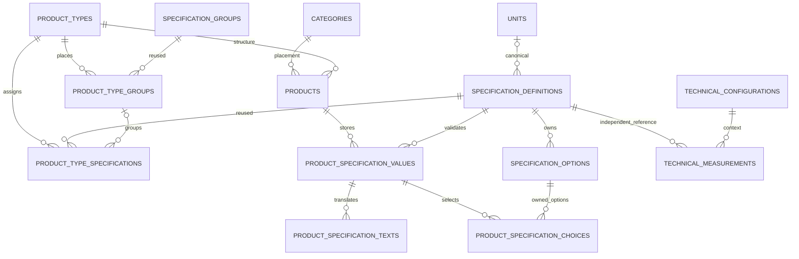

# Catalog v1.2 model dictionary

The reviewed final schema contains **66 physical tables, 646 columns, 73 local foreign keys, 188 indexes and 273 triggers** across four databases. These counts are exported from disposable final/fresh/upgraded schemas and verified against all four Prisma bindings. They do not describe the unchanged installed v1.1 Catalog. The manifest uses canonical service database keys even when verification uses disposable names.

Catalog has 50 physical tables (including the private write gate); Identity 5, Media 6, Inquiries 5. Gateway owns no database. See [manifest](../schema-manifest.json), [original v1.1 design](design-v1.1.md), [decision 006](../../documentation/decisions/006-dynamic-catalog-core.md) and [operator guide](../../documentation/operations/dynamic-catalog.md). Historical v1.1 remains 59 tables / 577 columns / 64 foreign keys.

## Core relationships

These diagrams describe retained relationships. Deferred validators enforce active lifecycle and type eligibility; foreign keys alone cannot enforce soft deletion. An active product has exactly one active leaf category and type; deleted historical products may have NULL type. Group ownership uses a composite same-type foreign key.

## Additions and changed authority

| Structure | Purpose |
| --- | --- |
| product_types / product_type_translations | Stable type codes, optimistic version, effective schema revision, deprecation and localized actual names/descriptions |
| specification_groups / specification_group_translations | Shared presentation groups without product values |
| product_type_groups | Independent per-type membership/order |
| product_type_specifications | Definition eligibility, same-type group placement, requiredness and restrictive public/search/filter/comparison flags |
| unit_translations | Reviewed canonical-unit labels in ar/en/ckb |
| products.product_type_id | Additive nullable FK; required for active products at final switch |
| specification_definitions | Global private-by-default disclosure, deprecation, TEXT multiline/length constraints |
| specification_options | Deprecation without destroying retained selections |
| specification_translations.help_text | Optional localized help, represented as description in API contracts |
| category_specifications | Retained migration evidence only after final switch; writes closed |

Active partial uniqueness protects translations and memberships. Reverse usage/order indexes support actual schema fan-out and reads. Stored NUMBER values stay numeric(20,6); bigint/version/quantity contracts are strings. No new duplicate value tables, JSON-value storage, inheritance, audit-history tables or commercial-variant model was introduced.

## Physical dictionary

The following columns/defaults and object names are generated from the reviewed manifest. SQL remains authoritative for CHECK/trigger bodies and grants. All business tables retain lifecycle protections; `catalog_write_gate` is ignored by Prisma and inaccessible to runtime roles. View objects are not counted as physical tables.

### golden_lift_identity

#### identity.staff_accounts

| Column | PostgreSQL type | Nullable | Default |
| --- | --- | --- | --- |
| id | uuid | no | gen_random_uuid() |
| email | text | no | — |
| email_key | text | yes | lower(btrim(email)) |
| display_name | text | no | — |
| role | text | no | — |
| status | text | no | 'INVITED'::text |
| password_hash | text | yes | — |
| auth_version | bigint | no | 1 |
| created_at | timestamp with time zone | no | clock_timestamp() |
| updated_at | timestamp with time zone | no | clock_timestamp() |
| deleted_at | timestamp with time zone | yes | — |
| version | bigint | no | 1 |

constraints: `CHECK ((auth_version > 0))`, `NOT NULL auth_version`, `CHECK (((status <> 'ACTIVE'::text) OR (password_hash IS NOT NULL)))`, `NOT NULL created_at`, `CHECK ((length(btrim(display_name)) > 0))`, `NOT NULL display_name`, `CHECK ((length(btrim(email)) > 0))`, `UNIQUE (email_key)`, `NOT NULL email`, `NOT NULL id`, `PRIMARY KEY (id)`, `CHECK ((role = ANY (ARRAY['ADMIN'::text, 'SUPER_ADMIN'::text])))`, `NOT NULL role`, `CHECK ((status = ANY (ARRAY['INVITED'::text, 'ACTIVE'::text, 'DISABLED'::text])))`, `NOT NULL status`, `NOT NULL updated_at`, `CHECK ((version > 0))`, `NOT NULL version`.

indexes: `CREATE UNIQUE INDEX staff_accounts_email_key_key ON identity.staff_accounts USING btree (email_key)`, `CREATE UNIQUE INDEX staff_accounts_pkey ON identity.staff_accounts USING btree (id)`, `CREATE INDEX staff_active_directory_idx ON identity.staff_accounts USING btree (role, created_at DESC, id) WHERE (deleted_at IS NULL)`.

triggers: `CREATE TRIGGER a_update_guard BEFORE UPDATE ON identity.staff_accounts FOR EACH ROW EXECUTE FUNCTION ops.guard_row_update()`, `CREATE TRIGGER account_auth_version BEFORE UPDATE ON identity.staff_accounts FOR EACH ROW EXECUTE FUNCTION identity.account_auth_change()`, `CREATE TRIGGER account_revoke_credentials AFTER UPDATE ON identity.staff_accounts FOR EACH ROW EXECUTE FUNCTION identity.revoke_account_credentials()`, `CREATE TRIGGER no_physical_delete BEFORE DELETE OR TRUNCATE ON identity.staff_accounts FOR EACH STATEMENT EXECUTE FUNCTION ops.reject_physical_delete()`.

#### identity.staff_sessions

| Column | PostgreSQL type | Nullable | Default |
| --- | --- | --- | --- |
| id | uuid | no | gen_random_uuid() |
| staff_id | uuid | no | — |
| token_hash | bytea | no | — |
| auth_version | bigint | no | — |
| expires_at | timestamp with time zone | no | — |
| revoked_at | timestamp with time zone | yes | — |
| created_at | timestamp with time zone | no | clock_timestamp() |
| updated_at | timestamp with time zone | no | clock_timestamp() |
| deleted_at | timestamp with time zone | yes | — |
| version | bigint | no | 1 |

constraints: `NOT NULL auth_version`, `CHECK ((expires_at > created_at))`, `NOT NULL created_at`, `NOT NULL expires_at`, `NOT NULL id`, `PRIMARY KEY (id)`, `FOREIGN KEY (staff_id) REFERENCES identity.staff_accounts(id) ON DELETE RESTRICT`, `NOT NULL staff_id`, `CHECK ((octet_length(token_hash) = 32))`, `UNIQUE (token_hash)`, `NOT NULL token_hash`, `NOT NULL updated_at`, `CHECK ((version > 0))`, `NOT NULL version`.

indexes: `CREATE INDEX sessions_account_active_idx ON identity.staff_sessions USING btree (staff_id, expires_at, id) WHERE ((deleted_at IS NULL) AND (revoked_at IS NULL))`, `CREATE INDEX sessions_expiry_idx ON identity.staff_sessions USING btree (expires_at, id) WHERE ((deleted_at IS NULL) AND (revoked_at IS NULL))`, `CREATE UNIQUE INDEX staff_sessions_pkey ON identity.staff_sessions USING btree (id)`, `CREATE UNIQUE INDEX staff_sessions_token_hash_key ON identity.staff_sessions USING btree (token_hash)`.

triggers: `CREATE TRIGGER a_update_guard BEFORE UPDATE ON identity.staff_sessions FOR EACH ROW EXECUTE FUNCTION ops.guard_row_update()`, `CREATE TRIGGER no_physical_delete BEFORE DELETE OR TRUNCATE ON identity.staff_sessions FOR EACH STATEMENT EXECUTE FUNCTION ops.reject_physical_delete()`.

#### identity.staff_tokens

| Column | PostgreSQL type | Nullable | Default |
| --- | --- | --- | --- |
| id | uuid | no | gen_random_uuid() |
| staff_id | uuid | no | — |
| purpose | text | no | — |
| token_hash | bytea | no | — |
| expires_at | timestamp with time zone | no | — |
| consumed_at | timestamp with time zone | yes | — |
| revoked_at | timestamp with time zone | yes | — |
| created_at | timestamp with time zone | no | clock_timestamp() |
| updated_at | timestamp with time zone | no | clock_timestamp() |
| deleted_at | timestamp with time zone | yes | — |
| version | bigint | no | 1 |

constraints: `CHECK ((expires_at > created_at))`, `NOT NULL created_at`, `NOT NULL expires_at`, `NOT NULL id`, `PRIMARY KEY (id)`, `CHECK ((purpose = ANY (ARRAY['INVITATION'::text, 'PASSWORD_RESET'::text])))`, `NOT NULL purpose`, `FOREIGN KEY (staff_id) REFERENCES identity.staff_accounts(id) ON DELETE RESTRICT`, `NOT NULL staff_id`, `CHECK ((octet_length(token_hash) = 32))`, `UNIQUE (token_hash)`, `NOT NULL token_hash`, `NOT NULL updated_at`, `CHECK ((version > 0))`, `NOT NULL version`.

indexes: `CREATE INDEX staff_tokens_open_idx ON identity.staff_tokens USING btree (staff_id, purpose, expires_at) WHERE ((deleted_at IS NULL) AND (consumed_at IS NULL) AND (revoked_at IS NULL))`, `CREATE UNIQUE INDEX staff_tokens_pkey ON identity.staff_tokens USING btree (id)`, `CREATE UNIQUE INDEX staff_tokens_token_hash_key ON identity.staff_tokens USING btree (token_hash)`.

triggers: `CREATE TRIGGER a_update_guard BEFORE UPDATE ON identity.staff_tokens FOR EACH ROW EXECUTE FUNCTION ops.guard_row_update()`, `CREATE TRIGGER no_physical_delete BEFORE DELETE OR TRUNCATE ON identity.staff_tokens FOR EACH STATEMENT EXECUTE FUNCTION ops.reject_physical_delete()`.

#### ops.inbox_messages

| Column | PostgreSQL type | Nullable | Default |
| --- | --- | --- | --- |
| consumer_name | text | no | — |
| message_id | uuid | no | — |
| processed_at | timestamp with time zone | no | clock_timestamp() |

constraints: `NOT NULL consumer_name`, `NOT NULL message_id`, `PRIMARY KEY (consumer_name, message_id)`, `NOT NULL processed_at`.

indexes: `CREATE UNIQUE INDEX inbox_messages_pkey ON ops.inbox_messages USING btree (consumer_name, message_id)`.

triggers: `CREATE TRIGGER inbox_no_delete BEFORE DELETE OR TRUNCATE ON ops.inbox_messages FOR EACH STATEMENT EXECUTE FUNCTION ops.reject_physical_delete()`.

#### ops.outbox_events

| Column | PostgreSQL type | Nullable | Default |
| --- | --- | --- | --- |
| id | uuid | no | gen_random_uuid() |
| aggregate_type | text | no | — |
| aggregate_id | uuid | yes | — |
| aggregate_version | bigint | yes | — |
| event_type | text | no | — |
| payload | jsonb | no | — |
| created_at | timestamp with time zone | no | clock_timestamp() |
| available_at | timestamp with time zone | no | clock_timestamp() |
| published_at | timestamp with time zone | yes | — |
| attempts | integer | no | 0 |
| locked_until | timestamp with time zone | yes | — |
| lease_token | uuid | yes | — |
| last_error | text | yes | — |
| deleted_at | timestamp with time zone | yes | — |

constraints: `NOT NULL aggregate_type`, `CHECK ((attempts >= 0))`, `NOT NULL attempts`, `NOT NULL available_at`, `NOT NULL created_at`, `NOT NULL event_type`, `NOT NULL id`, `CHECK ((jsonb_typeof(payload) = 'object'::text))`, `NOT NULL payload`, `PRIMARY KEY (id)`.

indexes: `CREATE UNIQUE INDEX outbox_events_pkey ON ops.outbox_events USING btree (id)`, `CREATE INDEX outbox_pending_idx ON ops.outbox_events USING btree (available_at, created_at, id) WHERE ((deleted_at IS NULL) AND (published_at IS NULL))`.

triggers: `CREATE TRIGGER outbox_no_delete BEFORE DELETE OR TRUNCATE ON ops.outbox_events FOR EACH STATEMENT EXECUTE FUNCTION ops.reject_physical_delete()`.

### golden_lift_catalog

#### catalog.categories

| Column | PostgreSQL type | Nullable | Default |
| --- | --- | --- | --- |
| id | uuid | no | gen_random_uuid() |
| parent_id | uuid | yes | — |
| cover_asset_id | uuid | yes | — |
| sort_order | bigint | no | 1024 |
| created_at | timestamp with time zone | no | clock_timestamp() |
| updated_at | timestamp with time zone | no | clock_timestamp() |
| deleted_at | timestamp with time zone | yes | — |
| version | bigint | no | 1 |

constraints: `CHECK (((parent_id IS NULL) OR (parent_id <> id)))`, `FOREIGN KEY (cover_asset_id) REFERENCES catalog.media_asset_refs(id) ON DELETE RESTRICT`, `NOT NULL created_at`, `NOT NULL id`, `FOREIGN KEY (parent_id) REFERENCES catalog.categories(id) ON DELETE RESTRICT`, `PRIMARY KEY (id)`, `NOT NULL sort_order`, `NOT NULL updated_at`, `CHECK ((version > 0))`, `NOT NULL version`, `TRIGGER DEFERRABLE INITIALLY DEFERRED`.

indexes: `CREATE INDEX categories_children_live_idx ON catalog.categories USING btree (parent_id, sort_order, id) WHERE (deleted_at IS NULL)`, `CREATE INDEX categories_cover_live_idx ON catalog.categories USING btree (cover_asset_id) WHERE ((deleted_at IS NULL) AND (cover_asset_id IS NOT NULL))`, `CREATE UNIQUE INDEX categories_pkey ON catalog.categories USING btree (id)`.

triggers: `CREATE TRIGGER a_update_guard BEFORE UPDATE ON catalog.categories FOR EACH ROW EXECUTE FUNCTION ops.guard_row_update()`, `CREATE TRIGGER no_physical_delete BEFORE DELETE OR TRUNCATE ON catalog.categories FOR EACH STATEMENT EXECUTE FUNCTION ops.reject_physical_delete()`, `CREATE TRIGGER technical_owner_deletion AFTER UPDATE ON catalog.categories FOR EACH ROW EXECUTE FUNCTION catalog.soft_delete_owner_technical_links()`, `CREATE CONSTRAINT TRIGGER z_catalog_integrity AFTER INSERT OR UPDATE ON catalog.categories DEFERRABLE INITIALLY DEFERRED FOR EACH ROW EXECUTE FUNCTION catalog.validate_deferred()`, `CREATE TRIGGER z_catalog_write_guard BEFORE INSERT OR UPDATE ON catalog.categories FOR EACH STATEMENT EXECUTE FUNCTION catalog.guard_write_statement()`.

#### catalog.category_specifications

| Column | PostgreSQL type | Nullable | Default |
| --- | --- | --- | --- |
| id | uuid | no | gen_random_uuid() |
| category_id | uuid | no | — |
| definition_id | uuid | no | — |
| sort_order | bigint | no | 1024 |
| created_at | timestamp with time zone | no | clock_timestamp() |
| updated_at | timestamp with time zone | no | clock_timestamp() |
| deleted_at | timestamp with time zone | yes | — |
| version | bigint | no | 1 |

constraints: `FOREIGN KEY (category_id) REFERENCES catalog.categories(id) ON DELETE RESTRICT`, `NOT NULL category_id`, `NOT NULL created_at`, `FOREIGN KEY (definition_id) REFERENCES catalog.specification_definitions(id) ON DELETE RESTRICT`, `NOT NULL definition_id`, `NOT NULL id`, `PRIMARY KEY (id)`, `NOT NULL sort_order`, `NOT NULL updated_at`, `CHECK ((version > 0))`, `NOT NULL version`, `TRIGGER DEFERRABLE INITIALLY DEFERRED`.

indexes: `CREATE INDEX category_specification_definition_idx ON catalog.category_specifications USING btree (definition_id, category_id) WHERE (deleted_at IS NULL)`, `CREATE UNIQUE INDEX category_specification_live_uq ON catalog.category_specifications USING btree (category_id, definition_id) WHERE (deleted_at IS NULL)`, `CREATE UNIQUE INDEX category_specifications_pkey ON catalog.category_specifications USING btree (id)`.

triggers: `CREATE TRIGGER a_update_guard BEFORE UPDATE ON catalog.category_specifications FOR EACH ROW EXECUTE FUNCTION ops.guard_row_update()`, `CREATE TRIGGER legacy_configuration_closed BEFORE INSERT OR UPDATE ON catalog.category_specifications FOR EACH ROW EXECUTE FUNCTION catalog.guard_legacy_configuration()`, `CREATE TRIGGER no_physical_delete BEFORE DELETE OR TRUNCATE ON catalog.category_specifications FOR EACH STATEMENT EXECUTE FUNCTION ops.reject_physical_delete()`, `CREATE CONSTRAINT TRIGGER z_catalog_integrity AFTER INSERT OR UPDATE ON catalog.category_specifications DEFERRABLE INITIALLY DEFERRED FOR EACH ROW EXECUTE FUNCTION catalog.validate_deferred()`, `CREATE TRIGGER z_catalog_write_guard BEFORE INSERT OR UPDATE ON catalog.category_specifications FOR EACH STATEMENT EXECUTE FUNCTION catalog.guard_write_statement()`.

#### catalog.category_technical_sheets

| Column | PostgreSQL type | Nullable | Default |
| --- | --- | --- | --- |
| id | uuid | no | gen_random_uuid() |
| category_id | uuid | no | — |
| sheet_id | uuid | no | — |
| sort_order | bigint | no | 1024 |
| created_at | timestamp with time zone | no | clock_timestamp() |
| updated_at | timestamp with time zone | no | clock_timestamp() |
| deleted_at | timestamp with time zone | yes | — |
| version | bigint | no | 1 |

constraints: `FOREIGN KEY (category_id) REFERENCES catalog.categories(id) ON DELETE RESTRICT`, `NOT NULL category_id`, `NOT NULL created_at`, `NOT NULL id`, `PRIMARY KEY (id)`, `FOREIGN KEY (sheet_id) REFERENCES catalog.technical_sheets(id) ON DELETE RESTRICT`, `NOT NULL sheet_id`, `NOT NULL sort_order`, `NOT NULL updated_at`, `CHECK ((version > 0))`, `NOT NULL version`, `TRIGGER DEFERRABLE INITIALLY DEFERRED`.

indexes: `CREATE UNIQUE INDEX category_technical_sheets_live_uq ON catalog.category_technical_sheets USING btree (category_id, sheet_id) WHERE (deleted_at IS NULL)`, `CREATE INDEX category_technical_sheets_order_idx ON catalog.category_technical_sheets USING btree (category_id, sort_order, id) WHERE (deleted_at IS NULL)`, `CREATE UNIQUE INDEX category_technical_sheets_pkey ON catalog.category_technical_sheets USING btree (id)`, `CREATE INDEX category_technical_sheets_reverse_idx ON catalog.category_technical_sheets USING btree (sheet_id, category_id) WHERE (deleted_at IS NULL)`.

triggers: `CREATE TRIGGER a_update_guard BEFORE UPDATE ON catalog.category_technical_sheets FOR EACH ROW EXECUTE FUNCTION ops.guard_row_update()`, `CREATE TRIGGER no_physical_delete BEFORE DELETE OR TRUNCATE ON catalog.category_technical_sheets FOR EACH STATEMENT EXECUTE FUNCTION ops.reject_physical_delete()`, `CREATE TRIGGER semantics_immutable BEFORE UPDATE ON catalog.category_technical_sheets FOR EACH ROW EXECUTE FUNCTION ops.immutable_fields('category_id', 'sheet_id')`, `CREATE CONSTRAINT TRIGGER z_catalog_integrity AFTER INSERT OR UPDATE ON catalog.category_technical_sheets DEFERRABLE INITIALLY DEFERRED FOR EACH ROW EXECUTE FUNCTION catalog.validate_deferred()`, `CREATE TRIGGER z_catalog_write_guard BEFORE INSERT OR UPDATE ON catalog.category_technical_sheets FOR EACH STATEMENT EXECUTE FUNCTION catalog.guard_write_statement()`.

#### catalog.category_translations

| Column | PostgreSQL type | Nullable | Default |
| --- | --- | --- | --- |
| id | uuid | no | gen_random_uuid() |
| category_id | uuid | no | — |
| locale | text | no | — |
| name | text | no | — |
| description | text | yes | — |
| slug | text | yes | — |
| search_text | text | yes | lower(((name \|\| ' '::text) \|\| COALESCE(description, ''::text))) |
| created_at | timestamp with time zone | no | clock_timestamp() |
| updated_at | timestamp with time zone | no | clock_timestamp() |
| deleted_at | timestamp with time zone | yes | — |
| version | bigint | no | 1 |

constraints: `FOREIGN KEY (category_id) REFERENCES catalog.categories(id) ON DELETE RESTRICT`, `NOT NULL category_id`, `NOT NULL created_at`, `NOT NULL id`, `CHECK ((locale = ANY (ARRAY['ar'::text, 'en'::text, 'ckb'::text])))`, `NOT NULL locale`, `CHECK ((length(btrim(name)) > 0))`, `NOT NULL name`, `PRIMARY KEY (id)`, `NOT NULL updated_at`, `CHECK ((version > 0))`, `NOT NULL version`, `TRIGGER DEFERRABLE INITIALLY DEFERRED`.

indexes: `CREATE UNIQUE INDEX category_translation_live_uq ON catalog.category_translations USING btree (category_id, locale) WHERE (deleted_at IS NULL)`, `CREATE INDEX category_translation_search_idx ON catalog.category_translations USING gin (search_text gin_trgm_ops) WHERE (deleted_at IS NULL)`, `CREATE UNIQUE INDEX category_translations_pkey ON catalog.category_translations USING btree (id)`.

triggers: `CREATE TRIGGER a_update_guard BEFORE UPDATE ON catalog.category_translations FOR EACH ROW EXECUTE FUNCTION ops.guard_row_update()`, `CREATE TRIGGER no_physical_delete BEFORE DELETE OR TRUNCATE ON catalog.category_translations FOR EACH STATEMENT EXECUTE FUNCTION ops.reject_physical_delete()`, `CREATE CONSTRAINT TRIGGER z_catalog_integrity AFTER INSERT OR UPDATE ON catalog.category_translations DEFERRABLE INITIALLY DEFERRED FOR EACH ROW EXECUTE FUNCTION catalog.validate_deferred()`, `CREATE TRIGGER z_catalog_write_guard BEFORE INSERT OR UPDATE ON catalog.category_translations FOR EACH STATEMENT EXECUTE FUNCTION catalog.guard_write_statement()`.

#### catalog.faq_items

| Column | PostgreSQL type | Nullable | Default |
| --- | --- | --- | --- |
| id | uuid | no | gen_random_uuid() |
| sort_order | bigint | no | 1024 |
| created_at | timestamp with time zone | no | clock_timestamp() |
| updated_at | timestamp with time zone | no | clock_timestamp() |
| deleted_at | timestamp with time zone | yes | — |
| version | bigint | no | 1 |

constraints: `NOT NULL created_at`, `NOT NULL id`, `PRIMARY KEY (id)`, `NOT NULL sort_order`, `NOT NULL updated_at`, `CHECK ((version > 0))`, `NOT NULL version`, `TRIGGER DEFERRABLE INITIALLY DEFERRED`.

indexes: `CREATE UNIQUE INDEX faq_items_pkey ON catalog.faq_items USING btree (id)`, `CREATE INDEX faq_order_live_idx ON catalog.faq_items USING btree (sort_order, id) WHERE (deleted_at IS NULL)`.

triggers: `CREATE TRIGGER a_update_guard BEFORE UPDATE ON catalog.faq_items FOR EACH ROW EXECUTE FUNCTION ops.guard_row_update()`, `CREATE TRIGGER no_physical_delete BEFORE DELETE OR TRUNCATE ON catalog.faq_items FOR EACH STATEMENT EXECUTE FUNCTION ops.reject_physical_delete()`, `CREATE CONSTRAINT TRIGGER z_catalog_integrity AFTER INSERT OR UPDATE ON catalog.faq_items DEFERRABLE INITIALLY DEFERRED FOR EACH ROW EXECUTE FUNCTION catalog.validate_deferred()`, `CREATE TRIGGER z_catalog_write_guard BEFORE INSERT OR UPDATE ON catalog.faq_items FOR EACH STATEMENT EXECUTE FUNCTION catalog.guard_write_statement()`.

#### catalog.faq_translations

| Column | PostgreSQL type | Nullable | Default |
| --- | --- | --- | --- |
| id | uuid | no | gen_random_uuid() |
| faq_id | uuid | no | — |
| locale | text | no | — |
| question | text | no | — |
| answer | text | no | — |
| created_at | timestamp with time zone | no | clock_timestamp() |
| updated_at | timestamp with time zone | no | clock_timestamp() |
| deleted_at | timestamp with time zone | yes | — |
| version | bigint | no | 1 |

constraints: `CHECK ((length(btrim(answer)) > 0))`, `NOT NULL answer`, `NOT NULL created_at`, `FOREIGN KEY (faq_id) REFERENCES catalog.faq_items(id) ON DELETE RESTRICT`, `NOT NULL faq_id`, `NOT NULL id`, `CHECK ((locale = ANY (ARRAY['ar'::text, 'en'::text, 'ckb'::text])))`, `NOT NULL locale`, `PRIMARY KEY (id)`, `CHECK ((length(btrim(question)) > 0))`, `NOT NULL question`, `NOT NULL updated_at`, `CHECK ((version > 0))`, `NOT NULL version`, `TRIGGER DEFERRABLE INITIALLY DEFERRED`.

indexes: `CREATE UNIQUE INDEX faq_translation_live_uq ON catalog.faq_translations USING btree (faq_id, locale) WHERE (deleted_at IS NULL)`, `CREATE UNIQUE INDEX faq_translations_pkey ON catalog.faq_translations USING btree (id)`.

triggers: `CREATE TRIGGER a_update_guard BEFORE UPDATE ON catalog.faq_translations FOR EACH ROW EXECUTE FUNCTION ops.guard_row_update()`, `CREATE TRIGGER no_physical_delete BEFORE DELETE OR TRUNCATE ON catalog.faq_translations FOR EACH STATEMENT EXECUTE FUNCTION ops.reject_physical_delete()`, `CREATE CONSTRAINT TRIGGER z_catalog_integrity AFTER INSERT OR UPDATE ON catalog.faq_translations DEFERRABLE INITIALLY DEFERRED FOR EACH ROW EXECUTE FUNCTION catalog.validate_deferred()`, `CREATE TRIGGER z_catalog_write_guard BEFORE INSERT OR UPDATE ON catalog.faq_translations FOR EACH STATEMENT EXECUTE FUNCTION catalog.guard_write_statement()`.

#### catalog.media_asset_refs

| Column | PostgreSQL type | Nullable | Default |
| --- | --- | --- | --- |
| id | uuid | no | — |
| media_kind | text | no | — |
| source_version | bigint | no | — |
| ready_at | timestamp with time zone | yes | — |
| retirement_event_id | uuid | yes | — |
| created_at | timestamp with time zone | no | clock_timestamp() |
| updated_at | timestamp with time zone | no | clock_timestamp() |
| deleted_at | timestamp with time zone | yes | — |
| version | bigint | no | 1 |

constraints: `CHECK (((deleted_at IS NULL) OR (retirement_event_id IS NOT NULL)))`, `CHECK (((deleted_at IS NOT NULL) OR (ready_at IS NOT NULL)))`, `NOT NULL created_at`, `NOT NULL id`, `CHECK ((media_kind = ANY (ARRAY['IMAGE'::text, 'VIDEO'::text, 'PDF'::text])))`, `NOT NULL media_kind`, `PRIMARY KEY (id)`, `UNIQUE (retirement_event_id)`, `CHECK ((source_version > 0))`, `NOT NULL source_version`, `NOT NULL updated_at`, `CHECK ((version > 0))`, `NOT NULL version`, `TRIGGER DEFERRABLE INITIALLY DEFERRED`.

indexes: `CREATE UNIQUE INDEX media_asset_refs_pkey ON catalog.media_asset_refs USING btree (id)`, `CREATE UNIQUE INDEX media_asset_refs_retirement_event_id_key ON catalog.media_asset_refs USING btree (retirement_event_id)`.

triggers: `CREATE TRIGGER a_update_guard BEFORE UPDATE ON catalog.media_asset_refs FOR EACH ROW EXECUTE FUNCTION ops.guard_row_update()`, `CREATE TRIGGER no_physical_delete BEFORE DELETE OR TRUNCATE ON catalog.media_asset_refs FOR EACH STATEMENT EXECUTE FUNCTION ops.reject_physical_delete()`, `CREATE TRIGGER registered_asset_kind_immutable BEFORE UPDATE ON catalog.media_asset_refs FOR EACH ROW EXECUTE FUNCTION ops.immutable_fields('media_kind')`, `CREATE CONSTRAINT TRIGGER z_catalog_integrity AFTER INSERT OR UPDATE ON catalog.media_asset_refs DEFERRABLE INITIALLY DEFERRED FOR EACH ROW EXECUTE FUNCTION catalog.validate_deferred()`, `CREATE TRIGGER z_catalog_write_guard BEFORE INSERT OR UPDATE ON catalog.media_asset_refs FOR EACH STATEMENT EXECUTE FUNCTION catalog.guard_write_statement()`.

#### catalog.page_translations

| Column | PostgreSQL type | Nullable | Default |
| --- | --- | --- | --- |
| id | uuid | no | gen_random_uuid() |
| page_id | uuid | no | — |
| locale | text | no | — |
| title | text | no | — |
| body | jsonb | no | '{}'::jsonb |
| created_at | timestamp with time zone | no | clock_timestamp() |
| updated_at | timestamp with time zone | no | clock_timestamp() |
| deleted_at | timestamp with time zone | yes | — |
| version | bigint | no | 1 |

constraints: `CHECK ((jsonb_typeof(body) = 'object'::text))`, `NOT NULL body`, `NOT NULL created_at`, `NOT NULL id`, `CHECK ((locale = ANY (ARRAY['ar'::text, 'en'::text, 'ckb'::text])))`, `NOT NULL locale`, `FOREIGN KEY (page_id) REFERENCES catalog.pages(id) ON DELETE RESTRICT`, `NOT NULL page_id`, `PRIMARY KEY (id)`, `CHECK ((length(btrim(title)) > 0))`, `NOT NULL title`, `NOT NULL updated_at`, `CHECK ((version > 0))`, `NOT NULL version`, `TRIGGER DEFERRABLE INITIALLY DEFERRED`.

indexes: `CREATE UNIQUE INDEX page_translation_live_uq ON catalog.page_translations USING btree (page_id, locale) WHERE (deleted_at IS NULL)`, `CREATE UNIQUE INDEX page_translations_pkey ON catalog.page_translations USING btree (id)`.

triggers: `CREATE TRIGGER a_update_guard BEFORE UPDATE ON catalog.page_translations FOR EACH ROW EXECUTE FUNCTION ops.guard_row_update()`, `CREATE TRIGGER no_physical_delete BEFORE DELETE OR TRUNCATE ON catalog.page_translations FOR EACH STATEMENT EXECUTE FUNCTION ops.reject_physical_delete()`, `CREATE CONSTRAINT TRIGGER z_catalog_integrity AFTER INSERT OR UPDATE ON catalog.page_translations DEFERRABLE INITIALLY DEFERRED FOR EACH ROW EXECUTE FUNCTION catalog.validate_deferred()`, `CREATE TRIGGER z_catalog_write_guard BEFORE INSERT OR UPDATE ON catalog.page_translations FOR EACH STATEMENT EXECUTE FUNCTION catalog.guard_write_statement()`.

#### catalog.pages

| Column | PostgreSQL type | Nullable | Default |
| --- | --- | --- | --- |
| id | uuid | no | gen_random_uuid() |
| page_key | text | no | — |
| cover_asset_id | uuid | yes | — |
| created_at | timestamp with time zone | no | clock_timestamp() |
| updated_at | timestamp with time zone | no | clock_timestamp() |
| deleted_at | timestamp with time zone | yes | — |
| version | bigint | no | 1 |

constraints: `FOREIGN KEY (cover_asset_id) REFERENCES catalog.media_asset_refs(id) ON DELETE RESTRICT`, `NOT NULL created_at`, `NOT NULL id`, `CHECK ((length(btrim(page_key)) > 0))`, `UNIQUE (page_key)`, `NOT NULL page_key`, `PRIMARY KEY (id)`, `NOT NULL updated_at`, `CHECK ((version > 0))`, `NOT NULL version`, `TRIGGER DEFERRABLE INITIALLY DEFERRED`.

indexes: `CREATE INDEX page_cover_live_idx ON catalog.pages USING btree (cover_asset_id) WHERE ((deleted_at IS NULL) AND (cover_asset_id IS NOT NULL))`, `CREATE UNIQUE INDEX pages_page_key_key ON catalog.pages USING btree (page_key)`, `CREATE UNIQUE INDEX pages_pkey ON catalog.pages USING btree (id)`.

triggers: `CREATE TRIGGER a_update_guard BEFORE UPDATE ON catalog.pages FOR EACH ROW EXECUTE FUNCTION ops.guard_row_update()`, `CREATE TRIGGER no_physical_delete BEFORE DELETE OR TRUNCATE ON catalog.pages FOR EACH STATEMENT EXECUTE FUNCTION ops.reject_physical_delete()`, `CREATE CONSTRAINT TRIGGER z_catalog_integrity AFTER INSERT OR UPDATE ON catalog.pages DEFERRABLE INITIALLY DEFERRED FOR EACH ROW EXECUTE FUNCTION catalog.validate_deferred()`, `CREATE TRIGGER z_catalog_write_guard BEFORE INSERT OR UPDATE ON catalog.pages FOR EACH STATEMENT EXECUTE FUNCTION catalog.guard_write_statement()`.

#### catalog.product_code_reservations

| Column | PostgreSQL type | Nullable | Default |
| --- | --- | --- | --- |
| id | uuid | no | gen_random_uuid() |
| product_id | uuid | no | — |
| code | text | no | — |
| code_key | text | yes | upper(btrim(code)) |
| created_at | timestamp with time zone | no | clock_timestamp() |
| updated_at | timestamp with time zone | no | clock_timestamp() |
| deleted_at | timestamp with time zone | yes | — |
| version | bigint | no | 1 |

constraints: `CHECK (((length(btrim(code)) >= 1) AND (length(btrim(code)) <= 128)))`, `UNIQUE (code_key)`, `NOT NULL code`, `NOT NULL created_at`, `NOT NULL id`, `PRIMARY KEY (id)`, `FOREIGN KEY (product_id) REFERENCES catalog.products(id) ON DELETE RESTRICT`, `UNIQUE (product_id, id)`, `NOT NULL product_id`, `NOT NULL updated_at`, `CHECK ((version > 0))`, `NOT NULL version`, `TRIGGER DEFERRABLE INITIALLY DEFERRED`.

indexes: `CREATE INDEX product_code_owner_idx ON catalog.product_code_reservations USING btree (product_id)`, `CREATE UNIQUE INDEX product_code_reservations_code_key_key ON catalog.product_code_reservations USING btree (code_key)`, `CREATE UNIQUE INDEX product_code_reservations_pkey ON catalog.product_code_reservations USING btree (id)`, `CREATE UNIQUE INDEX product_code_reservations_product_id_id_key ON catalog.product_code_reservations USING btree (product_id, id)`.

triggers: `CREATE TRIGGER a_update_guard BEFORE UPDATE ON catalog.product_code_reservations FOR EACH ROW EXECUTE FUNCTION ops.guard_row_update()`, `CREATE TRIGGER code_ownership_immutable BEFORE UPDATE ON catalog.product_code_reservations FOR EACH ROW EXECUTE FUNCTION ops.immutable_fields('product_id', 'code')`, `CREATE TRIGGER no_physical_delete BEFORE DELETE OR TRUNCATE ON catalog.product_code_reservations FOR EACH STATEMENT EXECUTE FUNCTION ops.reject_physical_delete()`, `CREATE CONSTRAINT TRIGGER z_catalog_integrity AFTER INSERT OR UPDATE ON catalog.product_code_reservations DEFERRABLE INITIALLY DEFERRED FOR EACH ROW EXECUTE FUNCTION catalog.validate_deferred()`, `CREATE TRIGGER z_catalog_write_guard BEFORE INSERT OR UPDATE ON catalog.product_code_reservations FOR EACH STATEMENT EXECUTE FUNCTION catalog.guard_write_statement()`.

#### catalog.product_media

| Column | PostgreSQL type | Nullable | Default |
| --- | --- | --- | --- |
| id | uuid | no | gen_random_uuid() |
| product_id | uuid | no | — |
| asset_id | uuid | no | — |
| content_locale | text | yes | — |
| sort_order | bigint | no | 1024 |
| created_at | timestamp with time zone | no | clock_timestamp() |
| updated_at | timestamp with time zone | no | clock_timestamp() |
| deleted_at | timestamp with time zone | yes | — |
| version | bigint | no | 1 |

constraints: `FOREIGN KEY (asset_id) REFERENCES catalog.media_asset_refs(id) ON DELETE RESTRICT`, `NOT NULL asset_id`, `CHECK ((content_locale = ANY (ARRAY['ar'::text, 'en'::text, 'ckb'::text])))`, `NOT NULL created_at`, `NOT NULL id`, `PRIMARY KEY (id)`, `FOREIGN KEY (product_id) REFERENCES catalog.products(id) ON DELETE RESTRICT`, `UNIQUE (product_id, id)`, `NOT NULL product_id`, `NOT NULL sort_order`, `NOT NULL updated_at`, `CHECK ((version > 0))`, `NOT NULL version`, `TRIGGER DEFERRABLE INITIALLY DEFERRED`.

indexes: `CREATE INDEX product_media_asset_live_idx ON catalog.product_media USING btree (asset_id, product_id) WHERE (deleted_at IS NULL)`, `CREATE UNIQUE INDEX product_media_live_uq ON catalog.product_media USING btree (product_id, asset_id) WHERE (deleted_at IS NULL)`, `CREATE INDEX product_media_order_live_idx ON catalog.product_media USING btree (product_id, sort_order, id) WHERE (deleted_at IS NULL)`, `CREATE UNIQUE INDEX product_media_pkey ON catalog.product_media USING btree (id)`, `CREATE UNIQUE INDEX product_media_product_id_id_key ON catalog.product_media USING btree (product_id, id)`.

triggers: `CREATE TRIGGER a_update_guard BEFORE UPDATE ON catalog.product_media FOR EACH ROW EXECUTE FUNCTION ops.guard_row_update()`, `CREATE TRIGGER no_physical_delete BEFORE DELETE OR TRUNCATE ON catalog.product_media FOR EACH STATEMENT EXECUTE FUNCTION ops.reject_physical_delete()`, `CREATE CONSTRAINT TRIGGER z_catalog_integrity AFTER INSERT OR UPDATE ON catalog.product_media DEFERRABLE INITIALLY DEFERRED FOR EACH ROW EXECUTE FUNCTION catalog.validate_deferred()`, `CREATE TRIGGER z_catalog_write_guard BEFORE INSERT OR UPDATE ON catalog.product_media FOR EACH STATEMENT EXECUTE FUNCTION catalog.guard_write_statement()`.

#### catalog.product_media_translations

| Column | PostgreSQL type | Nullable | Default |
| --- | --- | --- | --- |
| id | uuid | no | gen_random_uuid() |
| product_media_id | uuid | no | — |
| locale | text | no | — |
| title | text | yes | — |
| caption | text | yes | — |
| alt_text | text | yes | — |
| created_at | timestamp with time zone | no | clock_timestamp() |
| updated_at | timestamp with time zone | no | clock_timestamp() |
| deleted_at | timestamp with time zone | yes | — |
| version | bigint | no | 1 |

constraints: `NOT NULL created_at`, `NOT NULL id`, `CHECK ((locale = ANY (ARRAY['ar'::text, 'en'::text, 'ckb'::text])))`, `NOT NULL locale`, `PRIMARY KEY (id)`, `FOREIGN KEY (product_media_id) REFERENCES catalog.product_media(id) ON DELETE RESTRICT`, `NOT NULL product_media_id`, `NOT NULL updated_at`, `CHECK ((version > 0))`, `NOT NULL version`, `TRIGGER DEFERRABLE INITIALLY DEFERRED`.

indexes: `CREATE UNIQUE INDEX product_media_translation_live_uq ON catalog.product_media_translations USING btree (product_media_id, locale) WHERE (deleted_at IS NULL)`, `CREATE UNIQUE INDEX product_media_translations_pkey ON catalog.product_media_translations USING btree (id)`.

triggers: `CREATE TRIGGER a_update_guard BEFORE UPDATE ON catalog.product_media_translations FOR EACH ROW EXECUTE FUNCTION ops.guard_row_update()`, `CREATE TRIGGER no_physical_delete BEFORE DELETE OR TRUNCATE ON catalog.product_media_translations FOR EACH STATEMENT EXECUTE FUNCTION ops.reject_physical_delete()`, `CREATE CONSTRAINT TRIGGER z_catalog_integrity AFTER INSERT OR UPDATE ON catalog.product_media_translations DEFERRABLE INITIALLY DEFERRED FOR EACH ROW EXECUTE FUNCTION catalog.validate_deferred()`, `CREATE TRIGGER z_catalog_write_guard BEFORE INSERT OR UPDATE ON catalog.product_media_translations FOR EACH STATEMENT EXECUTE FUNCTION catalog.guard_write_statement()`.

#### catalog.product_specification_choices

| Column | PostgreSQL type | Nullable | Default |
| --- | --- | --- | --- |
| id | uuid | no | gen_random_uuid() |
| value_id | uuid | no | — |
| definition_id | uuid | no | — |
| option_id | uuid | no | — |
| created_at | timestamp with time zone | no | clock_timestamp() |
| updated_at | timestamp with time zone | no | clock_timestamp() |
| deleted_at | timestamp with time zone | yes | — |
| version | bigint | no | 1 |

constraints: `NOT NULL created_at`, `NOT NULL definition_id`, `NOT NULL id`, `FOREIGN KEY (option_id, definition_id) REFERENCES catalog.specification_options(id, definition_id) ON DELETE RESTRICT`, `NOT NULL option_id`, `PRIMARY KEY (id)`, `NOT NULL updated_at`, `FOREIGN KEY (value_id, definition_id) REFERENCES catalog.product_specification_values(id, definition_id) ON DELETE RESTRICT`, `NOT NULL value_id`, `CHECK ((version > 0))`, `NOT NULL version`, `TRIGGER DEFERRABLE INITIALLY DEFERRED`.

indexes: `CREATE UNIQUE INDEX product_specification_choices_pkey ON catalog.product_specification_choices USING btree (id)`, `CREATE INDEX specification_choice_filter_idx ON catalog.product_specification_choices USING btree (option_id, value_id) WHERE (deleted_at IS NULL)`, `CREATE UNIQUE INDEX specification_choice_live_uq ON catalog.product_specification_choices USING btree (value_id, option_id) WHERE (deleted_at IS NULL)`.

triggers: `CREATE TRIGGER a_update_guard BEFORE UPDATE ON catalog.product_specification_choices FOR EACH ROW EXECUTE FUNCTION ops.guard_row_update()`, `CREATE TRIGGER dynamic_new_use BEFORE INSERT OR UPDATE ON catalog.product_specification_choices FOR EACH ROW EXECUTE FUNCTION catalog.guard_dynamic_new_use()`, `CREATE TRIGGER no_physical_delete BEFORE DELETE OR TRUNCATE ON catalog.product_specification_choices FOR EACH STATEMENT EXECUTE FUNCTION ops.reject_physical_delete()`, `CREATE CONSTRAINT TRIGGER z_catalog_integrity AFTER INSERT OR UPDATE ON catalog.product_specification_choices DEFERRABLE INITIALLY DEFERRED FOR EACH ROW EXECUTE FUNCTION catalog.validate_deferred()`, `CREATE TRIGGER z_catalog_write_guard BEFORE INSERT OR UPDATE ON catalog.product_specification_choices FOR EACH STATEMENT EXECUTE FUNCTION catalog.guard_write_statement()`.

#### catalog.product_specification_texts

| Column | PostgreSQL type | Nullable | Default |
| --- | --- | --- | --- |
| id | uuid | no | gen_random_uuid() |
| value_id | uuid | no | — |
| locale | text | no | — |
| text_value | text | no | — |
| created_at | timestamp with time zone | no | clock_timestamp() |
| updated_at | timestamp with time zone | no | clock_timestamp() |
| deleted_at | timestamp with time zone | yes | — |
| version | bigint | no | 1 |

constraints: `NOT NULL created_at`, `NOT NULL id`, `CHECK ((locale = ANY (ARRAY['ar'::text, 'en'::text, 'ckb'::text])))`, `NOT NULL locale`, `PRIMARY KEY (id)`, `CHECK ((length(btrim(text_value)) > 0))`, `NOT NULL text_value`, `NOT NULL updated_at`, `FOREIGN KEY (value_id) REFERENCES catalog.product_specification_values(id) ON DELETE RESTRICT`, `NOT NULL value_id`, `CHECK ((version > 0))`, `NOT NULL version`, `TRIGGER DEFERRABLE INITIALLY DEFERRED`.

indexes: `CREATE UNIQUE INDEX product_specification_texts_pkey ON catalog.product_specification_texts USING btree (id)`, `CREATE UNIQUE INDEX specification_text_live_uq ON catalog.product_specification_texts USING btree (value_id, locale) WHERE (deleted_at IS NULL)`.

triggers: `CREATE TRIGGER a_update_guard BEFORE UPDATE ON catalog.product_specification_texts FOR EACH ROW EXECUTE FUNCTION ops.guard_row_update()`, `CREATE TRIGGER dynamic_new_use BEFORE INSERT OR UPDATE ON catalog.product_specification_texts FOR EACH ROW EXECUTE FUNCTION catalog.guard_dynamic_new_use()`, `CREATE TRIGGER no_physical_delete BEFORE DELETE OR TRUNCATE ON catalog.product_specification_texts FOR EACH STATEMENT EXECUTE FUNCTION ops.reject_physical_delete()`, `CREATE CONSTRAINT TRIGGER z_catalog_integrity AFTER INSERT OR UPDATE ON catalog.product_specification_texts DEFERRABLE INITIALLY DEFERRED FOR EACH ROW EXECUTE FUNCTION catalog.validate_deferred()`, `CREATE TRIGGER z_catalog_write_guard BEFORE INSERT OR UPDATE ON catalog.product_specification_texts FOR EACH STATEMENT EXECUTE FUNCTION catalog.guard_write_statement()`.

#### catalog.product_specification_values

| Column | PostgreSQL type | Nullable | Default |
| --- | --- | --- | --- |
| id | uuid | no | gen_random_uuid() |
| product_id | uuid | no | — |
| definition_id | uuid | no | — |
| value_type | text | no | — |
| number_value | numeric(20,6) | yes | — |
| boolean_value | boolean | yes | — |
| created_at | timestamp with time zone | no | clock_timestamp() |
| updated_at | timestamp with time zone | no | clock_timestamp() |
| deleted_at | timestamp with time zone | yes | — |
| version | bigint | no | 1 |

constraints: `CHECK ((((value_type = 'NUMBER'::text) AND (number_value IS NOT NULL) AND (number_value <> 'NaN'::numeric) AND (boolean_value IS NULL)) OR ((value_type = 'BOOLEAN'::text) AND (boolean_value IS NOT NULL) AND (number_value IS NULL)) OR ((value_type = ANY (ARRAY['TEXT'::text, 'CHOICE'::text])) AND (number_value IS NULL) AND (boolean_value IS NULL))))`, `NOT NULL created_at`, `NOT NULL definition_id`, `FOREIGN KEY (definition_id, value_type) REFERENCES catalog.specification_definitions(id, value_type) ON DELETE RESTRICT`, `UNIQUE (id, definition_id)`, `NOT NULL id`, `PRIMARY KEY (id)`, `FOREIGN KEY (product_id) REFERENCES catalog.products(id) ON DELETE RESTRICT`, `NOT NULL product_id`, `NOT NULL updated_at`, `CHECK ((value_type = ANY (ARRAY['NUMBER'::text, 'BOOLEAN'::text, 'TEXT'::text, 'CHOICE'::text])))`, `NOT NULL value_type`, `CHECK ((version > 0))`, `NOT NULL version`, `TRIGGER DEFERRABLE INITIALLY DEFERRED`.

indexes: `CREATE UNIQUE INDEX product_specification_live_uq ON catalog.product_specification_values USING btree (product_id, definition_id) WHERE (deleted_at IS NULL)`, `CREATE UNIQUE INDEX product_specification_values_id_definition_id_key ON catalog.product_specification_values USING btree (id, definition_id)`, `CREATE UNIQUE INDEX product_specification_values_pkey ON catalog.product_specification_values USING btree (id)`, `CREATE INDEX specification_boolean_filter_idx ON catalog.product_specification_values USING btree (definition_id, boolean_value, product_id) WHERE ((deleted_at IS NULL) AND (value_type = 'BOOLEAN'::text))`, `CREATE INDEX specification_number_filter_idx ON catalog.product_specification_values USING btree (definition_id, number_value, product_id) WHERE ((deleted_at IS NULL) AND (value_type = 'NUMBER'::text))`.

triggers: `CREATE TRIGGER a_update_guard BEFORE UPDATE ON catalog.product_specification_values FOR EACH ROW EXECUTE FUNCTION ops.guard_row_update()`, `CREATE TRIGGER dynamic_new_use BEFORE INSERT OR UPDATE ON catalog.product_specification_values FOR EACH ROW EXECUTE FUNCTION catalog.guard_dynamic_new_use()`, `CREATE TRIGGER no_physical_delete BEFORE DELETE OR TRUNCATE ON catalog.product_specification_values FOR EACH STATEMENT EXECUTE FUNCTION ops.reject_physical_delete()`, `CREATE CONSTRAINT TRIGGER z_catalog_integrity AFTER INSERT OR UPDATE ON catalog.product_specification_values DEFERRABLE INITIALLY DEFERRED FOR EACH ROW EXECUTE FUNCTION catalog.validate_deferred()`, `CREATE TRIGGER z_catalog_write_guard BEFORE INSERT OR UPDATE ON catalog.product_specification_values FOR EACH STATEMENT EXECUTE FUNCTION catalog.guard_write_statement()`.

#### catalog.product_technical_configurations

| Column | PostgreSQL type | Nullable | Default |
| --- | --- | --- | --- |
| id | uuid | no | gen_random_uuid() |
| sheet_id | uuid | no | — |
| product_sheet_id | uuid | no | — |
| configuration_id | uuid | no | — |
| created_at | timestamp with time zone | no | clock_timestamp() |
| updated_at | timestamp with time zone | no | clock_timestamp() |
| deleted_at | timestamp with time zone | yes | — |
| version | bigint | no | 1 |

constraints: `NOT NULL configuration_id`, `NOT NULL created_at`, `NOT NULL id`, `PRIMARY KEY (id)`, `NOT NULL product_sheet_id`, `FOREIGN KEY (sheet_id, configuration_id) REFERENCES catalog.technical_configurations(sheet_id, id) ON DELETE RESTRICT`, `FOREIGN KEY (sheet_id) REFERENCES catalog.technical_sheets(id) ON DELETE RESTRICT`, `NOT NULL sheet_id`, `FOREIGN KEY (sheet_id, product_sheet_id) REFERENCES catalog.product_technical_sheets(sheet_id, id) ON DELETE RESTRICT`, `NOT NULL updated_at`, `CHECK ((version > 0))`, `NOT NULL version`, `TRIGGER DEFERRABLE INITIALLY DEFERRED`.

indexes: `CREATE UNIQUE INDEX product_technical_configurations_live_uq ON catalog.product_technical_configurations USING btree (product_sheet_id, configuration_id) WHERE (deleted_at IS NULL)`, `CREATE UNIQUE INDEX product_technical_configurations_pkey ON catalog.product_technical_configurations USING btree (id)`, `CREATE INDEX product_technical_configurations_reverse_idx ON catalog.product_technical_configurations USING btree (configuration_id, product_sheet_id) WHERE (deleted_at IS NULL)`.

triggers: `CREATE TRIGGER a_update_guard BEFORE UPDATE ON catalog.product_technical_configurations FOR EACH ROW EXECUTE FUNCTION ops.guard_row_update()`, `CREATE TRIGGER no_physical_delete BEFORE DELETE OR TRUNCATE ON catalog.product_technical_configurations FOR EACH STATEMENT EXECUTE FUNCTION ops.reject_physical_delete()`, `CREATE TRIGGER semantics_immutable BEFORE UPDATE ON catalog.product_technical_configurations FOR EACH ROW EXECUTE FUNCTION ops.immutable_fields('sheet_id', 'product_sheet_id', 'configuration_id')`, `CREATE CONSTRAINT TRIGGER z_catalog_integrity AFTER INSERT OR UPDATE ON catalog.product_technical_configurations DEFERRABLE INITIALLY DEFERRED FOR EACH ROW EXECUTE FUNCTION catalog.validate_deferred()`, `CREATE TRIGGER z_catalog_write_guard BEFORE INSERT OR UPDATE ON catalog.product_technical_configurations FOR EACH STATEMENT EXECUTE FUNCTION catalog.guard_write_statement()`.

#### catalog.product_technical_sheets

| Column | PostgreSQL type | Nullable | Default |
| --- | --- | --- | --- |
| id | uuid | no | gen_random_uuid() |
| product_id | uuid | no | — |
| sheet_id | uuid | no | — |
| relation_kind | text | no | 'REFERENCE'::text |
| sort_order | bigint | no | 1024 |
| created_at | timestamp with time zone | no | clock_timestamp() |
| updated_at | timestamp with time zone | no | clock_timestamp() |
| deleted_at | timestamp with time zone | yes | — |
| version | bigint | no | 1 |

constraints: `NOT NULL created_at`, `NOT NULL id`, `PRIMARY KEY (id)`, `FOREIGN KEY (product_id) REFERENCES catalog.products(id) ON DELETE RESTRICT`, `NOT NULL product_id`, `CHECK ((relation_kind = ANY (ARRAY['REFERENCE'::text, 'PRODUCT_SPECIFICATION'::text])))`, `NOT NULL relation_kind`, `FOREIGN KEY (sheet_id) REFERENCES catalog.technical_sheets(id) ON DELETE RESTRICT`, `UNIQUE (sheet_id, id)`, `NOT NULL sheet_id`, `NOT NULL sort_order`, `NOT NULL updated_at`, `CHECK ((version > 0))`, `NOT NULL version`, `TRIGGER DEFERRABLE INITIALLY DEFERRED`.

indexes: `CREATE UNIQUE INDEX product_technical_sheets_live_uq ON catalog.product_technical_sheets USING btree (product_id, sheet_id) WHERE (deleted_at IS NULL)`, `CREATE INDEX product_technical_sheets_order_idx ON catalog.product_technical_sheets USING btree (product_id, sort_order, id) WHERE (deleted_at IS NULL)`, `CREATE UNIQUE INDEX product_technical_sheets_pkey ON catalog.product_technical_sheets USING btree (id)`, `CREATE INDEX product_technical_sheets_reverse_idx ON catalog.product_technical_sheets USING btree (sheet_id, product_id) WHERE (deleted_at IS NULL)`, `CREATE UNIQUE INDEX product_technical_sheets_sheet_id_id_key ON catalog.product_technical_sheets USING btree (sheet_id, id)`.

triggers: `CREATE TRIGGER a_update_guard BEFORE UPDATE ON catalog.product_technical_sheets FOR EACH ROW EXECUTE FUNCTION ops.guard_row_update()`, `CREATE TRIGGER no_physical_delete BEFORE DELETE OR TRUNCATE ON catalog.product_technical_sheets FOR EACH STATEMENT EXECUTE FUNCTION ops.reject_physical_delete()`, `CREATE TRIGGER semantics_immutable BEFORE UPDATE ON catalog.product_technical_sheets FOR EACH ROW EXECUTE FUNCTION ops.immutable_fields('product_id', 'sheet_id')`, `CREATE CONSTRAINT TRIGGER z_catalog_integrity AFTER INSERT OR UPDATE ON catalog.product_technical_sheets DEFERRABLE INITIALLY DEFERRED FOR EACH ROW EXECUTE FUNCTION catalog.validate_deferred()`, `CREATE TRIGGER z_catalog_write_guard BEFORE INSERT OR UPDATE ON catalog.product_technical_sheets FOR EACH STATEMENT EXECUTE FUNCTION catalog.guard_write_statement()`.

#### catalog.product_translations

| Column | PostgreSQL type | Nullable | Default |
| --- | --- | --- | --- |
| id | uuid | no | gen_random_uuid() |
| product_id | uuid | no | — |
| locale | text | no | — |
| name | text | no | — |
| short_description | text | yes | — |
| description | text | yes | — |
| slug | text | yes | — |
| search_text | text | yes | lower(((((name \|\| ' '::text) \|\| COALESCE(short_description, ''::text)) \|\| ' '::text) \|\| COALESCE(description, ''::text))) |
| created_at | timestamp with time zone | no | clock_timestamp() |
| updated_at | timestamp with time zone | no | clock_timestamp() |
| deleted_at | timestamp with time zone | yes | — |
| version | bigint | no | 1 |

constraints: `NOT NULL created_at`, `NOT NULL id`, `CHECK ((locale = ANY (ARRAY['ar'::text, 'en'::text, 'ckb'::text])))`, `NOT NULL locale`, `CHECK ((length(btrim(name)) > 0))`, `NOT NULL name`, `PRIMARY KEY (id)`, `FOREIGN KEY (product_id) REFERENCES catalog.products(id) ON DELETE RESTRICT`, `NOT NULL product_id`, `NOT NULL updated_at`, `CHECK ((version > 0))`, `NOT NULL version`, `TRIGGER DEFERRABLE INITIALLY DEFERRED`.

indexes: `CREATE UNIQUE INDEX product_translation_live_uq ON catalog.product_translations USING btree (product_id, locale) WHERE (deleted_at IS NULL)`, `CREATE INDEX product_translation_search_idx ON catalog.product_translations USING gin (search_text gin_trgm_ops) WHERE (deleted_at IS NULL)`, `CREATE UNIQUE INDEX product_translations_pkey ON catalog.product_translations USING btree (id)`.

triggers: `CREATE TRIGGER a_update_guard BEFORE UPDATE ON catalog.product_translations FOR EACH ROW EXECUTE FUNCTION ops.guard_row_update()`, `CREATE TRIGGER no_physical_delete BEFORE DELETE OR TRUNCATE ON catalog.product_translations FOR EACH STATEMENT EXECUTE FUNCTION ops.reject_physical_delete()`, `CREATE CONSTRAINT TRIGGER z_catalog_integrity AFTER INSERT OR UPDATE ON catalog.product_translations DEFERRABLE INITIALLY DEFERRED FOR EACH ROW EXECUTE FUNCTION catalog.validate_deferred()`, `CREATE TRIGGER z_catalog_write_guard BEFORE INSERT OR UPDATE ON catalog.product_translations FOR EACH STATEMENT EXECUTE FUNCTION catalog.guard_write_statement()`.

#### catalog.product_type_groups

| Column | PostgreSQL type | Nullable | Default |
| --- | --- | --- | --- |
| id | uuid | no | gen_random_uuid() |
| product_type_id | uuid | no | — |
| group_id | uuid | no | — |
| sort_order | bigint | no | 1024 |
| created_at | timestamp with time zone | no | clock_timestamp() |
| updated_at | timestamp with time zone | no | clock_timestamp() |
| deleted_at | timestamp with time zone | yes | — |
| version | bigint | no | 1 |

constraints: `NOT NULL created_at`, `FOREIGN KEY (group_id) REFERENCES catalog.specification_groups(id) ON DELETE RESTRICT`, `NOT NULL group_id`, `NOT NULL id`, `PRIMARY KEY (id)`, `FOREIGN KEY (product_type_id) REFERENCES catalog.product_types(id) ON DELETE RESTRICT`, `UNIQUE (product_type_id, id)`, `NOT NULL product_type_id`, `NOT NULL sort_order`, `NOT NULL updated_at`, `CHECK ((version > 0))`, `NOT NULL version`, `TRIGGER DEFERRABLE INITIALLY DEFERRED`.

indexes: `CREATE UNIQUE INDEX product_type_group_live_uq ON catalog.product_type_groups USING btree (product_type_id, group_id) WHERE (deleted_at IS NULL)`, `CREATE INDEX product_type_group_order_live_idx ON catalog.product_type_groups USING btree (product_type_id, sort_order, id) WHERE (deleted_at IS NULL)`, `CREATE INDEX product_type_group_usage_live_idx ON catalog.product_type_groups USING btree (group_id, product_type_id) WHERE (deleted_at IS NULL)`, `CREATE UNIQUE INDEX product_type_groups_pkey ON catalog.product_type_groups USING btree (id)`, `CREATE UNIQUE INDEX product_type_groups_product_type_id_id_key ON catalog.product_type_groups USING btree (product_type_id, id)`.

triggers: `CREATE TRIGGER a_update_guard BEFORE UPDATE ON catalog.product_type_groups FOR EACH ROW EXECUTE FUNCTION ops.guard_row_update()`, `CREATE TRIGGER dynamic_new_use BEFORE INSERT OR UPDATE ON catalog.product_type_groups FOR EACH ROW EXECUTE FUNCTION catalog.guard_dynamic_new_use()`, `CREATE TRIGGER no_physical_delete BEFORE DELETE OR TRUNCATE ON catalog.product_type_groups FOR EACH STATEMENT EXECUTE FUNCTION ops.reject_physical_delete()`, `CREATE TRIGGER schema_dependency AFTER INSERT OR UPDATE ON catalog.product_type_groups FOR EACH ROW EXECUTE FUNCTION catalog.bump_effective_schema()`, `CREATE TRIGGER type_group_identity_immutable BEFORE UPDATE ON catalog.product_type_groups FOR EACH ROW EXECUTE FUNCTION ops.immutable_fields('product_type_id', 'group_id')`, `CREATE CONSTRAINT TRIGGER z_catalog_integrity AFTER INSERT OR UPDATE ON catalog.product_type_groups DEFERRABLE INITIALLY DEFERRED FOR EACH ROW EXECUTE FUNCTION catalog.validate_deferred()`, `CREATE TRIGGER z_catalog_write_guard BEFORE INSERT OR UPDATE ON catalog.product_type_groups FOR EACH STATEMENT EXECUTE FUNCTION catalog.guard_write_statement()`.

#### catalog.product_type_specifications

| Column | PostgreSQL type | Nullable | Default |
| --- | --- | --- | --- |
| id | uuid | no | gen_random_uuid() |
| product_type_id | uuid | no | — |
| definition_id | uuid | no | — |
| type_group_id | uuid | yes | — |
| sort_order | bigint | no | 1024 |
| is_required | boolean | no | false |
| is_public | boolean | no | false |
| is_searchable | boolean | no | false |
| is_filterable | boolean | no | false |
| is_comparable | boolean | no | false |
| created_at | timestamp with time zone | no | clock_timestamp() |
| updated_at | timestamp with time zone | no | clock_timestamp() |
| deleted_at | timestamp with time zone | yes | — |
| version | bigint | no | 1 |

constraints: `CHECK ((is_public OR (NOT (is_searchable OR is_filterable OR is_comparable))))`, `NOT NULL created_at`, `FOREIGN KEY (definition_id) REFERENCES catalog.specification_definitions(id) ON DELETE RESTRICT`, `NOT NULL definition_id`, `NOT NULL id`, `NOT NULL is_comparable`, `NOT NULL is_filterable`, `NOT NULL is_public`, `NOT NULL is_required`, `NOT NULL is_searchable`, `PRIMARY KEY (id)`, `FOREIGN KEY (product_type_id) REFERENCES catalog.product_types(id) ON DELETE RESTRICT`, `NOT NULL product_type_id`, `FOREIGN KEY (product_type_id, type_group_id) REFERENCES catalog.product_type_groups(product_type_id, id) ON DELETE RESTRICT`, `NOT NULL sort_order`, `NOT NULL updated_at`, `CHECK ((version > 0))`, `NOT NULL version`, `TRIGGER DEFERRABLE INITIALLY DEFERRED`.

indexes: `CREATE UNIQUE INDEX product_type_specification_live_uq ON catalog.product_type_specifications USING btree (product_type_id, definition_id) WHERE (deleted_at IS NULL)`, `CREATE INDEX product_type_specification_order_live_idx ON catalog.product_type_specifications USING btree (product_type_id, type_group_id, sort_order, id) WHERE (deleted_at IS NULL)`, `CREATE INDEX product_type_specification_usage_live_idx ON catalog.product_type_specifications USING btree (definition_id, product_type_id) WHERE (deleted_at IS NULL)`, `CREATE UNIQUE INDEX product_type_specifications_pkey ON catalog.product_type_specifications USING btree (id)`.

triggers: `CREATE TRIGGER a_update_guard BEFORE UPDATE ON catalog.product_type_specifications FOR EACH ROW EXECUTE FUNCTION ops.guard_row_update()`, `CREATE TRIGGER dynamic_new_use BEFORE INSERT OR UPDATE ON catalog.product_type_specifications FOR EACH ROW EXECUTE FUNCTION catalog.guard_dynamic_new_use()`, `CREATE TRIGGER no_physical_delete BEFORE DELETE OR TRUNCATE ON catalog.product_type_specifications FOR EACH STATEMENT EXECUTE FUNCTION ops.reject_physical_delete()`, `CREATE TRIGGER schema_dependency AFTER INSERT OR UPDATE ON catalog.product_type_specifications FOR EACH ROW EXECUTE FUNCTION catalog.bump_effective_schema()`, `CREATE TRIGGER type_assignment_identity_immutable BEFORE UPDATE ON catalog.product_type_specifications FOR EACH ROW EXECUTE FUNCTION ops.immutable_fields('product_type_id', 'definition_id')`, `CREATE CONSTRAINT TRIGGER z_catalog_integrity AFTER INSERT OR UPDATE ON catalog.product_type_specifications DEFERRABLE INITIALLY DEFERRED FOR EACH ROW EXECUTE FUNCTION catalog.validate_deferred()`, `CREATE TRIGGER z_catalog_write_guard BEFORE INSERT OR UPDATE ON catalog.product_type_specifications FOR EACH STATEMENT EXECUTE FUNCTION catalog.guard_write_statement()`.

#### catalog.product_type_translations

| Column | PostgreSQL type | Nullable | Default |
| --- | --- | --- | --- |
| id | uuid | no | gen_random_uuid() |
| product_type_id | uuid | no | — |
| locale | text | no | — |
| name | text | no | — |
| description | text | yes | — |
| created_at | timestamp with time zone | no | clock_timestamp() |
| updated_at | timestamp with time zone | no | clock_timestamp() |
| deleted_at | timestamp with time zone | yes | — |
| version | bigint | no | 1 |

constraints: `NOT NULL created_at`, `NOT NULL id`, `CHECK ((locale = ANY (ARRAY['ar'::text, 'en'::text, 'ckb'::text])))`, `NOT NULL locale`, `CHECK (((length(btrim(name)) >= 1) AND (length(btrim(name)) <= 300)))`, `NOT NULL name`, `PRIMARY KEY (id)`, `FOREIGN KEY (product_type_id) REFERENCES catalog.product_types(id) ON DELETE RESTRICT`, `NOT NULL product_type_id`, `NOT NULL updated_at`, `CHECK ((version > 0))`, `NOT NULL version`, `TRIGGER DEFERRABLE INITIALLY DEFERRED`.

indexes: `CREATE UNIQUE INDEX product_type_translation_live_uq ON catalog.product_type_translations USING btree (product_type_id, locale) WHERE (deleted_at IS NULL)`, `CREATE UNIQUE INDEX product_type_translations_pkey ON catalog.product_type_translations USING btree (id)`.

triggers: `CREATE TRIGGER a_update_guard BEFORE UPDATE ON catalog.product_type_translations FOR EACH ROW EXECUTE FUNCTION ops.guard_row_update()`, `CREATE TRIGGER no_physical_delete BEFORE DELETE OR TRUNCATE ON catalog.product_type_translations FOR EACH STATEMENT EXECUTE FUNCTION ops.reject_physical_delete()`, `CREATE TRIGGER schema_dependency AFTER INSERT OR UPDATE ON catalog.product_type_translations FOR EACH ROW EXECUTE FUNCTION catalog.bump_effective_schema()`, `CREATE CONSTRAINT TRIGGER z_catalog_integrity AFTER INSERT OR UPDATE ON catalog.product_type_translations DEFERRABLE INITIALLY DEFERRED FOR EACH ROW EXECUTE FUNCTION catalog.validate_deferred()`, `CREATE TRIGGER z_catalog_write_guard BEFORE INSERT OR UPDATE ON catalog.product_type_translations FOR EACH STATEMENT EXECUTE FUNCTION catalog.guard_write_statement()`.

#### catalog.product_types

| Column | PostgreSQL type | Nullable | Default |
| --- | --- | --- | --- |
| id | uuid | no | gen_random_uuid() |
| code | text | no | — |
| schema_revision | bigint | no | 1 |
| deprecated_at | timestamp with time zone | yes | — |
| created_at | timestamp with time zone | no | clock_timestamp() |
| updated_at | timestamp with time zone | no | clock_timestamp() |
| deleted_at | timestamp with time zone | yes | — |
| version | bigint | no | 1 |

constraints: `CHECK (((length(btrim(code)) >= 1) AND (length(btrim(code)) <= 128)))`, `UNIQUE (code)`, `NOT NULL code`, `NOT NULL created_at`, `NOT NULL id`, `PRIMARY KEY (id)`, `CHECK ((schema_revision > 0))`, `NOT NULL schema_revision`, `NOT NULL updated_at`, `CHECK ((version > 0))`, `NOT NULL version`, `TRIGGER DEFERRABLE INITIALLY DEFERRED`.

indexes: `CREATE UNIQUE INDEX product_types_code_key ON catalog.product_types USING btree (code)`, `CREATE UNIQUE INDEX product_types_pkey ON catalog.product_types USING btree (id)`.

triggers: `CREATE TRIGGER a_update_guard BEFORE UPDATE ON catalog.product_types FOR EACH ROW EXECUTE FUNCTION ops.guard_row_update()`, `CREATE TRIGGER no_physical_delete BEFORE DELETE OR TRUNCATE ON catalog.product_types FOR EACH STATEMENT EXECUTE FUNCTION ops.reject_physical_delete()`, `CREATE TRIGGER product_type_code_immutable BEFORE UPDATE ON catalog.product_types FOR EACH ROW EXECUTE FUNCTION ops.immutable_fields('code')`, `CREATE TRIGGER schema_dependency AFTER INSERT OR UPDATE ON catalog.product_types FOR EACH ROW EXECUTE FUNCTION catalog.bump_effective_schema()`, `CREATE TRIGGER soft_delete_dynamic_owned AFTER UPDATE ON catalog.product_types FOR EACH ROW EXECUTE FUNCTION catalog.soft_delete_dynamic_owned_rows()`, `CREATE CONSTRAINT TRIGGER z_catalog_integrity AFTER INSERT OR UPDATE ON catalog.product_types DEFERRABLE INITIALLY DEFERRED FOR EACH ROW EXECUTE FUNCTION catalog.validate_deferred()`, `CREATE TRIGGER z_catalog_write_guard BEFORE INSERT OR UPDATE ON catalog.product_types FOR EACH STATEMENT EXECUTE FUNCTION catalog.guard_write_statement()`.

#### catalog.products

| Column | PostgreSQL type | Nullable | Default |
| --- | --- | --- | --- |
| id | uuid | no | gen_random_uuid() |
| category_id | uuid | no | — |
| cover_media_id | uuid | no | — |
| current_model_code_id | uuid | yes | — |
| sort_order | bigint | no | 1024 |
| is_featured | boolean | no | false |
| featured_order | bigint | no | 1024 |
| created_at | timestamp with time zone | no | clock_timestamp() |
| updated_at | timestamp with time zone | no | clock_timestamp() |
| deleted_at | timestamp with time zone | yes | — |
| version | bigint | no | 1 |
| product_type_id | uuid | yes | — |

constraints: `FOREIGN KEY (category_id) REFERENCES catalog.categories(id) ON DELETE RESTRICT`, `NOT NULL category_id`, `NOT NULL cover_media_id`, `NOT NULL created_at`, `NOT NULL featured_order`, `NOT NULL id`, `NOT NULL is_featured`, `FOREIGN KEY (id, current_model_code_id) REFERENCES catalog.product_code_reservations(product_id, id) DEFERRABLE INITIALLY DEFERRED`, `FOREIGN KEY (id, cover_media_id) REFERENCES catalog.product_media(product_id, id) DEFERRABLE INITIALLY DEFERRED`, `PRIMARY KEY (id)`, `FOREIGN KEY (product_type_id) REFERENCES catalog.product_types(id) ON DELETE RESTRICT`, `NOT NULL sort_order`, `NOT NULL updated_at`, `CHECK ((version > 0))`, `NOT NULL version`, `TRIGGER DEFERRABLE INITIALLY DEFERRED`.

indexes: `CREATE INDEX products_category_live_idx ON catalog.products USING btree (category_id, sort_order, id) WHERE (deleted_at IS NULL)`, `CREATE INDEX products_featured_live_idx ON catalog.products USING btree (featured_order, id) WHERE ((deleted_at IS NULL) AND is_featured)`, `CREATE UNIQUE INDEX products_pkey ON catalog.products USING btree (id)`, `CREATE INDEX products_type_live_idx ON catalog.products USING btree (product_type_id, id) WHERE (deleted_at IS NULL)`.

triggers: `CREATE TRIGGER a_update_guard BEFORE UPDATE ON catalog.products FOR EACH ROW EXECUTE FUNCTION ops.guard_row_update()`, `CREATE TRIGGER dynamic_new_use BEFORE INSERT OR UPDATE ON catalog.products FOR EACH ROW EXECUTE FUNCTION catalog.guard_dynamic_new_use()`, `CREATE TRIGGER no_physical_delete BEFORE DELETE OR TRUNCATE ON catalog.products FOR EACH STATEMENT EXECUTE FUNCTION ops.reject_physical_delete()`, `CREATE TRIGGER technical_owner_deletion AFTER UPDATE ON catalog.products FOR EACH ROW EXECUTE FUNCTION catalog.soft_delete_owner_technical_links()`, `CREATE CONSTRAINT TRIGGER z_catalog_integrity AFTER INSERT OR UPDATE ON catalog.products DEFERRABLE INITIALLY DEFERRED FOR EACH ROW EXECUTE FUNCTION catalog.validate_deferred()`, `CREATE TRIGGER z_catalog_write_guard BEFORE INSERT OR UPDATE ON catalog.products FOR EACH STATEMENT EXECUTE FUNCTION catalog.guard_write_statement()`.

#### catalog.site_setting_translations

| Column | PostgreSQL type | Nullable | Default |
| --- | --- | --- | --- |
| id | uuid | no | gen_random_uuid() |
| settings_id | smallint | no | — |
| locale | text | no | — |
| company_name | text | no | — |
| tagline | text | yes | — |
| address | text | yes | — |
| created_at | timestamp with time zone | no | clock_timestamp() |
| updated_at | timestamp with time zone | no | clock_timestamp() |
| deleted_at | timestamp with time zone | yes | — |
| version | bigint | no | 1 |

constraints: `CHECK ((length(btrim(company_name)) > 0))`, `NOT NULL company_name`, `NOT NULL created_at`, `NOT NULL id`, `CHECK ((locale = ANY (ARRAY['ar'::text, 'en'::text, 'ckb'::text])))`, `NOT NULL locale`, `PRIMARY KEY (id)`, `FOREIGN KEY (settings_id) REFERENCES catalog.site_settings(id) ON DELETE RESTRICT`, `NOT NULL settings_id`, `NOT NULL updated_at`, `CHECK ((version > 0))`, `NOT NULL version`, `TRIGGER DEFERRABLE INITIALLY DEFERRED`.

indexes: `CREATE UNIQUE INDEX site_setting_translations_pkey ON catalog.site_setting_translations USING btree (id)`, `CREATE UNIQUE INDEX site_translation_live_uq ON catalog.site_setting_translations USING btree (settings_id, locale) WHERE (deleted_at IS NULL)`.

triggers: `CREATE TRIGGER a_update_guard BEFORE UPDATE ON catalog.site_setting_translations FOR EACH ROW EXECUTE FUNCTION ops.guard_row_update()`, `CREATE TRIGGER no_physical_delete BEFORE DELETE OR TRUNCATE ON catalog.site_setting_translations FOR EACH STATEMENT EXECUTE FUNCTION ops.reject_physical_delete()`, `CREATE CONSTRAINT TRIGGER z_catalog_integrity AFTER INSERT OR UPDATE ON catalog.site_setting_translations DEFERRABLE INITIALLY DEFERRED FOR EACH ROW EXECUTE FUNCTION catalog.validate_deferred()`, `CREATE TRIGGER z_catalog_write_guard BEFORE INSERT OR UPDATE ON catalog.site_setting_translations FOR EACH STATEMENT EXECUTE FUNCTION catalog.guard_write_statement()`.

#### catalog.site_settings

| Column | PostgreSQL type | Nullable | Default |
| --- | --- | --- | --- |
| id | smallint | no | — |
| logo_asset_id | uuid | yes | — |
| public_email | text | yes | — |
| sales_notification_email | text | yes | — |
| phone | text | yes | — |
| whatsapp | text | yes | — |
| map_url | text | yes | — |
| created_at | timestamp with time zone | no | clock_timestamp() |
| updated_at | timestamp with time zone | no | clock_timestamp() |
| deleted_at | timestamp with time zone | yes | — |
| version | bigint | no | 1 |

constraints: `NOT NULL created_at`, `CHECK ((id = 1))`, `NOT NULL id`, `FOREIGN KEY (logo_asset_id) REFERENCES catalog.media_asset_refs(id) ON DELETE RESTRICT`, `PRIMARY KEY (id)`, `NOT NULL updated_at`, `CHECK ((version > 0))`, `NOT NULL version`, `TRIGGER DEFERRABLE INITIALLY DEFERRED`.

indexes: `CREATE UNIQUE INDEX site_settings_pkey ON catalog.site_settings USING btree (id)`.

triggers: `CREATE TRIGGER a_update_guard BEFORE UPDATE ON catalog.site_settings FOR EACH ROW EXECUTE FUNCTION ops.guard_row_update()`, `CREATE TRIGGER no_physical_delete BEFORE DELETE OR TRUNCATE ON catalog.site_settings FOR EACH STATEMENT EXECUTE FUNCTION ops.reject_physical_delete()`, `CREATE CONSTRAINT TRIGGER z_catalog_integrity AFTER INSERT OR UPDATE ON catalog.site_settings DEFERRABLE INITIALLY DEFERRED FOR EACH ROW EXECUTE FUNCTION catalog.validate_deferred()`, `CREATE TRIGGER z_catalog_write_guard BEFORE INSERT OR UPDATE ON catalog.site_settings FOR EACH STATEMENT EXECUTE FUNCTION catalog.guard_write_statement()`.

#### catalog.social_links

| Column | PostgreSQL type | Nullable | Default |
| --- | --- | --- | --- |
| id | uuid | no | gen_random_uuid() |
| platform | text | no | — |
| url | text | no | — |
| sort_order | bigint | no | 1024 |
| created_at | timestamp with time zone | no | clock_timestamp() |
| updated_at | timestamp with time zone | no | clock_timestamp() |
| deleted_at | timestamp with time zone | yes | — |
| version | bigint | no | 1 |

constraints: `NOT NULL created_at`, `NOT NULL id`, `PRIMARY KEY (id)`, `CHECK ((length(btrim(platform)) > 0))`, `NOT NULL platform`, `NOT NULL sort_order`, `NOT NULL updated_at`, `CHECK ((url ~ '^https://'::text))`, `NOT NULL url`, `CHECK ((version > 0))`, `NOT NULL version`, `TRIGGER DEFERRABLE INITIALLY DEFERRED`.

indexes: `CREATE INDEX social_links_order_live_idx ON catalog.social_links USING btree (sort_order, id) WHERE (deleted_at IS NULL)`, `CREATE UNIQUE INDEX social_links_pkey ON catalog.social_links USING btree (id)`.

triggers: `CREATE TRIGGER a_update_guard BEFORE UPDATE ON catalog.social_links FOR EACH ROW EXECUTE FUNCTION ops.guard_row_update()`, `CREATE TRIGGER no_physical_delete BEFORE DELETE OR TRUNCATE ON catalog.social_links FOR EACH STATEMENT EXECUTE FUNCTION ops.reject_physical_delete()`, `CREATE CONSTRAINT TRIGGER z_catalog_integrity AFTER INSERT OR UPDATE ON catalog.social_links DEFERRABLE INITIALLY DEFERRED FOR EACH ROW EXECUTE FUNCTION catalog.validate_deferred()`, `CREATE TRIGGER z_catalog_write_guard BEFORE INSERT OR UPDATE ON catalog.social_links FOR EACH STATEMENT EXECUTE FUNCTION catalog.guard_write_statement()`.

#### catalog.specification_definitions

| Column | PostgreSQL type | Nullable | Default |
| --- | --- | --- | --- |
| id | uuid | no | gen_random_uuid() |
| code | text | no | — |
| value_type | text | no | — |
| unit_code | text | yes | — |
| minimum_value | numeric(20,6) | yes | — |
| maximum_value | numeric(20,6) | yes | — |
| allow_multiple | boolean | no | false |
| is_filterable | boolean | no | false |
| created_at | timestamp with time zone | no | clock_timestamp() |
| updated_at | timestamp with time zone | no | clock_timestamp() |
| deleted_at | timestamp with time zone | yes | — |
| version | bigint | no | 1 |
| is_public | boolean | no | false |
| deprecated_at | timestamp with time zone | yes | — |
| text_multiline | boolean | no | false |
| text_max_length | integer | no | 4000 |

constraints: `CHECK ((((minimum_value IS NULL) OR ((minimum_value)::text <> ALL (ARRAY['NaN'::text, 'Infinity'::text, '-Infinity'::text]))) AND ((maximum_value IS NULL) OR ((maximum_value)::text <> ALL (ARRAY['NaN'::text, 'Infinity'::text, '-Infinity'::text])))))`, `NOT NULL allow_multiple`, `CHECK (((value_type = 'NUMBER'::text) OR ((unit_code IS NULL) AND (minimum_value IS NULL) AND (maximum_value IS NULL))))`, `CHECK (((value_type = 'CHOICE'::text) OR (allow_multiple = false)))`, `CHECK (((minimum_value IS NULL) OR (maximum_value IS NULL) OR (minimum_value <= maximum_value)))`, `CHECK ((length(btrim(code)) > 0))`, `UNIQUE (code)`, `NOT NULL code`, `NOT NULL created_at`, `NOT NULL id`, `UNIQUE (id, value_type)`, `NOT NULL is_filterable`, `NOT NULL is_public`, `PRIMARY KEY (id)`, `CHECK (((text_max_length >= 1) AND (text_max_length <= 10000)))`, `NOT NULL text_max_length`, `NOT NULL text_multiline`, `FOREIGN KEY (unit_code) REFERENCES catalog.units(code) ON DELETE RESTRICT`, `NOT NULL updated_at`, `CHECK ((value_type = ANY (ARRAY['NUMBER'::text, 'BOOLEAN'::text, 'TEXT'::text, 'CHOICE'::text])))`, `NOT NULL value_type`, `CHECK ((version > 0))`, `NOT NULL version`, `TRIGGER DEFERRABLE INITIALLY DEFERRED`.

indexes: `CREATE UNIQUE INDEX specification_definitions_code_key ON catalog.specification_definitions USING btree (code)`, `CREATE UNIQUE INDEX specification_definitions_id_value_type_key ON catalog.specification_definitions USING btree (id, value_type)`, `CREATE UNIQUE INDEX specification_definitions_pkey ON catalog.specification_definitions USING btree (id)`.

triggers: `CREATE TRIGGER a_update_guard BEFORE UPDATE ON catalog.specification_definitions FOR EACH ROW EXECUTE FUNCTION ops.guard_row_update()`, `CREATE TRIGGER definition_semantics BEFORE UPDATE ON catalog.specification_definitions FOR EACH ROW EXECUTE FUNCTION catalog.guard_definition_semantics()`, `CREATE TRIGGER no_physical_delete BEFORE DELETE OR TRUNCATE ON catalog.specification_definitions FOR EACH STATEMENT EXECUTE FUNCTION ops.reject_physical_delete()`, `CREATE TRIGGER schema_dependency AFTER INSERT OR UPDATE ON catalog.specification_definitions FOR EACH ROW EXECUTE FUNCTION catalog.bump_effective_schema()`, `CREATE TRIGGER soft_delete_dynamic_owned AFTER UPDATE ON catalog.specification_definitions FOR EACH ROW EXECUTE FUNCTION catalog.soft_delete_dynamic_owned_rows()`, `CREATE TRIGGER specification_code_immutable BEFORE UPDATE ON catalog.specification_definitions FOR EACH ROW EXECUTE FUNCTION ops.immutable_fields('code')`, `CREATE CONSTRAINT TRIGGER z_catalog_integrity AFTER INSERT OR UPDATE ON catalog.specification_definitions DEFERRABLE INITIALLY DEFERRED FOR EACH ROW EXECUTE FUNCTION catalog.validate_deferred()`, `CREATE TRIGGER z_catalog_write_guard BEFORE INSERT OR UPDATE ON catalog.specification_definitions FOR EACH STATEMENT EXECUTE FUNCTION catalog.guard_write_statement()`.

#### catalog.specification_group_translations

| Column | PostgreSQL type | Nullable | Default |
| --- | --- | --- | --- |
| id | uuid | no | gen_random_uuid() |
| group_id | uuid | no | — |
| locale | text | no | — |
| name | text | no | — |
| description | text | yes | — |
| created_at | timestamp with time zone | no | clock_timestamp() |
| updated_at | timestamp with time zone | no | clock_timestamp() |
| deleted_at | timestamp with time zone | yes | — |
| version | bigint | no | 1 |

constraints: `NOT NULL created_at`, `FOREIGN KEY (group_id) REFERENCES catalog.specification_groups(id) ON DELETE RESTRICT`, `NOT NULL group_id`, `NOT NULL id`, `CHECK ((locale = ANY (ARRAY['ar'::text, 'en'::text, 'ckb'::text])))`, `NOT NULL locale`, `CHECK (((length(btrim(name)) >= 1) AND (length(btrim(name)) <= 300)))`, `NOT NULL name`, `PRIMARY KEY (id)`, `NOT NULL updated_at`, `CHECK ((version > 0))`, `NOT NULL version`, `TRIGGER DEFERRABLE INITIALLY DEFERRED`.

indexes: `CREATE UNIQUE INDEX specification_group_translation_live_uq ON catalog.specification_group_translations USING btree (group_id, locale) WHERE (deleted_at IS NULL)`, `CREATE UNIQUE INDEX specification_group_translations_pkey ON catalog.specification_group_translations USING btree (id)`.

triggers: `CREATE TRIGGER a_update_guard BEFORE UPDATE ON catalog.specification_group_translations FOR EACH ROW EXECUTE FUNCTION ops.guard_row_update()`, `CREATE TRIGGER no_physical_delete BEFORE DELETE OR TRUNCATE ON catalog.specification_group_translations FOR EACH STATEMENT EXECUTE FUNCTION ops.reject_physical_delete()`, `CREATE TRIGGER schema_dependency AFTER INSERT OR UPDATE ON catalog.specification_group_translations FOR EACH ROW EXECUTE FUNCTION catalog.bump_effective_schema()`, `CREATE CONSTRAINT TRIGGER z_catalog_integrity AFTER INSERT OR UPDATE ON catalog.specification_group_translations DEFERRABLE INITIALLY DEFERRED FOR EACH ROW EXECUTE FUNCTION catalog.validate_deferred()`, `CREATE TRIGGER z_catalog_write_guard BEFORE INSERT OR UPDATE ON catalog.specification_group_translations FOR EACH STATEMENT EXECUTE FUNCTION catalog.guard_write_statement()`.

#### catalog.specification_groups

| Column | PostgreSQL type | Nullable | Default |
| --- | --- | --- | --- |
| id | uuid | no | gen_random_uuid() |
| code | text | no | — |
| created_at | timestamp with time zone | no | clock_timestamp() |
| updated_at | timestamp with time zone | no | clock_timestamp() |
| deleted_at | timestamp with time zone | yes | — |
| version | bigint | no | 1 |

constraints: `CHECK (((length(btrim(code)) >= 1) AND (length(btrim(code)) <= 128)))`, `UNIQUE (code)`, `NOT NULL code`, `NOT NULL created_at`, `NOT NULL id`, `PRIMARY KEY (id)`, `NOT NULL updated_at`, `CHECK ((version > 0))`, `NOT NULL version`, `TRIGGER DEFERRABLE INITIALLY DEFERRED`.

indexes: `CREATE UNIQUE INDEX specification_groups_code_key ON catalog.specification_groups USING btree (code)`, `CREATE UNIQUE INDEX specification_groups_pkey ON catalog.specification_groups USING btree (id)`.

triggers: `CREATE TRIGGER a_update_guard BEFORE UPDATE ON catalog.specification_groups FOR EACH ROW EXECUTE FUNCTION ops.guard_row_update()`, `CREATE TRIGGER group_code_immutable BEFORE UPDATE ON catalog.specification_groups FOR EACH ROW EXECUTE FUNCTION ops.immutable_fields('code')`, `CREATE TRIGGER no_physical_delete BEFORE DELETE OR TRUNCATE ON catalog.specification_groups FOR EACH STATEMENT EXECUTE FUNCTION ops.reject_physical_delete()`, `CREATE TRIGGER schema_dependency AFTER INSERT OR UPDATE ON catalog.specification_groups FOR EACH ROW EXECUTE FUNCTION catalog.bump_effective_schema()`, `CREATE TRIGGER soft_delete_dynamic_owned AFTER UPDATE ON catalog.specification_groups FOR EACH ROW EXECUTE FUNCTION catalog.soft_delete_dynamic_owned_rows()`, `CREATE CONSTRAINT TRIGGER z_catalog_integrity AFTER INSERT OR UPDATE ON catalog.specification_groups DEFERRABLE INITIALLY DEFERRED FOR EACH ROW EXECUTE FUNCTION catalog.validate_deferred()`, `CREATE TRIGGER z_catalog_write_guard BEFORE INSERT OR UPDATE ON catalog.specification_groups FOR EACH STATEMENT EXECUTE FUNCTION catalog.guard_write_statement()`.

#### catalog.specification_option_translations

| Column | PostgreSQL type | Nullable | Default |
| --- | --- | --- | --- |
| id | uuid | no | gen_random_uuid() |
| option_id | uuid | no | — |
| locale | text | no | — |
| label | text | no | — |
| created_at | timestamp with time zone | no | clock_timestamp() |
| updated_at | timestamp with time zone | no | clock_timestamp() |
| deleted_at | timestamp with time zone | yes | — |
| version | bigint | no | 1 |

constraints: `NOT NULL created_at`, `NOT NULL id`, `CHECK ((length(btrim(label)) > 0))`, `NOT NULL label`, `CHECK ((locale = ANY (ARRAY['ar'::text, 'en'::text, 'ckb'::text])))`, `NOT NULL locale`, `FOREIGN KEY (option_id) REFERENCES catalog.specification_options(id) ON DELETE RESTRICT`, `NOT NULL option_id`, `PRIMARY KEY (id)`, `NOT NULL updated_at`, `CHECK ((version > 0))`, `NOT NULL version`, `TRIGGER DEFERRABLE INITIALLY DEFERRED`.

indexes: `CREATE UNIQUE INDEX specification_option_translation_live_uq ON catalog.specification_option_translations USING btree (option_id, locale) WHERE (deleted_at IS NULL)`, `CREATE UNIQUE INDEX specification_option_translations_pkey ON catalog.specification_option_translations USING btree (id)`.

triggers: `CREATE TRIGGER a_update_guard BEFORE UPDATE ON catalog.specification_option_translations FOR EACH ROW EXECUTE FUNCTION ops.guard_row_update()`, `CREATE TRIGGER no_physical_delete BEFORE DELETE OR TRUNCATE ON catalog.specification_option_translations FOR EACH STATEMENT EXECUTE FUNCTION ops.reject_physical_delete()`, `CREATE TRIGGER schema_dependency AFTER INSERT OR UPDATE ON catalog.specification_option_translations FOR EACH ROW EXECUTE FUNCTION catalog.bump_effective_schema()`, `CREATE CONSTRAINT TRIGGER z_catalog_integrity AFTER INSERT OR UPDATE ON catalog.specification_option_translations DEFERRABLE INITIALLY DEFERRED FOR EACH ROW EXECUTE FUNCTION catalog.validate_deferred()`, `CREATE TRIGGER z_catalog_write_guard BEFORE INSERT OR UPDATE ON catalog.specification_option_translations FOR EACH STATEMENT EXECUTE FUNCTION catalog.guard_write_statement()`.

#### catalog.specification_options

| Column | PostgreSQL type | Nullable | Default |
| --- | --- | --- | --- |
| id | uuid | no | gen_random_uuid() |
| definition_id | uuid | no | — |
| code | text | no | — |
| sort_order | bigint | no | 1024 |
| created_at | timestamp with time zone | no | clock_timestamp() |
| updated_at | timestamp with time zone | no | clock_timestamp() |
| deleted_at | timestamp with time zone | yes | — |
| version | bigint | no | 1 |
| deprecated_at | timestamp with time zone | yes | — |

constraints: `CHECK ((length(btrim(code)) > 0))`, `NOT NULL code`, `NOT NULL created_at`, `UNIQUE (definition_id, code)`, `FOREIGN KEY (definition_id) REFERENCES catalog.specification_definitions(id) ON DELETE RESTRICT`, `NOT NULL definition_id`, `UNIQUE (id, definition_id)`, `NOT NULL id`, `PRIMARY KEY (id)`, `NOT NULL sort_order`, `NOT NULL updated_at`, `CHECK ((version > 0))`, `NOT NULL version`, `TRIGGER DEFERRABLE INITIALLY DEFERRED`.

indexes: `CREATE UNIQUE INDEX specification_options_definition_id_code_key ON catalog.specification_options USING btree (definition_id, code)`, `CREATE UNIQUE INDEX specification_options_id_definition_id_key ON catalog.specification_options USING btree (id, definition_id)`, `CREATE INDEX specification_options_live_idx ON catalog.specification_options USING btree (definition_id, sort_order, id) WHERE (deleted_at IS NULL)`, `CREATE UNIQUE INDEX specification_options_pkey ON catalog.specification_options USING btree (id)`.

triggers: `CREATE TRIGGER a_update_guard BEFORE UPDATE ON catalog.specification_options FOR EACH ROW EXECUTE FUNCTION ops.guard_row_update()`, `CREATE TRIGGER no_physical_delete BEFORE DELETE OR TRUNCATE ON catalog.specification_options FOR EACH STATEMENT EXECUTE FUNCTION ops.reject_physical_delete()`, `CREATE TRIGGER option_identity_immutable BEFORE UPDATE ON catalog.specification_options FOR EACH ROW EXECUTE FUNCTION ops.immutable_fields('definition_id', 'code')`, `CREATE TRIGGER schema_dependency AFTER INSERT OR UPDATE ON catalog.specification_options FOR EACH ROW EXECUTE FUNCTION catalog.bump_effective_schema()`, `CREATE TRIGGER soft_delete_dynamic_owned AFTER UPDATE ON catalog.specification_options FOR EACH ROW EXECUTE FUNCTION catalog.soft_delete_dynamic_owned_rows()`, `CREATE CONSTRAINT TRIGGER z_catalog_integrity AFTER INSERT OR UPDATE ON catalog.specification_options DEFERRABLE INITIALLY DEFERRED FOR EACH ROW EXECUTE FUNCTION catalog.validate_deferred()`, `CREATE TRIGGER z_catalog_write_guard BEFORE INSERT OR UPDATE ON catalog.specification_options FOR EACH STATEMENT EXECUTE FUNCTION catalog.guard_write_statement()`.

#### catalog.specification_translations

| Column | PostgreSQL type | Nullable | Default |
| --- | --- | --- | --- |
| id | uuid | no | gen_random_uuid() |
| definition_id | uuid | no | — |
| locale | text | no | — |
| label | text | no | — |
| created_at | timestamp with time zone | no | clock_timestamp() |
| updated_at | timestamp with time zone | no | clock_timestamp() |
| deleted_at | timestamp with time zone | yes | — |
| version | bigint | no | 1 |
| help_text | text | yes | — |

constraints: `NOT NULL created_at`, `FOREIGN KEY (definition_id) REFERENCES catalog.specification_definitions(id) ON DELETE RESTRICT`, `NOT NULL definition_id`, `NOT NULL id`, `CHECK ((length(btrim(label)) > 0))`, `NOT NULL label`, `CHECK ((locale = ANY (ARRAY['ar'::text, 'en'::text, 'ckb'::text])))`, `NOT NULL locale`, `PRIMARY KEY (id)`, `NOT NULL updated_at`, `CHECK ((version > 0))`, `NOT NULL version`, `TRIGGER DEFERRABLE INITIALLY DEFERRED`.

indexes: `CREATE UNIQUE INDEX specification_translation_live_uq ON catalog.specification_translations USING btree (definition_id, locale) WHERE (deleted_at IS NULL)`, `CREATE UNIQUE INDEX specification_translations_pkey ON catalog.specification_translations USING btree (id)`.

triggers: `CREATE TRIGGER a_update_guard BEFORE UPDATE ON catalog.specification_translations FOR EACH ROW EXECUTE FUNCTION ops.guard_row_update()`, `CREATE TRIGGER no_physical_delete BEFORE DELETE OR TRUNCATE ON catalog.specification_translations FOR EACH STATEMENT EXECUTE FUNCTION ops.reject_physical_delete()`, `CREATE TRIGGER schema_dependency AFTER INSERT OR UPDATE ON catalog.specification_translations FOR EACH ROW EXECUTE FUNCTION catalog.bump_effective_schema()`, `CREATE CONSTRAINT TRIGGER z_catalog_integrity AFTER INSERT OR UPDATE ON catalog.specification_translations DEFERRABLE INITIALLY DEFERRED FOR EACH ROW EXECUTE FUNCTION catalog.validate_deferred()`, `CREATE TRIGGER z_catalog_write_guard BEFORE INSERT OR UPDATE ON catalog.specification_translations FOR EACH STATEMENT EXECUTE FUNCTION catalog.guard_write_statement()`.

#### catalog.technical_condition_translations

| Column | PostgreSQL type | Nullable | Default |
| --- | --- | --- | --- |
| id | uuid | no | gen_random_uuid() |
| condition_id | uuid | no | — |
| locale | text | no | — |
| label | text | no | — |
| detail | text | yes | — |
| created_at | timestamp with time zone | no | clock_timestamp() |
| updated_at | timestamp with time zone | no | clock_timestamp() |
| deleted_at | timestamp with time zone | yes | — |
| version | bigint | no | 1 |

constraints: `FOREIGN KEY (condition_id) REFERENCES catalog.technical_conditions(id) ON DELETE RESTRICT`, `NOT NULL condition_id`, `NOT NULL created_at`, `NOT NULL id`, `CHECK ((length(btrim(label)) > 0))`, `NOT NULL label`, `CHECK ((locale = ANY (ARRAY['ar'::text, 'en'::text, 'ckb'::text])))`, `NOT NULL locale`, `PRIMARY KEY (id)`, `NOT NULL updated_at`, `CHECK ((version > 0))`, `NOT NULL version`, `TRIGGER DEFERRABLE INITIALLY DEFERRED`.

indexes: `CREATE UNIQUE INDEX technical_condition_translations_live_uq ON catalog.technical_condition_translations USING btree (condition_id, locale) WHERE (deleted_at IS NULL)`, `CREATE UNIQUE INDEX technical_condition_translations_pkey ON catalog.technical_condition_translations USING btree (id)`.

triggers: `CREATE TRIGGER a_update_guard BEFORE UPDATE ON catalog.technical_condition_translations FOR EACH ROW EXECUTE FUNCTION ops.guard_row_update()`, `CREATE TRIGGER no_physical_delete BEFORE DELETE OR TRUNCATE ON catalog.technical_condition_translations FOR EACH STATEMENT EXECUTE FUNCTION ops.reject_physical_delete()`, `CREATE TRIGGER semantics_immutable BEFORE UPDATE ON catalog.technical_condition_translations FOR EACH ROW EXECUTE FUNCTION ops.immutable_fields('condition_id', 'locale')`, `CREATE CONSTRAINT TRIGGER z_catalog_integrity AFTER INSERT OR UPDATE ON catalog.technical_condition_translations DEFERRABLE INITIALLY DEFERRED FOR EACH ROW EXECUTE FUNCTION catalog.validate_deferred()`, `CREATE TRIGGER z_catalog_write_guard BEFORE INSERT OR UPDATE ON catalog.technical_condition_translations FOR EACH STATEMENT EXECUTE FUNCTION catalog.guard_write_statement()`.

#### catalog.technical_conditions

| Column | PostgreSQL type | Nullable | Default |
| --- | --- | --- | --- |
| id | uuid | no | gen_random_uuid() |
| sheet_id | uuid | no | — |
| condition_key | text | no | — |
| condition_kind | text | no | — |
| speed_mps | numeric(20,6) | yes | — |
| sort_order | bigint | no | 1024 |
| created_at | timestamp with time zone | no | clock_timestamp() |
| updated_at | timestamp with time zone | no | clock_timestamp() |
| deleted_at | timestamp with time zone | yes | — |
| version | bigint | no | 1 |

constraints: `CHECK ((((condition_kind = 'EXACT_SPEED'::text) AND (speed_mps IS NOT NULL) AND (speed_mps > (0)::numeric) AND (speed_mps <> ALL (ARRAY['NaN'::numeric, 'Infinity'::numeric, '-Infinity'::numeric]))) OR ((condition_kind <> 'EXACT_SPEED'::text) AND (speed_mps IS NULL))))`, `CHECK ((length(btrim(condition_key)) > 0))`, `NOT NULL condition_key`, `CHECK ((condition_kind = ANY (ARRAY['UNQUALIFIED'::text, 'EXACT_SPEED'::text, 'OTHER'::text])))`, `NOT NULL condition_kind`, `NOT NULL created_at`, `NOT NULL id`, `PRIMARY KEY (id)`, `FOREIGN KEY (sheet_id) REFERENCES catalog.technical_sheets(id) ON DELETE RESTRICT`, `UNIQUE (sheet_id, id)`, `NOT NULL sheet_id`, `NOT NULL sort_order`, `NOT NULL updated_at`, `CHECK ((version > 0))`, `NOT NULL version`, `TRIGGER DEFERRABLE INITIALLY DEFERRED`.

indexes: `CREATE UNIQUE INDEX technical_conditions_live_uq ON catalog.technical_conditions USING btree (sheet_id, condition_key) WHERE (deleted_at IS NULL)`, `CREATE INDEX technical_conditions_order_idx ON catalog.technical_conditions USING btree (sheet_id, sort_order, id) WHERE (deleted_at IS NULL)`, `CREATE UNIQUE INDEX technical_conditions_pkey ON catalog.technical_conditions USING btree (id)`, `CREATE UNIQUE INDEX technical_conditions_sheet_id_id_key ON catalog.technical_conditions USING btree (sheet_id, id)`, `CREATE INDEX technical_speed_lookup_idx ON catalog.technical_conditions USING btree (speed_mps, sheet_id, id) WHERE ((deleted_at IS NULL) AND (condition_kind = 'EXACT_SPEED'::text))`.

triggers: `CREATE TRIGGER a_update_guard BEFORE UPDATE ON catalog.technical_conditions FOR EACH ROW EXECUTE FUNCTION ops.guard_row_update()`, `CREATE TRIGGER no_physical_delete BEFORE DELETE OR TRUNCATE ON catalog.technical_conditions FOR EACH STATEMENT EXECUTE FUNCTION ops.reject_physical_delete()`, `CREATE TRIGGER semantics_immutable BEFORE UPDATE ON catalog.technical_conditions FOR EACH ROW EXECUTE FUNCTION ops.immutable_fields('sheet_id', 'condition_key', 'condition_kind', 'speed_mps')`, `CREATE CONSTRAINT TRIGGER z_catalog_integrity AFTER INSERT OR UPDATE ON catalog.technical_conditions DEFERRABLE INITIALLY DEFERRED FOR EACH ROW EXECUTE FUNCTION catalog.validate_deferred()`, `CREATE TRIGGER z_catalog_write_guard BEFORE INSERT OR UPDATE ON catalog.technical_conditions FOR EACH STATEMENT EXECUTE FUNCTION catalog.guard_write_statement()`.

#### catalog.technical_configuration_translations

| Column | PostgreSQL type | Nullable | Default |
| --- | --- | --- | --- |
| id | uuid | no | gen_random_uuid() |
| configuration_id | uuid | no | — |
| locale | text | no | — |
| label | text | no | — |
| applicability_note | text | yes | — |
| created_at | timestamp with time zone | no | clock_timestamp() |
| updated_at | timestamp with time zone | no | clock_timestamp() |
| deleted_at | timestamp with time zone | yes | — |
| version | bigint | no | 1 |

constraints: `FOREIGN KEY (configuration_id) REFERENCES catalog.technical_configurations(id) ON DELETE RESTRICT`, `NOT NULL configuration_id`, `NOT NULL created_at`, `NOT NULL id`, `CHECK ((length(btrim(label)) > 0))`, `NOT NULL label`, `CHECK ((locale = ANY (ARRAY['ar'::text, 'en'::text, 'ckb'::text])))`, `NOT NULL locale`, `PRIMARY KEY (id)`, `NOT NULL updated_at`, `CHECK ((version > 0))`, `NOT NULL version`, `TRIGGER DEFERRABLE INITIALLY DEFERRED`.

indexes: `CREATE UNIQUE INDEX technical_configuration_translations_live_uq ON catalog.technical_configuration_translations USING btree (configuration_id, locale) WHERE (deleted_at IS NULL)`, `CREATE UNIQUE INDEX technical_configuration_translations_pkey ON catalog.technical_configuration_translations USING btree (id)`.

triggers: `CREATE TRIGGER a_update_guard BEFORE UPDATE ON catalog.technical_configuration_translations FOR EACH ROW EXECUTE FUNCTION ops.guard_row_update()`, `CREATE TRIGGER no_physical_delete BEFORE DELETE OR TRUNCATE ON catalog.technical_configuration_translations FOR EACH STATEMENT EXECUTE FUNCTION ops.reject_physical_delete()`, `CREATE TRIGGER semantics_immutable BEFORE UPDATE ON catalog.technical_configuration_translations FOR EACH ROW EXECUTE FUNCTION ops.immutable_fields('configuration_id', 'locale')`, `CREATE CONSTRAINT TRIGGER z_catalog_integrity AFTER INSERT OR UPDATE ON catalog.technical_configuration_translations DEFERRABLE INITIALLY DEFERRED FOR EACH ROW EXECUTE FUNCTION catalog.validate_deferred()`, `CREATE TRIGGER z_catalog_write_guard BEFORE INSERT OR UPDATE ON catalog.technical_configuration_translations FOR EACH STATEMENT EXECUTE FUNCTION catalog.guard_write_statement()`.

#### catalog.technical_configurations

| Column | PostgreSQL type | Nullable | Default |
| --- | --- | --- | --- |
| id | uuid | no | gen_random_uuid() |
| sheet_id | uuid | no | — |
| configuration_key | text | no | — |
| capacity_kg | numeric(20,6) | yes | — |
| passenger_count | integer | yes | — |
| sort_order | bigint | no | 1024 |
| created_at | timestamp with time zone | no | clock_timestamp() |
| updated_at | timestamp with time zone | no | clock_timestamp() |
| deleted_at | timestamp with time zone | yes | — |
| version | bigint | no | 1 |

constraints: `CHECK (((capacity_kg IS NULL) OR ((capacity_kg > (0)::numeric) AND (capacity_kg <> ALL (ARRAY['NaN'::numeric, 'Infinity'::numeric, '-Infinity'::numeric])))))`, `CHECK ((length(btrim(configuration_key)) > 0))`, `NOT NULL configuration_key`, `NOT NULL created_at`, `NOT NULL id`, `CHECK (((passenger_count IS NULL) OR (passenger_count > 0)))`, `PRIMARY KEY (id)`, `FOREIGN KEY (sheet_id) REFERENCES catalog.technical_sheets(id) ON DELETE RESTRICT`, `UNIQUE (sheet_id, id)`, `NOT NULL sheet_id`, `NOT NULL sort_order`, `NOT NULL updated_at`, `CHECK ((version > 0))`, `NOT NULL version`, `TRIGGER DEFERRABLE INITIALLY DEFERRED`.

indexes: `CREATE INDEX technical_capacity_lookup_idx ON catalog.technical_configurations USING btree (capacity_kg, sheet_id, id) WHERE ((deleted_at IS NULL) AND (capacity_kg IS NOT NULL))`, `CREATE UNIQUE INDEX technical_configurations_live_uq ON catalog.technical_configurations USING btree (sheet_id, configuration_key) WHERE (deleted_at IS NULL)`, `CREATE INDEX technical_configurations_order_idx ON catalog.technical_configurations USING btree (sheet_id, sort_order, id) WHERE (deleted_at IS NULL)`, `CREATE UNIQUE INDEX technical_configurations_pkey ON catalog.technical_configurations USING btree (id)`, `CREATE UNIQUE INDEX technical_configurations_sheet_id_id_key ON catalog.technical_configurations USING btree (sheet_id, id)`.

triggers: `CREATE TRIGGER a_update_guard BEFORE UPDATE ON catalog.technical_configurations FOR EACH ROW EXECUTE FUNCTION ops.guard_row_update()`, `CREATE TRIGGER no_physical_delete BEFORE DELETE OR TRUNCATE ON catalog.technical_configurations FOR EACH STATEMENT EXECUTE FUNCTION ops.reject_physical_delete()`, `CREATE TRIGGER semantics_immutable BEFORE UPDATE ON catalog.technical_configurations FOR EACH ROW EXECUTE FUNCTION ops.immutable_fields('sheet_id', 'configuration_key')`, `CREATE CONSTRAINT TRIGGER z_catalog_integrity AFTER INSERT OR UPDATE ON catalog.technical_configurations DEFERRABLE INITIALLY DEFERRED FOR EACH ROW EXECUTE FUNCTION catalog.validate_deferred()`, `CREATE TRIGGER z_catalog_write_guard BEFORE INSERT OR UPDATE ON catalog.technical_configurations FOR EACH STATEMENT EXECUTE FUNCTION catalog.guard_write_statement()`.

#### catalog.technical_measurements

| Column | PostgreSQL type | Nullable | Default |
| --- | --- | --- | --- |
| id | uuid | no | gen_random_uuid() |
| sheet_id | uuid | no | — |
| configuration_id | uuid | no | — |
| condition_id | uuid | no | — |
| section_id | uuid | no | — |
| definition_id | uuid | no | — |
| value_type | text | no | 'NUMBER'::text |
| qualifier | text | no | 'EXACT'::text |
| value_state | text | no | 'KNOWN'::text |
| number_value | numeric(20,6) | yes | — |
| source_observation_id | uuid | yes | — |
| entry_basis | text | yes | — |
| sort_order | bigint | no | 1024 |
| created_at | timestamp with time zone | no | clock_timestamp() |
| updated_at | timestamp with time zone | no | clock_timestamp() |
| deleted_at | timestamp with time zone | yes | — |
| version | bigint | no | 1 |

constraints: `CHECK ((((value_state = 'KNOWN'::text) AND (number_value IS NOT NULL) AND (number_value <> ALL (ARRAY['NaN'::numeric, 'Infinity'::numeric, '-Infinity'::numeric]))) OR ((value_state <> 'KNOWN'::text) AND (number_value IS NULL))))`, `CHECK (((source_observation_id IS NOT NULL) OR (entry_basis IS NOT NULL)))`, `NOT NULL condition_id`, `NOT NULL configuration_id`, `NOT NULL created_at`, `NOT NULL definition_id`, `FOREIGN KEY (definition_id, value_type) REFERENCES catalog.specification_definitions(id, value_type) ON DELETE RESTRICT`, `CHECK (((entry_basis IS NULL) OR (length(btrim(entry_basis)) > 0)))`, `NOT NULL id`, `PRIMARY KEY (id)`, `CHECK ((qualifier = ANY (ARRAY['EXACT'::text, 'MINIMUM'::text, 'MAXIMUM'::text])))`, `NOT NULL qualifier`, `NOT NULL section_id`, `FOREIGN KEY (sheet_id, condition_id) REFERENCES catalog.technical_conditions(sheet_id, id) ON DELETE RESTRICT`, `FOREIGN KEY (sheet_id, configuration_id) REFERENCES catalog.technical_configurations(sheet_id, id) ON DELETE RESTRICT`, `FOREIGN KEY (sheet_id) REFERENCES catalog.technical_sheets(id) ON DELETE RESTRICT`, `UNIQUE (sheet_id, id)`, `NOT NULL sheet_id`, `FOREIGN KEY (sheet_id, section_id) REFERENCES catalog.technical_sections(sheet_id, id) ON DELETE RESTRICT`, `FOREIGN KEY (sheet_id, source_observation_id) REFERENCES catalog.technical_source_observations(sheet_id, id) ON DELETE RESTRICT`, `NOT NULL sort_order`, `NOT NULL updated_at`, `CHECK ((value_state = ANY (ARRAY['KNOWN'::text, 'NOT_SPECIFIED'::text, 'NOT_APPLICABLE'::text])))`, `NOT NULL value_state`, `CHECK ((value_type = 'NUMBER'::text))`, `NOT NULL value_type`, `CHECK ((version > 0))`, `NOT NULL version`, `TRIGGER DEFERRABLE INITIALLY DEFERRED`.

indexes: `CREATE INDEX technical_measurements_condition_idx ON catalog.technical_measurements USING btree (condition_id, configuration_id) WHERE (deleted_at IS NULL)`, `CREATE UNIQUE INDEX technical_measurements_live_uq ON catalog.technical_measurements USING btree (configuration_id, condition_id, definition_id, qualifier) WHERE (deleted_at IS NULL)`, `CREATE INDEX technical_measurements_numeric_idx ON catalog.technical_measurements USING btree (definition_id, qualifier, number_value, configuration_id) WHERE ((deleted_at IS NULL) AND (value_state = 'KNOWN'::text))`, `CREATE UNIQUE INDEX technical_measurements_pkey ON catalog.technical_measurements USING btree (id)`, `CREATE INDEX technical_measurements_render_idx ON catalog.technical_measurements USING btree (sheet_id, configuration_id, section_id, sort_order, id) WHERE (deleted_at IS NULL)`, `CREATE UNIQUE INDEX technical_measurements_sheet_id_id_key ON catalog.technical_measurements USING btree (sheet_id, id)`, `CREATE INDEX technical_measurements_source_idx ON catalog.technical_measurements USING btree (source_observation_id) WHERE ((deleted_at IS NULL) AND (source_observation_id IS NOT NULL))`.

triggers: `CREATE TRIGGER a_update_guard BEFORE UPDATE ON catalog.technical_measurements FOR EACH ROW EXECUTE FUNCTION ops.guard_row_update()`, `CREATE TRIGGER no_physical_delete BEFORE DELETE OR TRUNCATE ON catalog.technical_measurements FOR EACH STATEMENT EXECUTE FUNCTION ops.reject_physical_delete()`, `CREATE TRIGGER semantics_immutable BEFORE UPDATE ON catalog.technical_measurements FOR EACH ROW EXECUTE FUNCTION ops.immutable_fields('sheet_id', 'configuration_id', 'condition_id', 'definition_id', 'value_type', 'qualifier')`, `CREATE CONSTRAINT TRIGGER z_catalog_integrity AFTER INSERT OR UPDATE ON catalog.technical_measurements DEFERRABLE INITIALLY DEFERRED FOR EACH ROW EXECUTE FUNCTION catalog.validate_deferred()`, `CREATE TRIGGER z_catalog_write_guard BEFORE INSERT OR UPDATE ON catalog.technical_measurements FOR EACH STATEMENT EXECUTE FUNCTION catalog.guard_write_statement()`.

#### catalog.technical_note_translations

| Column | PostgreSQL type | Nullable | Default |
| --- | --- | --- | --- |
| id | uuid | no | gen_random_uuid() |
| note_id | uuid | no | — |
| locale | text | no | — |
| body | text | no | — |
| created_at | timestamp with time zone | no | clock_timestamp() |
| updated_at | timestamp with time zone | no | clock_timestamp() |
| deleted_at | timestamp with time zone | yes | — |
| version | bigint | no | 1 |

constraints: `CHECK ((length(btrim(body)) > 0))`, `NOT NULL body`, `NOT NULL created_at`, `NOT NULL id`, `CHECK ((locale = ANY (ARRAY['ar'::text, 'en'::text, 'ckb'::text])))`, `NOT NULL locale`, `FOREIGN KEY (note_id) REFERENCES catalog.technical_notes(id) ON DELETE RESTRICT`, `NOT NULL note_id`, `PRIMARY KEY (id)`, `NOT NULL updated_at`, `CHECK ((version > 0))`, `NOT NULL version`, `TRIGGER DEFERRABLE INITIALLY DEFERRED`.

indexes: `CREATE UNIQUE INDEX technical_note_translations_live_uq ON catalog.technical_note_translations USING btree (note_id, locale) WHERE (deleted_at IS NULL)`, `CREATE UNIQUE INDEX technical_note_translations_pkey ON catalog.technical_note_translations USING btree (id)`.

triggers: `CREATE TRIGGER a_update_guard BEFORE UPDATE ON catalog.technical_note_translations FOR EACH ROW EXECUTE FUNCTION ops.guard_row_update()`, `CREATE TRIGGER no_physical_delete BEFORE DELETE OR TRUNCATE ON catalog.technical_note_translations FOR EACH STATEMENT EXECUTE FUNCTION ops.reject_physical_delete()`, `CREATE TRIGGER semantics_immutable BEFORE UPDATE ON catalog.technical_note_translations FOR EACH ROW EXECUTE FUNCTION ops.immutable_fields('note_id', 'locale')`, `CREATE CONSTRAINT TRIGGER z_catalog_integrity AFTER INSERT OR UPDATE ON catalog.technical_note_translations DEFERRABLE INITIALLY DEFERRED FOR EACH ROW EXECUTE FUNCTION catalog.validate_deferred()`, `CREATE TRIGGER z_catalog_write_guard BEFORE INSERT OR UPDATE ON catalog.technical_note_translations FOR EACH STATEMENT EXECUTE FUNCTION catalog.guard_write_statement()`.

#### catalog.technical_notes

| Column | PostgreSQL type | Nullable | Default |
| --- | --- | --- | --- |
| id | uuid | no | gen_random_uuid() |
| sheet_id | uuid | no | — |
| section_id | uuid | yes | — |
| configuration_id | uuid | yes | — |
| condition_id | uuid | yes | — |
| measurement_id | uuid | yes | — |
| source_observation_id | uuid | yes | — |
| sort_order | bigint | no | 1024 |
| created_at | timestamp with time zone | no | clock_timestamp() |
| updated_at | timestamp with time zone | no | clock_timestamp() |
| deleted_at | timestamp with time zone | yes | — |
| version | bigint | no | 1 |

constraints: `CHECK (((measurement_id IS NULL) OR ((section_id IS NULL) AND (configuration_id IS NULL) AND (condition_id IS NULL))))`, `NOT NULL created_at`, `NOT NULL id`, `PRIMARY KEY (id)`, `FOREIGN KEY (sheet_id, condition_id) REFERENCES catalog.technical_conditions(sheet_id, id) ON DELETE RESTRICT`, `FOREIGN KEY (sheet_id, configuration_id) REFERENCES catalog.technical_configurations(sheet_id, id) ON DELETE RESTRICT`, `FOREIGN KEY (sheet_id) REFERENCES catalog.technical_sheets(id) ON DELETE RESTRICT`, `FOREIGN KEY (sheet_id, measurement_id) REFERENCES catalog.technical_measurements(sheet_id, id) ON DELETE RESTRICT`, `NOT NULL sheet_id`, `FOREIGN KEY (sheet_id, section_id) REFERENCES catalog.technical_sections(sheet_id, id) ON DELETE RESTRICT`, `FOREIGN KEY (sheet_id, source_observation_id) REFERENCES catalog.technical_source_observations(sheet_id, id) ON DELETE RESTRICT`, `NOT NULL sort_order`, `NOT NULL updated_at`, `CHECK ((version > 0))`, `NOT NULL version`, `TRIGGER DEFERRABLE INITIALLY DEFERRED`.

indexes: `CREATE INDEX technical_notes_measurement_idx ON catalog.technical_notes USING btree (measurement_id) WHERE ((deleted_at IS NULL) AND (measurement_id IS NOT NULL))`, `CREATE INDEX technical_notes_order_idx ON catalog.technical_notes USING btree (sheet_id, sort_order, id) WHERE (deleted_at IS NULL)`, `CREATE UNIQUE INDEX technical_notes_pkey ON catalog.technical_notes USING btree (id)`.

triggers: `CREATE TRIGGER a_update_guard BEFORE UPDATE ON catalog.technical_notes FOR EACH ROW EXECUTE FUNCTION ops.guard_row_update()`, `CREATE TRIGGER no_physical_delete BEFORE DELETE OR TRUNCATE ON catalog.technical_notes FOR EACH STATEMENT EXECUTE FUNCTION ops.reject_physical_delete()`, `CREATE TRIGGER semantics_immutable BEFORE UPDATE ON catalog.technical_notes FOR EACH ROW EXECUTE FUNCTION ops.immutable_fields('sheet_id')`, `CREATE CONSTRAINT TRIGGER z_catalog_integrity AFTER INSERT OR UPDATE ON catalog.technical_notes DEFERRABLE INITIALLY DEFERRED FOR EACH ROW EXECUTE FUNCTION catalog.validate_deferred()`, `CREATE TRIGGER z_catalog_write_guard BEFORE INSERT OR UPDATE ON catalog.technical_notes FOR EACH STATEMENT EXECUTE FUNCTION catalog.guard_write_statement()`.

#### catalog.technical_section_translations

| Column | PostgreSQL type | Nullable | Default |
| --- | --- | --- | --- |
| id | uuid | no | gen_random_uuid() |
| section_id | uuid | no | — |
| locale | text | no | — |
| title | text | no | — |
| created_at | timestamp with time zone | no | clock_timestamp() |
| updated_at | timestamp with time zone | no | clock_timestamp() |
| deleted_at | timestamp with time zone | yes | — |
| version | bigint | no | 1 |

constraints: `NOT NULL created_at`, `NOT NULL id`, `CHECK ((locale = ANY (ARRAY['ar'::text, 'en'::text, 'ckb'::text])))`, `NOT NULL locale`, `PRIMARY KEY (id)`, `FOREIGN KEY (section_id) REFERENCES catalog.technical_sections(id) ON DELETE RESTRICT`, `NOT NULL section_id`, `CHECK ((length(btrim(title)) > 0))`, `NOT NULL title`, `NOT NULL updated_at`, `CHECK ((version > 0))`, `NOT NULL version`, `TRIGGER DEFERRABLE INITIALLY DEFERRED`.

indexes: `CREATE UNIQUE INDEX technical_section_translations_live_uq ON catalog.technical_section_translations USING btree (section_id, locale) WHERE (deleted_at IS NULL)`, `CREATE UNIQUE INDEX technical_section_translations_pkey ON catalog.technical_section_translations USING btree (id)`.

triggers: `CREATE TRIGGER a_update_guard BEFORE UPDATE ON catalog.technical_section_translations FOR EACH ROW EXECUTE FUNCTION ops.guard_row_update()`, `CREATE TRIGGER no_physical_delete BEFORE DELETE OR TRUNCATE ON catalog.technical_section_translations FOR EACH STATEMENT EXECUTE FUNCTION ops.reject_physical_delete()`, `CREATE TRIGGER semantics_immutable BEFORE UPDATE ON catalog.technical_section_translations FOR EACH ROW EXECUTE FUNCTION ops.immutable_fields('section_id', 'locale')`, `CREATE CONSTRAINT TRIGGER z_catalog_integrity AFTER INSERT OR UPDATE ON catalog.technical_section_translations DEFERRABLE INITIALLY DEFERRED FOR EACH ROW EXECUTE FUNCTION catalog.validate_deferred()`, `CREATE TRIGGER z_catalog_write_guard BEFORE INSERT OR UPDATE ON catalog.technical_section_translations FOR EACH STATEMENT EXECUTE FUNCTION catalog.guard_write_statement()`.

#### catalog.technical_sections

| Column | PostgreSQL type | Nullable | Default |
| --- | --- | --- | --- |
| id | uuid | no | gen_random_uuid() |
| sheet_id | uuid | no | — |
| section_key | text | no | — |
| sort_order | bigint | no | 1024 |
| created_at | timestamp with time zone | no | clock_timestamp() |
| updated_at | timestamp with time zone | no | clock_timestamp() |
| deleted_at | timestamp with time zone | yes | — |
| version | bigint | no | 1 |

constraints: `NOT NULL created_at`, `NOT NULL id`, `PRIMARY KEY (id)`, `CHECK ((length(btrim(section_key)) > 0))`, `NOT NULL section_key`, `FOREIGN KEY (sheet_id) REFERENCES catalog.technical_sheets(id) ON DELETE RESTRICT`, `UNIQUE (sheet_id, id)`, `NOT NULL sheet_id`, `NOT NULL sort_order`, `NOT NULL updated_at`, `CHECK ((version > 0))`, `NOT NULL version`, `TRIGGER DEFERRABLE INITIALLY DEFERRED`.

indexes: `CREATE UNIQUE INDEX technical_sections_live_uq ON catalog.technical_sections USING btree (sheet_id, section_key) WHERE (deleted_at IS NULL)`, `CREATE INDEX technical_sections_order_idx ON catalog.technical_sections USING btree (sheet_id, sort_order, id) WHERE (deleted_at IS NULL)`, `CREATE UNIQUE INDEX technical_sections_pkey ON catalog.technical_sections USING btree (id)`, `CREATE UNIQUE INDEX technical_sections_sheet_id_id_key ON catalog.technical_sections USING btree (sheet_id, id)`.

triggers: `CREATE TRIGGER a_update_guard BEFORE UPDATE ON catalog.technical_sections FOR EACH ROW EXECUTE FUNCTION ops.guard_row_update()`, `CREATE TRIGGER no_physical_delete BEFORE DELETE OR TRUNCATE ON catalog.technical_sections FOR EACH STATEMENT EXECUTE FUNCTION ops.reject_physical_delete()`, `CREATE TRIGGER semantics_immutable BEFORE UPDATE ON catalog.technical_sections FOR EACH ROW EXECUTE FUNCTION ops.immutable_fields('sheet_id', 'section_key')`, `CREATE CONSTRAINT TRIGGER z_catalog_integrity AFTER INSERT OR UPDATE ON catalog.technical_sections DEFERRABLE INITIALLY DEFERRED FOR EACH ROW EXECUTE FUNCTION catalog.validate_deferred()`, `CREATE TRIGGER z_catalog_write_guard BEFORE INSERT OR UPDATE ON catalog.technical_sections FOR EACH STATEMENT EXECUTE FUNCTION catalog.guard_write_statement()`.

#### catalog.technical_sheet_sources

| Column | PostgreSQL type | Nullable | Default |
| --- | --- | --- | --- |
| id | uuid | no | gen_random_uuid() |
| sheet_id | uuid | no | — |
| asset_id | uuid | no | — |
| source_label | text | no | — |
| page_from | integer | no | — |
| page_to | integer | no | — |
| download_enabled | boolean | no | false |
| created_at | timestamp with time zone | no | clock_timestamp() |
| updated_at | timestamp with time zone | no | clock_timestamp() |
| deleted_at | timestamp with time zone | yes | — |
| version | bigint | no | 1 |

constraints: `FOREIGN KEY (asset_id) REFERENCES catalog.media_asset_refs(id) ON DELETE RESTRICT`, `NOT NULL asset_id`, `CHECK ((page_to >= page_from))`, `NOT NULL created_at`, `NOT NULL download_enabled`, `NOT NULL id`, `CHECK ((page_from > 0))`, `NOT NULL page_from`, `NOT NULL page_to`, `PRIMARY KEY (id)`, `FOREIGN KEY (sheet_id) REFERENCES catalog.technical_sheets(id) ON DELETE RESTRICT`, `UNIQUE (sheet_id, id)`, `NOT NULL sheet_id`, `CHECK ((length(btrim(source_label)) > 0))`, `NOT NULL source_label`, `NOT NULL updated_at`, `CHECK ((version > 0))`, `NOT NULL version`, `TRIGGER DEFERRABLE INITIALLY DEFERRED`.

indexes: `CREATE UNIQUE INDEX technical_sheet_sources_pkey ON catalog.technical_sheet_sources USING btree (id)`, `CREATE UNIQUE INDEX technical_sheet_sources_sheet_id_id_key ON catalog.technical_sheet_sources USING btree (sheet_id, id)`, `CREATE INDEX technical_sources_asset_idx ON catalog.technical_sheet_sources USING btree (asset_id, sheet_id) WHERE (deleted_at IS NULL)`, `CREATE INDEX technical_sources_sheet_idx ON catalog.technical_sheet_sources USING btree (sheet_id, id) WHERE (deleted_at IS NULL)`.

triggers: `CREATE TRIGGER a_update_guard BEFORE UPDATE ON catalog.technical_sheet_sources FOR EACH ROW EXECUTE FUNCTION ops.guard_row_update()`, `CREATE TRIGGER no_physical_delete BEFORE DELETE OR TRUNCATE ON catalog.technical_sheet_sources FOR EACH STATEMENT EXECUTE FUNCTION ops.reject_physical_delete()`, `CREATE TRIGGER semantics_immutable BEFORE UPDATE ON catalog.technical_sheet_sources FOR EACH ROW EXECUTE FUNCTION ops.immutable_fields('sheet_id', 'asset_id', 'page_from', 'page_to')`, `CREATE CONSTRAINT TRIGGER z_catalog_integrity AFTER INSERT OR UPDATE ON catalog.technical_sheet_sources DEFERRABLE INITIALLY DEFERRED FOR EACH ROW EXECUTE FUNCTION catalog.validate_deferred()`, `CREATE TRIGGER z_catalog_write_guard BEFORE INSERT OR UPDATE ON catalog.technical_sheet_sources FOR EACH STATEMENT EXECUTE FUNCTION catalog.guard_write_statement()`.

#### catalog.technical_sheet_translations

| Column | PostgreSQL type | Nullable | Default |
| --- | --- | --- | --- |
| id | uuid | no | gen_random_uuid() |
| sheet_id | uuid | no | — |
| locale | text | no | — |
| title | text | no | — |
| summary | text | yes | — |
| applicability_note | text | yes | — |
| created_at | timestamp with time zone | no | clock_timestamp() |
| updated_at | timestamp with time zone | no | clock_timestamp() |
| deleted_at | timestamp with time zone | yes | — |
| version | bigint | no | 1 |

constraints: `NOT NULL created_at`, `NOT NULL id`, `CHECK ((locale = ANY (ARRAY['ar'::text, 'en'::text, 'ckb'::text])))`, `NOT NULL locale`, `PRIMARY KEY (id)`, `FOREIGN KEY (sheet_id) REFERENCES catalog.technical_sheets(id) ON DELETE RESTRICT`, `NOT NULL sheet_id`, `CHECK ((length(btrim(title)) > 0))`, `NOT NULL title`, `NOT NULL updated_at`, `CHECK ((version > 0))`, `NOT NULL version`, `TRIGGER DEFERRABLE INITIALLY DEFERRED`.

indexes: `CREATE UNIQUE INDEX technical_sheet_translations_live_uq ON catalog.technical_sheet_translations USING btree (sheet_id, locale) WHERE (deleted_at IS NULL)`, `CREATE UNIQUE INDEX technical_sheet_translations_pkey ON catalog.technical_sheet_translations USING btree (id)`.

triggers: `CREATE TRIGGER a_update_guard BEFORE UPDATE ON catalog.technical_sheet_translations FOR EACH ROW EXECUTE FUNCTION ops.guard_row_update()`, `CREATE TRIGGER no_physical_delete BEFORE DELETE OR TRUNCATE ON catalog.technical_sheet_translations FOR EACH STATEMENT EXECUTE FUNCTION ops.reject_physical_delete()`, `CREATE TRIGGER semantics_immutable BEFORE UPDATE ON catalog.technical_sheet_translations FOR EACH ROW EXECUTE FUNCTION ops.immutable_fields('sheet_id', 'locale')`, `CREATE CONSTRAINT TRIGGER z_catalog_integrity AFTER INSERT OR UPDATE ON catalog.technical_sheet_translations DEFERRABLE INITIALLY DEFERRED FOR EACH ROW EXECUTE FUNCTION catalog.validate_deferred()`, `CREATE TRIGGER z_catalog_write_guard BEFORE INSERT OR UPDATE ON catalog.technical_sheet_translations FOR EACH STATEMENT EXECUTE FUNCTION catalog.guard_write_statement()`.

#### catalog.technical_sheets

| Column | PostgreSQL type | Nullable | Default |
| --- | --- | --- | --- |
| id | uuid | no | gen_random_uuid() |
| sheet_key | text | no | — |
| created_at | timestamp with time zone | no | clock_timestamp() |
| updated_at | timestamp with time zone | no | clock_timestamp() |
| deleted_at | timestamp with time zone | yes | — |
| version | bigint | no | 1 |

constraints: `NOT NULL created_at`, `NOT NULL id`, `PRIMARY KEY (id)`, `CHECK ((length(btrim(sheet_key)) > 0))`, `UNIQUE (sheet_key)`, `NOT NULL sheet_key`, `NOT NULL updated_at`, `CHECK ((version > 0))`, `NOT NULL version`, `TRIGGER DEFERRABLE INITIALLY DEFERRED`.

indexes: `CREATE UNIQUE INDEX technical_sheets_pkey ON catalog.technical_sheets USING btree (id)`, `CREATE UNIQUE INDEX technical_sheets_sheet_key_key ON catalog.technical_sheets USING btree (sheet_key)`.

triggers: `CREATE TRIGGER a_update_guard BEFORE UPDATE ON catalog.technical_sheets FOR EACH ROW EXECUTE FUNCTION ops.guard_row_update()`, `CREATE TRIGGER no_physical_delete BEFORE DELETE OR TRUNCATE ON catalog.technical_sheets FOR EACH STATEMENT EXECUTE FUNCTION ops.reject_physical_delete()`, `CREATE TRIGGER semantics_immutable BEFORE UPDATE ON catalog.technical_sheets FOR EACH ROW EXECUTE FUNCTION ops.immutable_fields('sheet_key')`, `CREATE CONSTRAINT TRIGGER z_catalog_integrity AFTER INSERT OR UPDATE ON catalog.technical_sheets DEFERRABLE INITIALLY DEFERRED FOR EACH ROW EXECUTE FUNCTION catalog.validate_deferred()`, `CREATE TRIGGER z_catalog_write_guard BEFORE INSERT OR UPDATE ON catalog.technical_sheets FOR EACH STATEMENT EXECUTE FUNCTION catalog.guard_write_statement()`.

#### catalog.technical_source_observations

| Column | PostgreSQL type | Nullable | Default |
| --- | --- | --- | --- |
| id | uuid | no | gen_random_uuid() |
| sheet_id | uuid | no | — |
| source_id | uuid | no | — |
| page_number | integer | no | — |
| table_label | text | no | — |
| row_label | text | no | — |
| column_label | text | no | — |
| source_symbol | text | yes | — |
| source_unit_text | text | yes | — |
| raw_value_text | text | no | — |
| raw_condition_text | text | yes | — |
| raw_note_text | text | yes | — |
| requires_clarification | boolean | no | false |
| resolution_note | text | yes | — |
| created_at | timestamp with time zone | no | clock_timestamp() |
| updated_at | timestamp with time zone | no | clock_timestamp() |
| deleted_at | timestamp with time zone | yes | — |
| version | bigint | no | 1 |

constraints: `NOT NULL column_label`, `NOT NULL created_at`, `NOT NULL id`, `CHECK ((page_number > 0))`, `NOT NULL page_number`, `PRIMARY KEY (id)`, `NOT NULL raw_value_text`, `NOT NULL requires_clarification`, `CHECK (((resolution_note IS NULL) OR (length(btrim(resolution_note)) > 0)))`, `NOT NULL row_label`, `FOREIGN KEY (sheet_id) REFERENCES catalog.technical_sheets(id) ON DELETE RESTRICT`, `UNIQUE (sheet_id, id)`, `NOT NULL sheet_id`, `FOREIGN KEY (sheet_id, source_id) REFERENCES catalog.technical_sheet_sources(sheet_id, id) ON DELETE RESTRICT`, `NOT NULL source_id`, `NOT NULL table_label`, `NOT NULL updated_at`, `CHECK ((version > 0))`, `NOT NULL version`, `TRIGGER DEFERRABLE INITIALLY DEFERRED`.

indexes: `CREATE INDEX technical_observations_sheet_idx ON catalog.technical_source_observations USING btree (sheet_id, id) WHERE (deleted_at IS NULL)`, `CREATE INDEX technical_observations_source_idx ON catalog.technical_source_observations USING btree (source_id, page_number, id) WHERE (deleted_at IS NULL)`, `CREATE UNIQUE INDEX technical_source_observations_pkey ON catalog.technical_source_observations USING btree (id)`, `CREATE UNIQUE INDEX technical_source_observations_sheet_id_id_key ON catalog.technical_source_observations USING btree (sheet_id, id)`.

triggers: `CREATE TRIGGER a_update_guard BEFORE UPDATE ON catalog.technical_source_observations FOR EACH ROW EXECUTE FUNCTION ops.guard_row_update()`, `CREATE TRIGGER no_physical_delete BEFORE DELETE OR TRUNCATE ON catalog.technical_source_observations FOR EACH STATEMENT EXECUTE FUNCTION ops.reject_physical_delete()`, `CREATE TRIGGER semantics_immutable BEFORE UPDATE ON catalog.technical_source_observations FOR EACH ROW EXECUTE FUNCTION ops.immutable_fields('sheet_id', 'source_id', 'page_number', 'table_label', 'row_label', 'column_label', 'source_symbol', 'source_unit_text', 'raw_value_text', 'raw_condition_text', 'raw_note_text')`, `CREATE CONSTRAINT TRIGGER z_catalog_integrity AFTER INSERT OR UPDATE ON catalog.technical_source_observations DEFERRABLE INITIALLY DEFERRED FOR EACH ROW EXECUTE FUNCTION catalog.validate_deferred()`, `CREATE TRIGGER z_catalog_write_guard BEFORE INSERT OR UPDATE ON catalog.technical_source_observations FOR EACH STATEMENT EXECUTE FUNCTION catalog.guard_write_statement()`.

#### catalog.unit_translations

| Column | PostgreSQL type | Nullable | Default |
| --- | --- | --- | --- |
| id | uuid | no | gen_random_uuid() |
| unit_code | text | no | — |
| locale | text | no | — |
| label | text | no | — |
| created_at | timestamp with time zone | no | clock_timestamp() |
| updated_at | timestamp with time zone | no | clock_timestamp() |
| deleted_at | timestamp with time zone | yes | — |
| version | bigint | no | 1 |

constraints: `NOT NULL created_at`, `NOT NULL id`, `CHECK (((length(btrim(label)) >= 1) AND (length(btrim(label)) <= 300)))`, `NOT NULL label`, `CHECK ((locale = ANY (ARRAY['ar'::text, 'en'::text, 'ckb'::text])))`, `NOT NULL locale`, `PRIMARY KEY (id)`, `FOREIGN KEY (unit_code) REFERENCES catalog.units(code) ON DELETE RESTRICT`, `NOT NULL unit_code`, `NOT NULL updated_at`, `CHECK ((version > 0))`, `NOT NULL version`, `TRIGGER DEFERRABLE INITIALLY DEFERRED`.

indexes: `CREATE UNIQUE INDEX unit_translation_live_uq ON catalog.unit_translations USING btree (unit_code, locale) WHERE (deleted_at IS NULL)`, `CREATE UNIQUE INDEX unit_translations_pkey ON catalog.unit_translations USING btree (id)`.

triggers: `CREATE TRIGGER a_update_guard BEFORE UPDATE ON catalog.unit_translations FOR EACH ROW EXECUTE FUNCTION ops.guard_row_update()`, `CREATE TRIGGER no_physical_delete BEFORE DELETE OR TRUNCATE ON catalog.unit_translations FOR EACH STATEMENT EXECUTE FUNCTION ops.reject_physical_delete()`, `CREATE TRIGGER schema_dependency AFTER INSERT OR UPDATE ON catalog.unit_translations FOR EACH ROW EXECUTE FUNCTION catalog.bump_effective_schema()`, `CREATE CONSTRAINT TRIGGER z_catalog_integrity AFTER INSERT OR UPDATE ON catalog.unit_translations DEFERRABLE INITIALLY DEFERRED FOR EACH ROW EXECUTE FUNCTION catalog.validate_deferred()`, `CREATE TRIGGER z_catalog_write_guard BEFORE INSERT OR UPDATE ON catalog.unit_translations FOR EACH STATEMENT EXECUTE FUNCTION catalog.guard_write_statement()`.

#### catalog.units

| Column | PostgreSQL type | Nullable | Default |
| --- | --- | --- | --- |
| code | text | no | — |
| symbol | text | no | — |
| dimension | text | no | — |
| created_at | timestamp with time zone | no | clock_timestamp() |
| updated_at | timestamp with time zone | no | clock_timestamp() |
| deleted_at | timestamp with time zone | yes | — |
| version | bigint | no | 1 |

constraints: `NOT NULL code`, `NOT NULL created_at`, `NOT NULL dimension`, `PRIMARY KEY (code)`, `NOT NULL symbol`, `NOT NULL updated_at`, `CHECK ((version > 0))`, `NOT NULL version`, `TRIGGER DEFERRABLE INITIALLY DEFERRED`.

indexes: `CREATE UNIQUE INDEX units_pkey ON catalog.units USING btree (code)`.

triggers: `CREATE TRIGGER a_update_guard BEFORE UPDATE ON catalog.units FOR EACH ROW EXECUTE FUNCTION ops.guard_row_update()`, `CREATE TRIGGER no_physical_delete BEFORE DELETE OR TRUNCATE ON catalog.units FOR EACH STATEMENT EXECUTE FUNCTION ops.reject_physical_delete()`, `CREATE TRIGGER schema_dependency AFTER INSERT OR UPDATE ON catalog.units FOR EACH ROW EXECUTE FUNCTION catalog.bump_effective_schema()`, `CREATE TRIGGER soft_delete_dynamic_owned AFTER UPDATE ON catalog.units FOR EACH ROW EXECUTE FUNCTION catalog.soft_delete_dynamic_owned_rows()`, `CREATE TRIGGER unit_semantics_immutable BEFORE UPDATE ON catalog.units FOR EACH ROW EXECUTE FUNCTION ops.immutable_fields('code', 'symbol', 'dimension')`, `CREATE CONSTRAINT TRIGGER z_catalog_integrity AFTER INSERT OR UPDATE ON catalog.units DEFERRABLE INITIALLY DEFERRED FOR EACH ROW EXECUTE FUNCTION catalog.validate_deferred()`, `CREATE TRIGGER z_catalog_write_guard BEFORE INSERT OR UPDATE ON catalog.units FOR EACH STATEMENT EXECUTE FUNCTION catalog.guard_write_statement()`.

#### catalog.write_gate

| Column | PostgreSQL type | Nullable | Default |
| --- | --- | --- | --- |
| id | smallint | no | — |
| revision | bigint | no | 0 |
| validated_revision | bigint | no | 0 |

constraints: `CHECK ((id = 1))`, `NOT NULL id`, `PRIMARY KEY (id)`, `NOT NULL revision`, `NOT NULL validated_revision`.

indexes: `CREATE UNIQUE INDEX write_gate_pkey ON catalog.write_gate USING btree (id)`.

triggers: `CREATE TRIGGER gate_no_delete BEFORE DELETE OR TRUNCATE ON catalog.write_gate FOR EACH STATEMENT EXECUTE FUNCTION ops.reject_physical_delete()`.

#### ops.inbox_messages

| Column | PostgreSQL type | Nullable | Default |
| --- | --- | --- | --- |
| consumer_name | text | no | — |
| message_id | uuid | no | — |
| processed_at | timestamp with time zone | no | clock_timestamp() |

constraints: `NOT NULL consumer_name`, `NOT NULL message_id`, `PRIMARY KEY (consumer_name, message_id)`, `NOT NULL processed_at`.

indexes: `CREATE UNIQUE INDEX inbox_messages_pkey ON ops.inbox_messages USING btree (consumer_name, message_id)`.

triggers: `CREATE TRIGGER inbox_no_delete BEFORE DELETE OR TRUNCATE ON ops.inbox_messages FOR EACH STATEMENT EXECUTE FUNCTION ops.reject_physical_delete()`.

#### ops.outbox_events

| Column | PostgreSQL type | Nullable | Default |
| --- | --- | --- | --- |
| id | uuid | no | gen_random_uuid() |
| aggregate_type | text | no | — |
| aggregate_id | uuid | yes | — |
| aggregate_version | bigint | yes | — |
| event_type | text | no | — |
| payload | jsonb | no | — |
| created_at | timestamp with time zone | no | clock_timestamp() |
| available_at | timestamp with time zone | no | clock_timestamp() |
| published_at | timestamp with time zone | yes | — |
| attempts | integer | no | 0 |
| locked_until | timestamp with time zone | yes | — |
| lease_token | uuid | yes | — |
| last_error | text | yes | — |
| deleted_at | timestamp with time zone | yes | — |

constraints: `NOT NULL aggregate_type`, `CHECK ((attempts >= 0))`, `NOT NULL attempts`, `NOT NULL available_at`, `NOT NULL created_at`, `NOT NULL event_type`, `NOT NULL id`, `CHECK ((jsonb_typeof(payload) = 'object'::text))`, `NOT NULL payload`, `PRIMARY KEY (id)`.

indexes: `CREATE UNIQUE INDEX outbox_events_pkey ON ops.outbox_events USING btree (id)`, `CREATE INDEX outbox_pending_idx ON ops.outbox_events USING btree (available_at, created_at, id) WHERE ((deleted_at IS NULL) AND (published_at IS NULL))`.

triggers: `CREATE TRIGGER outbox_no_delete BEFORE DELETE OR TRUNCATE ON ops.outbox_events FOR EACH STATEMENT EXECUTE FUNCTION ops.reject_physical_delete()`.

### golden_lift_media

#### media.asset_variants

| Column | PostgreSQL type | Nullable | Default |
| --- | --- | --- | --- |
| id | uuid | no | gen_random_uuid() |
| asset_id | uuid | no | — |
| variant_key | text | no | — |
| mime_type | text | no | — |
| storage_bucket | text | no | — |
| storage_key | text | no | — |
| byte_size | bigint | no | — |
| width_px | integer | yes | — |
| height_px | integer | yes | — |
| duration_ms | bigint | yes | — |
| created_at | timestamp with time zone | no | clock_timestamp() |
| updated_at | timestamp with time zone | no | clock_timestamp() |
| deleted_at | timestamp with time zone | yes | — |
| version | bigint | no | 1 |

constraints: `FOREIGN KEY (asset_id) REFERENCES media.assets(id) ON DELETE RESTRICT`, `NOT NULL asset_id`, `CHECK ((byte_size > 0))`, `NOT NULL byte_size`, `NOT NULL created_at`, `CHECK (((duration_ms IS NULL) OR (duration_ms >= 0)))`, `CHECK (((height_px IS NULL) OR (height_px > 0)))`, `NOT NULL id`, `NOT NULL mime_type`, `PRIMARY KEY (id)`, `NOT NULL storage_bucket`, `UNIQUE (storage_bucket, storage_key)`, `NOT NULL storage_key`, `NOT NULL updated_at`, `CHECK ((length(btrim(variant_key)) > 0))`, `NOT NULL variant_key`, `CHECK ((version > 0))`, `NOT NULL version`, `CHECK (((width_px IS NULL) OR (width_px > 0)))`.

indexes: `CREATE UNIQUE INDEX asset_variant_live_uq ON media.asset_variants USING btree (asset_id, variant_key) WHERE (deleted_at IS NULL)`, `CREATE UNIQUE INDEX asset_variants_pkey ON media.asset_variants USING btree (id)`, `CREATE UNIQUE INDEX asset_variants_storage_bucket_storage_key_key ON media.asset_variants USING btree (storage_bucket, storage_key)`.

triggers: `CREATE TRIGGER a_update_guard BEFORE UPDATE ON media.asset_variants FOR EACH ROW EXECUTE FUNCTION ops.guard_row_update()`, `CREATE TRIGGER no_physical_delete BEFORE DELETE OR TRUNCATE ON media.asset_variants FOR EACH STATEMENT EXECUTE FUNCTION ops.reject_physical_delete()`.

#### media.assets

| Column | PostgreSQL type | Nullable | Default |
| --- | --- | --- | --- |
| id | uuid | no | gen_random_uuid() |
| media_kind | text | no | — |
| status | text | no | 'UPLOADING'::text |
| original_name | text | no | — |
| storage_bucket | text | no | — |
| storage_key | text | no | — |
| detected_mime_type | text | yes | — |
| byte_size | bigint | yes | — |
| sha256 | bytea | yes | — |
| width_px | integer | yes | — |
| height_px | integer | yes | — |
| duration_ms | bigint | yes | — |
| metadata | jsonb | no | '{}'::jsonb |
| retirement_event_id | uuid | yes | — |
| created_at | timestamp with time zone | no | clock_timestamp() |
| updated_at | timestamp with time zone | no | clock_timestamp() |
| deleted_at | timestamp with time zone | yes | — |
| version | bigint | no | 1 |

constraints: `CHECK (((byte_size IS NULL) OR (byte_size > 0)))`, `CHECK (((status <> 'READY'::text) OR ((detected_mime_type IS NOT NULL) AND (byte_size IS NOT NULL) AND (sha256 IS NOT NULL))))`, `CHECK (((deleted_at IS NULL) OR (retirement_event_id IS NOT NULL)))`, `NOT NULL created_at`, `CHECK (((duration_ms IS NULL) OR (duration_ms >= 0)))`, `CHECK (((height_px IS NULL) OR (height_px > 0)))`, `NOT NULL id`, `CHECK ((media_kind = ANY (ARRAY['IMAGE'::text, 'VIDEO'::text, 'PDF'::text])))`, `NOT NULL media_kind`, `CHECK ((jsonb_typeof(metadata) = 'object'::text))`, `NOT NULL metadata`, `NOT NULL original_name`, `PRIMARY KEY (id)`, `UNIQUE (retirement_event_id)`, `CHECK (((sha256 IS NULL) OR (octet_length(sha256) = 32)))`, `CHECK ((status = ANY (ARRAY['UPLOADING'::text, 'PROCESSING'::text, 'READY'::text, 'FAILED'::text])))`, `NOT NULL status`, `NOT NULL storage_bucket`, `UNIQUE (storage_bucket, storage_key)`, `NOT NULL storage_key`, `NOT NULL updated_at`, `CHECK ((version > 0))`, `NOT NULL version`, `CHECK (((width_px IS NULL) OR (width_px > 0)))`.

indexes: `CREATE UNIQUE INDEX assets_pkey ON media.assets USING btree (id)`, `CREATE UNIQUE INDEX assets_retirement_event_id_key ON media.assets USING btree (retirement_event_id)`, `CREATE UNIQUE INDEX assets_storage_bucket_storage_key_key ON media.assets USING btree (storage_bucket, storage_key)`, `CREATE INDEX media_assets_library_live_idx ON media.assets USING btree (media_kind, created_at DESC, id) WHERE (deleted_at IS NULL)`, `CREATE INDEX media_assets_state_live_idx ON media.assets USING btree (status, created_at, id) WHERE (deleted_at IS NULL)`.

triggers: `CREATE TRIGGER a_update_guard BEFORE UPDATE ON media.assets FOR EACH ROW EXECUTE FUNCTION ops.guard_row_update()`, `CREATE TRIGGER asset_semantics BEFORE UPDATE ON media.assets FOR EACH ROW EXECUTE FUNCTION media.protect_asset_semantics()`, `CREATE TRIGGER no_physical_delete BEFORE DELETE OR TRUNCATE ON media.assets FOR EACH STATEMENT EXECUTE FUNCTION ops.reject_physical_delete()`.

#### media.processing_jobs

| Column | PostgreSQL type | Nullable | Default |
| --- | --- | --- | --- |
| id | uuid | no | gen_random_uuid() |
| asset_id | uuid | no | — |
| job_type | text | no | — |
| status | text | no | 'QUEUED'::text |
| attempts | integer | no | 0 |
| next_attempt_at | timestamp with time zone | no | clock_timestamp() |
| locked_until | timestamp with time zone | yes | — |
| lease_token | uuid | yes | — |
| last_error | text | yes | — |
| created_at | timestamp with time zone | no | clock_timestamp() |
| updated_at | timestamp with time zone | no | clock_timestamp() |
| deleted_at | timestamp with time zone | yes | — |
| version | bigint | no | 1 |

constraints: `FOREIGN KEY (asset_id) REFERENCES media.assets(id) ON DELETE RESTRICT`, `NOT NULL asset_id`, `CHECK ((attempts >= 0))`, `NOT NULL attempts`, `NOT NULL created_at`, `NOT NULL id`, `CHECK ((job_type = ANY (ARRAY['VALIDATE'::text, 'IMAGE_VARIANTS'::text, 'VIDEO_TRANSCODE'::text, 'PDF_PREVIEW'::text])))`, `NOT NULL job_type`, `NOT NULL next_attempt_at`, `PRIMARY KEY (id)`, `CHECK ((status = ANY (ARRAY['QUEUED'::text, 'RUNNING'::text, 'SUCCEEDED'::text, 'FAILED'::text])))`, `NOT NULL status`, `NOT NULL updated_at`, `CHECK ((version > 0))`, `NOT NULL version`.

indexes: `CREATE UNIQUE INDEX processing_active_job_uq ON media.processing_jobs USING btree (asset_id, job_type) WHERE ((deleted_at IS NULL) AND (status = ANY (ARRAY['QUEUED'::text, 'RUNNING'::text])))`, `CREATE UNIQUE INDEX processing_jobs_pkey ON media.processing_jobs USING btree (id)`, `CREATE INDEX processing_ready_queue_idx ON media.processing_jobs USING btree (next_attempt_at, created_at, id) WHERE ((deleted_at IS NULL) AND (status = 'QUEUED'::text))`, `CREATE INDEX processing_stale_lease_idx ON media.processing_jobs USING btree (locked_until, id) WHERE ((deleted_at IS NULL) AND (status = 'RUNNING'::text))`.

triggers: `CREATE TRIGGER a_update_guard BEFORE UPDATE ON media.processing_jobs FOR EACH ROW EXECUTE FUNCTION ops.guard_row_update()`, `CREATE TRIGGER no_physical_delete BEFORE DELETE OR TRUNCATE ON media.processing_jobs FOR EACH STATEMENT EXECUTE FUNCTION ops.reject_physical_delete()`.

#### media.upload_sessions

| Column | PostgreSQL type | Nullable | Default |
| --- | --- | --- | --- |
| id | uuid | no | gen_random_uuid() |
| asset_id | uuid | no | — |
| uploader_staff_id | uuid | no | — |
| provider_upload_id | text | yes | — |
| expected_byte_size | bigint | yes | — |
| status | text | no | 'OPEN'::text |
| expires_at | timestamp with time zone | no | — |
| completed_at | timestamp with time zone | yes | — |
| created_at | timestamp with time zone | no | clock_timestamp() |
| updated_at | timestamp with time zone | no | clock_timestamp() |
| deleted_at | timestamp with time zone | yes | — |
| version | bigint | no | 1 |

constraints: `FOREIGN KEY (asset_id) REFERENCES media.assets(id) ON DELETE RESTRICT`, `NOT NULL asset_id`, `CHECK ((expires_at > created_at))`, `NOT NULL created_at`, `CHECK (((expected_byte_size IS NULL) OR (expected_byte_size > 0)))`, `NOT NULL expires_at`, `NOT NULL id`, `PRIMARY KEY (id)`, `CHECK ((status = ANY (ARRAY['OPEN'::text, 'COMPLETED'::text, 'EXPIRED'::text, 'FAILED'::text])))`, `NOT NULL status`, `NOT NULL updated_at`, `NOT NULL uploader_staff_id`, `CHECK ((version > 0))`, `NOT NULL version`.

indexes: `CREATE INDEX upload_expiry_idx ON media.upload_sessions USING btree (expires_at, id) WHERE ((deleted_at IS NULL) AND (status = 'OPEN'::text))`, `CREATE UNIQUE INDEX upload_open_asset_uq ON media.upload_sessions USING btree (asset_id) WHERE ((deleted_at IS NULL) AND (status = 'OPEN'::text))`, `CREATE UNIQUE INDEX upload_sessions_pkey ON media.upload_sessions USING btree (id)`.

triggers: `CREATE TRIGGER a_update_guard BEFORE UPDATE ON media.upload_sessions FOR EACH ROW EXECUTE FUNCTION ops.guard_row_update()`, `CREATE TRIGGER no_physical_delete BEFORE DELETE OR TRUNCATE ON media.upload_sessions FOR EACH STATEMENT EXECUTE FUNCTION ops.reject_physical_delete()`.

#### ops.inbox_messages

| Column | PostgreSQL type | Nullable | Default |
| --- | --- | --- | --- |
| consumer_name | text | no | — |
| message_id | uuid | no | — |
| processed_at | timestamp with time zone | no | clock_timestamp() |

constraints: `NOT NULL consumer_name`, `NOT NULL message_id`, `PRIMARY KEY (consumer_name, message_id)`, `NOT NULL processed_at`.

indexes: `CREATE UNIQUE INDEX inbox_messages_pkey ON ops.inbox_messages USING btree (consumer_name, message_id)`.

triggers: `CREATE TRIGGER inbox_no_delete BEFORE DELETE OR TRUNCATE ON ops.inbox_messages FOR EACH STATEMENT EXECUTE FUNCTION ops.reject_physical_delete()`.

#### ops.outbox_events

| Column | PostgreSQL type | Nullable | Default |
| --- | --- | --- | --- |
| id | uuid | no | gen_random_uuid() |
| aggregate_type | text | no | — |
| aggregate_id | uuid | yes | — |
| aggregate_version | bigint | yes | — |
| event_type | text | no | — |
| payload | jsonb | no | — |
| created_at | timestamp with time zone | no | clock_timestamp() |
| available_at | timestamp with time zone | no | clock_timestamp() |
| published_at | timestamp with time zone | yes | — |
| attempts | integer | no | 0 |
| locked_until | timestamp with time zone | yes | — |
| lease_token | uuid | yes | — |
| last_error | text | yes | — |
| deleted_at | timestamp with time zone | yes | — |

constraints: `NOT NULL aggregate_type`, `CHECK ((attempts >= 0))`, `NOT NULL attempts`, `NOT NULL available_at`, `NOT NULL created_at`, `NOT NULL event_type`, `NOT NULL id`, `CHECK ((jsonb_typeof(payload) = 'object'::text))`, `NOT NULL payload`, `PRIMARY KEY (id)`.

indexes: `CREATE UNIQUE INDEX outbox_events_pkey ON ops.outbox_events USING btree (id)`, `CREATE INDEX outbox_pending_idx ON ops.outbox_events USING btree (available_at, created_at, id) WHERE ((deleted_at IS NULL) AND (published_at IS NULL))`.

triggers: `CREATE TRIGGER outbox_no_delete BEFORE DELETE OR TRUNCATE ON ops.outbox_events FOR EACH STATEMENT EXECUTE FUNCTION ops.reject_physical_delete()`.

### golden_lift_inquiries

#### inquiries.inquiries

| Column | PostgreSQL type | Nullable | Default |
| --- | --- | --- | --- |
| id | uuid | no | gen_random_uuid() |
| kind | text | no | — |
| locale | text | no | — |
| full_name | text | no | — |
| email | text | yes | — |
| phone | text | yes | — |
| message | text | no | — |
| product_id | uuid | yes | — |
| product_name_snapshot | text | yes | — |
| product_model_code_snapshot | text | yes | — |
| status | text | no | 'NEW'::text |
| idempotency_key | uuid | no | — |
| request_hash | bytea | no | — |
| created_at | timestamp with time zone | no | clock_timestamp() |
| updated_at | timestamp with time zone | no | clock_timestamp() |
| deleted_at | timestamp with time zone | yes | — |
| version | bigint | no | 1 |

constraints: `CHECK (((email IS NOT NULL) OR (phone IS NOT NULL)))`, `CHECK ((((product_id IS NULL) AND (product_name_snapshot IS NULL) AND (product_model_code_snapshot IS NULL)) OR ((product_id IS NOT NULL) AND (product_name_snapshot IS NOT NULL) AND (length(btrim(product_name_snapshot)) > 0))))`, `NOT NULL created_at`, `CHECK (((email IS NULL) OR (length(btrim(email)) > 0)))`, `CHECK ((length(btrim(full_name)) > 0))`, `NOT NULL full_name`, `NOT NULL id`, `UNIQUE (idempotency_key)`, `NOT NULL idempotency_key`, `CHECK ((kind = ANY (ARRAY['CONTACT'::text, 'QUOTE'::text])))`, `NOT NULL kind`, `CHECK ((locale = ANY (ARRAY['ar'::text, 'en'::text, 'ckb'::text])))`, `NOT NULL locale`, `CHECK ((length(btrim(message)) > 0))`, `NOT NULL message`, `CHECK (((phone IS NULL) OR (length(btrim(phone)) > 0)))`, `PRIMARY KEY (id)`, `CHECK ((octet_length(request_hash) = 32))`, `NOT NULL request_hash`, `CHECK ((status = ANY (ARRAY['NEW'::text, 'IN_PROGRESS'::text, 'CLOSED'::text])))`, `NOT NULL status`, `NOT NULL updated_at`, `CHECK ((version > 0))`, `NOT NULL version`.

indexes: `CREATE UNIQUE INDEX inquiries_idempotency_key_key ON inquiries.inquiries USING btree (idempotency_key)`, `CREATE INDEX inquiries_inbox_live_idx ON inquiries.inquiries USING btree (status, created_at DESC, id) WHERE (deleted_at IS NULL)`, `CREATE UNIQUE INDEX inquiries_pkey ON inquiries.inquiries USING btree (id)`, `CREATE INDEX inquiries_product_live_idx ON inquiries.inquiries USING btree (product_id, created_at DESC, id) WHERE ((deleted_at IS NULL) AND (product_id IS NOT NULL))`, `CREATE INDEX inquiries_recent_live_idx ON inquiries.inquiries USING btree (created_at DESC, id) WHERE (deleted_at IS NULL)`.

triggers: `CREATE TRIGGER a_update_guard BEFORE UPDATE ON inquiries.inquiries FOR EACH ROW EXECUTE FUNCTION ops.guard_row_update()`, `CREATE TRIGGER cancel_notifications AFTER UPDATE ON inquiries.inquiries FOR EACH ROW EXECUTE FUNCTION inquiries.cancel_deleted_inquiry_notifications()`, `CREATE TRIGGER no_physical_delete BEFORE DELETE OR TRUNCATE ON inquiries.inquiries FOR EACH STATEMENT EXECUTE FUNCTION ops.reject_physical_delete()`.

#### inquiries.notification_deliveries

| Column | PostgreSQL type | Nullable | Default |
| --- | --- | --- | --- |
| id | uuid | no | gen_random_uuid() |
| inquiry_id | uuid | no | — |
| notification_kind | text | no | 'NEW_INQUIRY'::text |
| recipient_email | text | yes | — |
| status | text | no | 'PENDING'::text |
| attempts | integer | no | 0 |
| next_attempt_at | timestamp with time zone | no | clock_timestamp() |
| locked_until | timestamp with time zone | yes | — |
| lease_token | uuid | yes | — |
| provider_message_id | text | yes | — |
| sent_at | timestamp with time zone | yes | — |
| last_error | text | yes | — |
| created_at | timestamp with time zone | no | clock_timestamp() |
| updated_at | timestamp with time zone | no | clock_timestamp() |
| deleted_at | timestamp with time zone | yes | — |
| version | bigint | no | 1 |

constraints: `CHECK ((attempts >= 0))`, `NOT NULL attempts`, `CHECK (((status <> ALL (ARRAY['SENDING'::text, 'SENT'::text])) OR (recipient_email IS NOT NULL)))`, `NOT NULL created_at`, `NOT NULL id`, `FOREIGN KEY (inquiry_id) REFERENCES inquiries.inquiries(id) ON DELETE RESTRICT`, `NOT NULL inquiry_id`, `UNIQUE (inquiry_id, notification_kind)`, `NOT NULL next_attempt_at`, `CHECK ((notification_kind = 'NEW_INQUIRY'::text))`, `NOT NULL notification_kind`, `PRIMARY KEY (id)`, `CHECK ((status = ANY (ARRAY['PENDING'::text, 'SENDING'::text, 'SENT'::text, 'FAILED'::text, 'CANCELLED'::text])))`, `NOT NULL status`, `NOT NULL updated_at`, `CHECK ((version > 0))`, `NOT NULL version`.

indexes: `CREATE UNIQUE INDEX notification_deliveries_inquiry_id_notification_kind_key ON inquiries.notification_deliveries USING btree (inquiry_id, notification_kind)`, `CREATE UNIQUE INDEX notification_deliveries_pkey ON inquiries.notification_deliveries USING btree (id)`, `CREATE INDEX notifications_pending_idx ON inquiries.notification_deliveries USING btree (next_attempt_at, id) WHERE ((deleted_at IS NULL) AND (status = 'PENDING'::text))`, `CREATE INDEX notifications_stale_lease_idx ON inquiries.notification_deliveries USING btree (locked_until, id) WHERE ((deleted_at IS NULL) AND (status = 'SENDING'::text))`.

triggers: `CREATE TRIGGER a_update_guard BEFORE UPDATE ON inquiries.notification_deliveries FOR EACH ROW EXECUTE FUNCTION ops.guard_row_update()`, `CREATE TRIGGER no_physical_delete BEFORE DELETE OR TRUNCATE ON inquiries.notification_deliveries FOR EACH STATEMENT EXECUTE FUNCTION ops.reject_physical_delete()`.

#### inquiries.notification_settings

| Column | PostgreSQL type | Nullable | Default |
| --- | --- | --- | --- |
| id | smallint | no | — |
| sales_email | text | yes | — |
| source_version | bigint | no | — |
| created_at | timestamp with time zone | no | clock_timestamp() |
| updated_at | timestamp with time zone | no | clock_timestamp() |
| deleted_at | timestamp with time zone | yes | — |
| version | bigint | no | 1 |

constraints: `NOT NULL created_at`, `CHECK ((id = 1))`, `NOT NULL id`, `PRIMARY KEY (id)`, `CHECK ((source_version > 0))`, `NOT NULL source_version`, `NOT NULL updated_at`, `CHECK ((version > 0))`, `NOT NULL version`.

indexes: `CREATE UNIQUE INDEX notification_settings_pkey ON inquiries.notification_settings USING btree (id)`.

triggers: `CREATE TRIGGER a_update_guard BEFORE UPDATE ON inquiries.notification_settings FOR EACH ROW EXECUTE FUNCTION ops.guard_row_update()`, `CREATE TRIGGER no_physical_delete BEFORE DELETE OR TRUNCATE ON inquiries.notification_settings FOR EACH STATEMENT EXECUTE FUNCTION ops.reject_physical_delete()`.

#### ops.inbox_messages

| Column | PostgreSQL type | Nullable | Default |
| --- | --- | --- | --- |
| consumer_name | text | no | — |
| message_id | uuid | no | — |
| processed_at | timestamp with time zone | no | clock_timestamp() |

constraints: `NOT NULL consumer_name`, `NOT NULL message_id`, `PRIMARY KEY (consumer_name, message_id)`, `NOT NULL processed_at`.

indexes: `CREATE UNIQUE INDEX inbox_messages_pkey ON ops.inbox_messages USING btree (consumer_name, message_id)`.

triggers: `CREATE TRIGGER inbox_no_delete BEFORE DELETE OR TRUNCATE ON ops.inbox_messages FOR EACH STATEMENT EXECUTE FUNCTION ops.reject_physical_delete()`.

#### ops.outbox_events

| Column | PostgreSQL type | Nullable | Default |
| --- | --- | --- | --- |
| id | uuid | no | gen_random_uuid() |
| aggregate_type | text | no | — |
| aggregate_id | uuid | yes | — |
| aggregate_version | bigint | yes | — |
| event_type | text | no | — |
| payload | jsonb | no | — |
| created_at | timestamp with time zone | no | clock_timestamp() |
| available_at | timestamp with time zone | no | clock_timestamp() |
| published_at | timestamp with time zone | yes | — |
| attempts | integer | no | 0 |
| locked_until | timestamp with time zone | yes | — |
| lease_token | uuid | yes | — |
| last_error | text | yes | — |
| deleted_at | timestamp with time zone | yes | — |

constraints: `NOT NULL aggregate_type`, `CHECK ((attempts >= 0))`, `NOT NULL attempts`, `NOT NULL available_at`, `NOT NULL created_at`, `NOT NULL event_type`, `NOT NULL id`, `CHECK ((jsonb_typeof(payload) = 'object'::text))`, `NOT NULL payload`, `PRIMARY KEY (id)`.

indexes: `CREATE UNIQUE INDEX outbox_events_pkey ON ops.outbox_events USING btree (id)`, `CREATE INDEX outbox_pending_idx ON ops.outbox_events USING btree (available_at, created_at, id) WHERE ((deleted_at IS NULL) AND (published_at IS NULL))`.

triggers: `CREATE TRIGGER outbox_no_delete BEFORE DELETE OR TRUNCATE ON ops.outbox_events FOR EACH STATEMENT EXECUTE FUNCTION ops.reject_physical_delete()`.

