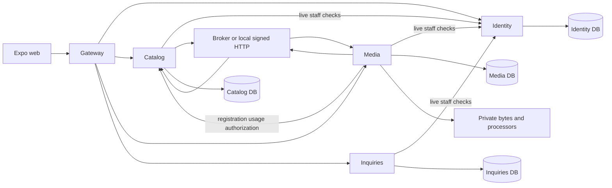

# Dependency map

Date: 2026-10-10. Source direction and runtime communication are distinct.

## Source direction

Domain/application depend on owning-service modules and dependency-free contracts. Infrastructure implements ports; presentation invokes use cases; composition injects concrete adapters. Public exports and [architecture checks](../../scripts/check-boundaries.mjs) reject cross-service implementation imports, reversed layers and import cycles. Current evidence: 245 source files and fourteen enforcement probes passed. This does not prove every semantic ownership or authorization rule.

## Runtime communication

The current web client can also address the configured Media origin directly for binary traffic. Future central staff ingress should place authenticated API/binary routes on the staff origin; this is not implemented by the diagram.

Catalog/Media have a deliberate runtime feedback loop: Catalog owns references/public eligibility; Media owns bytes/readiness. Versioned events and authenticated coordination connect them. This is neither a source-import cycle nor a distributed SQL transaction. Identity outage closes protected access while public published Catalog reads remain available.

## Transactions

Catalog uses SERIALIZABLE Prisma interactive units of work, optimistic versions, local lock/statement limits, a private SQL write gate, deferred integrity and atomic outbox. Identity uses service-owned READ COMMITTED transactions and account/token/session locking. Media combines transactional lease/fence state with private storage coordination. Bigint/decimal values remain strings. External HTTP/mail/files stay outside bounded whole-transaction retries.

No service reads another service's database. Intentional registration/snapshot/inbox projections have one writable authority. Future access projections must define staleness separately from authoritative Identity checks. Scope changes must cover root readers, counts, every UoW, raw pg storage locks, functions/views/triggers, worker discovery and cleanup; a scoped controller is insufficient.
