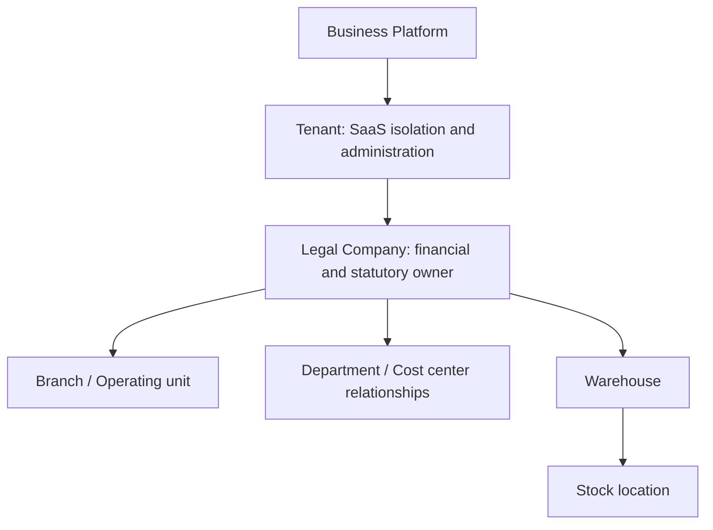

# Proposed organizational model

Date: 2026-10-10. Design only. Tenant and legal company are separate identities; neither is implemented today.

The hierarchy expresses ownership, not a universal organizational-unit inheritance table. Warehouses may reference branches; departments and cost centers are not warehouses.

| Concept            | Mandatory owner / relationship                                 | Sharing and access rule                                                                                                                       |
| ------------------ | -------------------------------------------------------------- | --------------------------------------------------------------------------------------------------------------------------------------------- |
| Tenant             | Platform registry; stable ID/lifecycle                         | SaaS security, administration and subscription boundary. Contains one or more companies after provisioning; ownership transfer is a migration |
| Legal company      | Exactly one tenant                                             | Legal/financial/statutory owner with own currency/fiscal/tax policy. Requires company permission plus active tenant membership                |
| Branch             | Exactly one company                                            | Operational/geographic site; no independent legal ledger by default                                                                           |
| Department         | Exactly one company initially                                  | Functional structure; cross-company reporting is a permissioned projection, not ambiguous ownership                                           |
| Operating unit     | Exactly one company                                            | Operational responsibility; explicit branch/department relationships. Prove workflows before a generic hierarchy                              |
| Warehouse          | Exactly one company; optional same-company branch              | Physical stock owner; no warehouse shared across company ledgers                                                                              |
| Stock location     | Exactly one warehouse; inherits company/tenant                 | Bin/zone/sub-location; optional bounded tree with same-company relationships                                                                  |
| User               | Global Identity account                                        | May belong to multiple tenants/companies. Global identity is not global content authority                                                     |
| Tenant membership  | User + tenant; roles/lifecycle                                 | Association entity, one effective membership. Does not grant all companies automatically                                                      |
| Company membership | Tenant membership + company in same tenant                     | Explicit association/capabilities; all-company access only as an authorized scope. Tenant revocation invalidates subordinate access           |
| Role               | Explicit platform, tenant or company scope                     | Permission bundle; platform administration does not confer tenant content access                                                              |
| Permission         | Versioned capability vocabulary                                | Owning use cases also check object, tenant/company and narrower branch/warehouse constraints                                                  |
| Subscription       | Tenant, control-plane authority                                | Plan/lifecycle/commercial relationship; distinct from ERP invoices. No provider/schema implemented                                            |
| Module entitlement | Tenant plan/platform grant; company activation when applicable | Entitlement and operational activation differ. Backend enforcement, data preservation and narrow cleanup/recovery permission required         |

## Company and cross-company policy

Products/content default to one owning company. Tenant-owned definitions may be shared with explicit use rights; company overrides need a designed relationship and one writable authority. Company A access never implies company B access. Company switching must cancel/guard stale queries, mutations, drafts and grants.

Accounting documents, journals, balances, fiscal periods and statutory policies belong to one legal company. Future intercompany operations name authorized counterpart companies, correlate immutable document IDs, balance each company's entries and use an approved posting/reconciliation protocol. A shared tenant never permits a journal to silently mix company books. Settlement, exchange rates, eliminations and reporting remain future Accounting decisions.

Cross-tenant sharing is denied by default. Shared identity and immutable templates do not make business data global. Shared definitions do not permit attachment of another company's private Media. Legacy records need a reviewed tenant+company ownership manifest; do not infer legal structure from branding. See [ADR](../../documentation/decisions/026-tenant-legal-company-separation.md).
