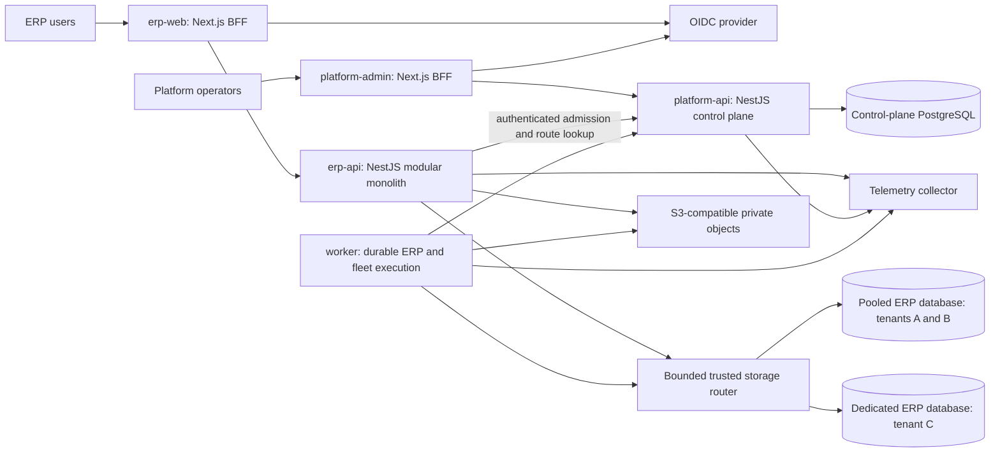

# Target system architecture

Owner approved revision target-specification-2026-10-10-v1 and ADRs 030–035 on 2026-10-10. Earlier proposal labels below record the specification origin; approval and bounded deadlines are recorded in [the decision register](../specifications/phase-01-owner-decisions.md). This approval does not certify implementation.

Date: 2026-10-10. New plan.md Phase 01 specification. Target direction is authorized by the owner through plan.md and the master prompt; detailed ADRs remain proposed until Phase 01 approval. No target runtime is implemented.

## Authority and baseline

[plan.md](../../plan.md) and [implementation-prompt.md](../../implementation-prompt.md) govern the target. [ADR 030](../../documentation/decisions/030-greenfield-target-authority.md) resolves the conflicting legacy service topology, unconditional Prisma choice, Expo frontend and old phase numbering. The owner revoked earlier AGENTS.md instructions during this session; its legacy service constraints are not target requirements. The canonical ADR sequence remains documentation/decisions, resolving the illustrative docs/adr path in plan.md.

The fresh [discovery inventory](../implementation/phases/phase-01-discovery.json) confirms five legacy services, fourteen workspaces and 71 models across four Prisma schemas at Git HEAD 54778083efea968eeedf162cab0541f84b4dbb41. These are source counts, not installed database observations. Catalog is single company; global staff Identity, Media, Gateway and an Inquiries foundation are legacy evidence. No source implementation of ERP tenant/company isolation was found in the reviewed composition/schema paths. Older normalization [Phase 01 report](phase-01-report.md) remains historical and cannot close this new phase.

## Deployment and trust boundaries

The control plane and ERP API deploy independently with distinct runtime identities, secrets and physical PostgreSQL databases. Initially their databases may share a PostgreSQL server if resource/security budgets permit; independent databases do not imply independent host failure domains. Production server/region separation requires owner hosting and availability decisions. Platform APIs cannot query ERP business tables through their ordinary runtime credential. Fleet workers receive narrowly scoped operational credentials, separate from business job credentials.

ERP accounting, stock, purchasing, sales and payments operate in one database transaction inside the selected tenant ERP database. Their modules are independent owners within one deployed application, not independent transactional microservices. Both pooled and dedicated storage execute the same application, schema, migrations and tests. Neither client paths nor OIDC claims may supply a connection string or select a database.

Target applications are apps/erp-api, erp-web, platform-api, platform-admin and worker. Business modules and technical packages follow the master prompt structure. Create directories only when they contain working phase artifacts. A worker executable may host distinct process profiles; provisioning/migration authority must never become ambient authority for ERP jobs. Runtime dependency manifests and network policies enforce that separation.

## Domain and contract boundaries

[ERP domain model](erp-domain-model.md) defines aggregate owners and company sharing. A module exports commands, queries and event contracts through its published surface; other modules cannot import repositories or write its tables. Authorized application orchestration invokes those commands on a shared transaction session. [Transaction design](transaction-design.md) defines atomic workflows. The shared kernel contains exact identifiers, money/quantity primitives and transaction context types only; it contains no tenant registry, ORM clients or universal repository.

Control plane owns subscriptions, entitlements, tenant lifecycle, OIDC subject associations, tenant/company grants and storage assignments. Organization owns company identity and legal organization structure in ERP. Company grant creation validates company ownership through an authenticated Organization contract; lifecycle changes reconcile grants durably. There is no cross-database FK or distributed transaction. A stale grant never makes a nonexistent, inactive or wrong-tenant company usable.

REST is versioned /api/v1 with generated OpenAPI, safe errors and scoped idempotency. Internal admission/route responses are authenticated, audience-bound and contain IDs, lifecycle, membership versions, routing generation and credential references rather than database passwords. Events carry trusted tenant/company ownership and schema version. [Engineering standards](engineering-standards.md) specifies precise payload conventions.

The [foundation contracts](../specifications/foundation-contracts.md) specify admission/routing inputs, ownership keys, control-plane records, jobs/files and safe failure responses before implementation.

## Environment and transition strategy

Use disposable local/CI PostgreSQL clusters with unmistakable target fixture IDs and distinct secrets. Production values are never implicit defaults. CI provisions pooled A/B and dedicated C plus two companies per tenant; staging uses the same images and migration lineage. Select production hosting/OIDC/storage providers only after owner budget, jurisdiction and operations approval.

The legacy source snapshot is retained under .local/target-phase-01/source-snapshot with hashes in discovery evidence. Git history remains intact. This is a source recovery copy, not a database or object backup. No old data import, database deletion, deployed service cutover or target source-of-truth activation is authorized by this phase. Before removing legacy components, verify new acceptance, secure required database/object backups and approve any valuable data disposition. Do not run two production business authorities.

## Delivery and acceptance

[Requirements and scenario matrix](../specifications/phase-01-acceptance.json) maps twelve delivery phases and security/transaction/operations requirements to executable design checks and future runtime scenarios. [Owner decisions](../specifications/phase-01-owner-decisions.md) contains unknown product/NFR values. [Phase evidence](../implementation/phases/phase-01.md) records actual commands.

Phase 01 closes only after internally consistent specifications, complete traceability and explicit owner architecture/product approval. Phases 02–07 implement the foundation, Phase 08 certifies it in both modes, and only then do Phases 09–12 implement ERP workflows. Future manufacturing, POS, HR/payroll, CRM, fixed assets, projects, mobile and jurisdiction packs have versioned integration boundaries but no implementation in this release without new scope approval.
