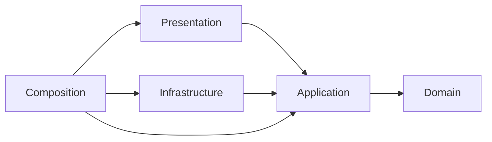

> Target authority: [plan.md](../plan.md) and the [new Phase 01 specifications](../docs/architecture/README.md) govern the greenfield system. The service/Prisma/Expo boundaries below describe legacy implementation evidence. See [ADR 030](decisions/030-greenfield-target-authority.md) for the target supersession map.

# Business Platform architecture and engineering standards

Updated 2026-10-10. The user's standing instruction to follow best practices and suitable design patterns is saved in [AGENTS.md](../AGENTS.md). This guide describes the actual implementation, dependency rules and patterns. The [current ERP architecture baseline](../docs/architecture/README.md) separates observed implementation from tenant/company and future module proposals.

Catalog classification now belongs to leaf Categories and their ordered Attribute Groups. Both directions of Group/Attribute editing use the same Catalog-owned memberships, reviewed use case and Prisma unit of work; product forms consume the service's deduplicated category schema. Product Type runtime classification has been retired with retained migration evidence. See [decision 020](decisions/020-final-category-relationships.md) and the [retirement procedure](operations/product-type-migration.md).

## Repository layout

```text
business-platform/
  AGENTS.md                 Standing project rules
  apps/storefront/          Expo Router public web shell and replaceable data composition
  services/
    identity/               Staff accounts, sessions and action tokens
    catalog/                Category/product/content ownership
    media/                  Private storage, uploads, processing, delivery and retirement
    inquiries/              Inquiry ownership; business workflows pending
    gateway/                Stateless HTTP entrypoint; no database
  packages/
    contracts/              Dependency-free types, errors, API/event contracts
    platform/               Technical HTTP/configuration/database adapters
    tokens/ui/icons/        Shared frontend tokens, Tamagui primitives and Lucide exports
    i18n/api/catalog-ui/    Locale provider, public HTTP/data ports and catalog presentation
  database/
    sql/                    Reviewed schemas, upgrade SQL and integrity rules
    tests/                  Database integrity/concurrency checks
  documentation/
    decisions/              Architecture choices and tradeoffs
    operations/             Setup, bootstrap and operating guides
    api/openapi.json        Implemented gateway contract
  infrastructure/           Container recipes
  scripts/                  Build/development/architecture/validation tools
```

Every business service has domain/application/infrastructure/presentation/composition folders under src. The gateway uses application ports, HTTP infrastructure, presentation and composition, with no artificial business domain. Service READMEs describe implemented scope and entrypoints: [Identity](../services/identity/README.md), [Catalog](../services/catalog/README.md), [Media](../services/media/README.md), [Inquiries](../services/inquiries/README.md), [Gateway](../services/gateway/README.md).

## Layers and dependency direction

```text
services/catalog/
  prisma/schema.prisma      Service-owned Prisma models and database mappings
  prisma.config.ts          CLI configuration; owning runtime URL for introspection
  src/
    domain/category.ts
    application/
      ports/catalog.ts
      use-cases/create-category.ts
      use-cases/edit-category.ts
      use-cases/read-categories.ts
      use-cases/read-category-navigation.ts
      use-cases/move-category.ts
      use-cases/reorder-categories.ts
      use-cases/delete-category-branch.ts
    infrastructure/prisma/
      category-repository.ts
      unit-of-work.ts
      outbox.ts
    presentation/http/
      categories-controller.ts
      admin-categories-controller.ts
    composition/
      application.ts
      main.ts
  tests/
```

| Layer          | Responsibility                                                                    | Allowed dependencies                                    |
| -------------- | --------------------------------------------------------------------------------- | ------------------------------------------------------- |
| Domain         | Business models/policies, role rules, Arabic category requirements                | Domain modules and dependency-free contracts            |
| Application    | Use cases, repository/integration ports, orchestration and transaction boundaries | Domain/application modules and contracts                |
| Infrastructure | PostgreSQL, HTTP, mail and security implementations                               | Domain/application ports and technical libraries        |
| Presentation   | Parse HTTP/events, authenticate transport, invoke use cases, serialize responses  | Application use cases/contracts and transport libraries |
| Composition    | Construct/inject adapters, configure/start/shut down processes                    | All service layers                                      |



The arrows show source dependency direction. At runtime, application code calls repository interfaces implemented by infrastructure. Composition supplies instances. Business authorization remains inside use cases even when controllers authenticate requests.

For category creation, the controller parses input and resolves the actor through live Identity verification. CreateCategory enforces ADMIN permission and category draft rules. Its CatalogUnitOfWork port performs repository and outbox operations together. PrismaCatalogUnitOfWork adapts these ports to one SERIALIZABLE transaction. COMMIT must succeed before returning the result. Domain/application know neither SQL nor the Nest module/HTTP client/database pool.

Identity reads depend on focused StaffAuthenticationReader, AdminDirectoryReader and ActionTokenReader views; category browsing uses CategoryReader. Each workflow receives only the lookup capabilities it needs. Mutation/outbox methods are available through the unit-of-work callback.

## Patterns used

| Pattern/principle         | Concrete use                                      | Purpose                                                                   |
| ------------------------- | ------------------------------------------------- | ------------------------------------------------------------------------- |
| Repository                | Service-owned ports and PostgreSQL adapters       | Keep SQL outside use cases and use domain-specific operations             |
| Unit of Work              | CatalogUnitOfWork and IdentityUnitOfWork          | Commit business changes and applicable events together                    |
| Constructor injection     | Composition connects use cases/adapters/ports     | Explicit, replaceable dependencies                                        |
| Adapter                   | SMTP/mailbox, Argon2id, HTTP session verification | Isolate external protocols and implementations                            |
| Transactional outbox      | ops.outbox_events in business transactions        | Retain event intent atomically; Catalog/Media relays publish after commit |
| Interface segregation     | Focused read/query ports                          | Avoid unrelated mutation capabilities in read dependencies                |
| Shared retry and shutdown | retryTransaction and closePersistence in platform | Reuse bounded retries, safe failure mapping and shutdown                  |
| Bounded retry             | 40001/40P01 retry the complete local callback     | Handle contention without retrying arbitrary failures/external effects    |

Prisma interactive transactions own connection acquisition, COMMIT and rollback. Services choose isolation, inject the transaction client into their repositories/outbox and map structured database errors. Catalog stays SERIALIZABLE with its private write gate; Identity stays READ COMMITTED with account/token locking. Platform retries complete transactions for serialization/deadlock failures, including failures at COMMIT. External mail/HTTP/file effects stay outside retries.

Apply SOLID/KISS/DRY/YAGNI to demonstrated needs. Keep cohesive business modules and focused interfaces; share technical duplication. Avoid speculative base repositories, service locators, unnecessary inheritance, empty entities and layers with no real responsibility.

## Persistence and ownership

Prisma 7.10.0 implements persistence through service-local schemas and generated clients. PrismaPg reuses each service runtime pool. Native model operations implement CRUD and outbox inserts; narrow parameterized SQL preserves exact timestamp cursors, locks and server-timed token rules. Reviewed SQL owns migrations, triggers, deferred constraints and grants. See [decision 004](decisions/004-prisma-persistence.md) and the [Prisma plan](orm-implementation-plan.md).

Each service uses only its own runtime database. Gateway has no database or internal introspection credential. Cross-service dependencies use API/events rather than implementation imports. Contracts never import platform/service code; platform contains technical adapters rather than business policies. Shared packages are imported through declared public exports.

Live Identity checks and owning-service permissions enforce non-hierarchical staff roles: Super Admin manages ADMIN accounts; ADMIN manages content/inquiries. Gateway drops untrusted role headers and does not route introspection. See [Identity operations](operations/identity.md).

## Enforcement and verification

npm run check builds the code, runs strict types, checks format/architecture and executes unit tests. The architecture checker uses TypeScript module resolution and inspects imports, re-exports and inline import types. It rejects reversed layers, service implementation imports, shared-package escapes/internal subpaths, CommonJS/dynamic import bypasses, explicit any and cycles.

Fourteen probes exercise forbidden framework/service dependencies, cycles, inline infrastructure/external types, import-equals, contract-to-platform escape and shared internal subpaths, plus an allowed contract import. Architecture checks complement behavior tests; they do not prove every business rule or deployment property.

For a change: read the owning code/design, choose the smallest suitable pattern, implement through its ports/adapters, update relevant contracts/operations/decisions and run meaningful checks. Persistence/security changes require real PostgreSQL/API/process regressions and disposable fixture cleanup. Keep historical validation dated and add new evidence separately.

## Scope and decisions

Current implementation includes global staff Identity, category-derived products/configuration/publication, real public collection/search/filters, Media uploads/processing/delivery and reviewed permanent deletion, plus Admin/Super Admin web workflows. Inquiries has persistence, health and staff access only; its business workflows remain pending. Tenant/company organization and ERP modules are not implemented. See the [current inventory](../docs/architecture/service-inventory.md), [checks and risks](../docs/architecture/phase-01-report.md) and [Catalog operations](operations/catalog.md). Earlier B milestone reports remain historical evidence.

The current persistence package adds Prisma schemas/clients, native interactive transactions, exact data mappings and stronger validation. See [decision 003](decisions/003-engineering-standards.md), [earlier ORM adoption validation](orm-validation.json), [Identity milestone evidence](identity-validation.json) and [the backend sequence](backend-implementation-plan.md). Hosted CI/Docker/production providers/TLS/load checks require deployment environments.

## Dynamic Catalog Core

[Decision 006](decisions/006-dynamic-catalog-core.md) records the separately named milestone after B4. Catalog now contains plain typed-value strategies and effective-schema/public projections in domain; focused configuration/product ports and safe preview/commit/copy/type-change/placement use cases in application; transaction-scoped native Prisma repositories, mappings, dependency readers and precondition hashing in infrastructure; strict allowlisted Admin/public controllers in presentation; and explicit providers in composition. Gateway forwards only approved routes.

## B5 Media implementation

Media adds pure policies in domain; storage/repository/processing/Catalog ports and uploads/library/delivery/processing/reconciliation use cases in application; private filesystem/S3, ClamAV, isolated native processors and transaction-scoped Prisma adapters in infrastructure; staff/control/binary/delivery controllers in presentation; API, per-kind worker and event-relay entrypoints in composition. Catalog adds an authenticated coordination controller, application policies, a Prisma registration/usage adapter and its own relay. Platform shares only technical broker/signature/relay mechanics. [Decision 007](decisions/007-media-core.md) documents sealing, readiness, reference and revocation boundaries. [Media operations](operations/media.md) records the available profiles and external acceptance gates.

The application uses Repository/Unit of Work, validator strategies, a shared effective-schema resolver, explicit projections, bounded whole-transaction retries and an atomic transactional outbox. Reviewed SQL final-state guards enforce type eligibility and privacy; migration tools stay outside business application layers. Public product reads are independent of Identity; every Admin read/write uses live ADMIN verification. Earlier API/B milestone descriptions preserve context; current OpenAPI 0.9.0 includes category-derived Catalog, public collections/filters and permanent-deletion workflows. Technical-sheet UX, commerce, Inquiry workflows and native applications remain separate scope.

## Admin dashboard

`apps/storefront/features/admin` owns staff presentation and composes the shared UI/i18n/API packages through Expo Router `/admin` and `/super-admin` entries. `packages/api/src/staff.ts` validates owning-service DTOs, keeps CSRF in memory, bounds requests and invalidates staff caches on session failure. Staff queries use a dedicated QueryClient; public demo fixtures are never used here.

Catalog adds `application/ports/product-management.ts`, `application/use-cases/manage-products.ts`, `infrastructure/prisma/product-management.ts` and `presentation/http/product-management-controller.ts`. Constructor composition injects the focused Unit of Work and live authorization. Publication, media association updates and reviewed permanent deletion remain Catalog-owned serializable transactions with outbox events; retained evidence follows the deletion compatibility policy. Exact bigint manual-order cursors bind to the current filter scope. SQL 21/22 add activation while preserving active staff usage and filtering inactive owners from public delivery. Media exposes safe metadata and bounded library filters; Gateway retains an explicit staff route allowlist. See [decision 009](decisions/009-admin-dashboard.md) and [dashboard scope](admin-dashboard.md).
