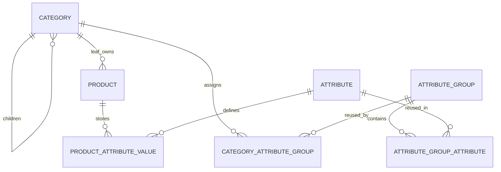

# Category-driven catalog classification

Status: category-authoritative runtime implemented, 2026-10-08. [Decision 020](../decisions/020-final-category-relationships.md) records transaction, retention and compatibility tradeoffs. Current acceptance belongs to the [final phase report](../implementation/final-catalog-admin-visitor-completed-work.md).

Only a live leaf can own products or group placements. A reusable group can appear in several categories; a reusable attribute can appear in several groups. The existing typed value tables retain the unique live `(product_id, definition_id)` key. No Product Type substitute or JSON specification blob is introduced.

SQL expansion 23 introduces ordered category/group and group/attribute joins and the `category_effective_attributes` view. First category-group order, then member order, then UUID ties determine presentation. Repeated attributes resolve once at their first group. Requiredness combines with OR. Disclosure, searchable, filterable and comparable permissions combine with AND, including global definition privacy and filterability. Numeric bounds, units, multilingual text and choices remain definition-owned.

The Catalog-owned `GET /api/v1/admin/categories/{id}/schema?locale=en` endpoint supplies both effective configuration and generated form fields in one bounded repeatable-read Prisma snapshot. It rejects incomplete migration stages. The application use case enforces ADMIN authorization; the controller uses the existing live session authenticator. Gateway forwards this explicit route. SUPER_ADMIN retains staff administration permissions and cannot read content configuration. Group and effective-field collections are bounded at 500; overflow is rejected rather than silently truncated.

SQL cutover 24 has been exercised on disposable databases. It changes eligibility, publication integrity, privacy and reverse schema dependencies together. Inactive drafts can omit a cover and required values. Published products require a verified image cover, valid required category fields and explicit resolution of retained nonapplicable values. Changing category can retain values in an inactive product; nonapplicable values are hidden from public delivery and cannot be edited as applicable fields. They are never silently deleted.

The cutover retires legacy type tables as immutable owner-only migration evidence, closes their writes, revokes runtime access and removes the old service stage sentinel. Old binaries therefore reject dynamic operations after cutover. Cutover and physical binding retirement have been applied to the normal local project after restored-copy rehearsal; deployment remains coordinated.

Owner creation includes initial relationships atomically. Existing leaf groups and inverse group/attribute memberships use reviewed preview/commit endpoints. Product placement compares source/target schemas and retains values. Runtime Product Type code/contracts/Prisma models are removed; SQL 26 archives and drops physical bindings after parity verification. Visitor detail supplies eligible same-category neighbors and ancestor breadcrumbs. See [retirement operations](../operations/product-type-migration.md).
