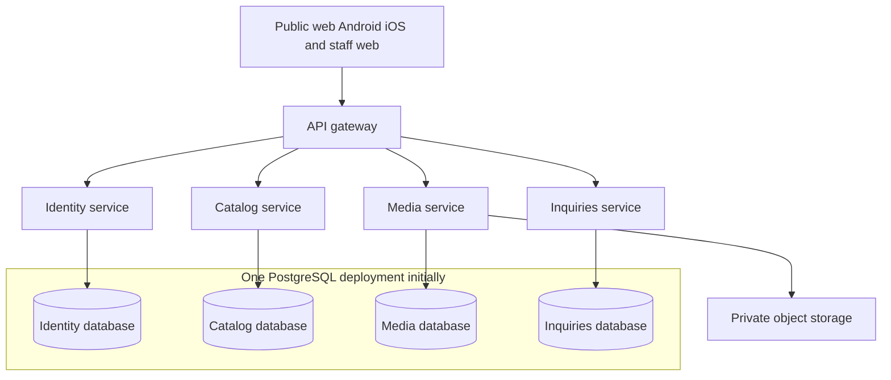

# Business Platform Backend Implementation Plan

Prepared on 2026-10-03; updated 2026-10-04. Status: B1/B2 foundation, B3 Identity, Prisma integration and B4 category administration implemented locally. This plan retains the microservice ownership and Clean Architecture baseline. B4 completes editor reads/saved translations, bounded deep navigation/breadcrumbs/destinations, branch moves, atomic root/nested ordering and confirmed soft deletion with scope-bound preview protection. See the [Catalog operating guide](operations/catalog.md), [category decision](decisions/005-category-administration.md), [B4 validation](validation/b4-2026-10-04T09-14-07-069Z.json) and [current progress](project-progress.md). Media/product/inquiry and application workflows remain later milestones.

The immediate goal is a working backend workflow: bootstrap a Super Admin, invite and activate an Admin, create an eligible category, upload and process a cover image, create a product, retrieve it anonymously, then soft-delete it and verify that fresh public requests lose access while records and files remain stored. The first application milestone repeats that workflow through the web and native interfaces.

Microservices define the business ownership and deployment boundaries. Clean Architecture defines the dependency direction and separation of business rules inside each service.

## Starting point and scope

The repository contains four PostgreSQL databases and 59 application tables, runtime/owner isolation, lifecycle guards, Catalog integrity functions, technical sheets, SQL query examples, six initial categories and management tools. The [validation report](../database/validation-report.json) records seven passed SQL suites, four concurrency scenarios, 12 denied cross-service connections and a verified v1.0 upgrade. These results cover the database implementation; service, infrastructure and interface checks are planned below.

The local database endpoint is `127.0.0.1:55432`. Runtime connection strings are in `.local/database.env`. Backend processes receive only their own runtime credentials. Database migrations use separate deployment credentials.

Confirmed constraints are Node.js and TypeScript, PostgreSQL, microservices, Clean Architecture, React Native with browser support, public web/Android/iOS, a separate web-only dashboard, anonymous visitors, Arabic/English/Sorani, immediate visibility after a valid save, soft deletion and file retention. The current request also confirms microservices and Clean Architecture.

The four-service database boundaries are the implementation baseline. NestJS, RabbitMQ, Expo and particular libraries are engineering choices. Prisma 7.10.0 is the implemented user-selected ORM; [decision 004](decisions/004-prisma-persistence.md) supersedes earlier persistence proposals. Reviewed SQL remains authoritative.

## Architecture and service ownership



The gateway is an additional stateless entry process with no business database. Service-to-service HTTP supports decisions requiring a current answer. Versioned events support background propagation. Each service runs its own outbox publisher and relevant consumers; Media and Inquiries have separately runnable processing and notification workers.

| Component | Owns and implements                                                                                                                     | Dependencies through contracts                                     |
| --------- | --------------------------------------------------------------------------------------------------------------------------------------- | ------------------------------------------------------------------ |
| Identity  | Staff accounts, sessions, invitations, password setup/reset and authorization                                                           | Email adapter and its own database                                 |
| Catalog   | Categories, products, codes, translations, typed attributes, company content, technical sheets, media associations and retirement fence | Identity verification; trusted Media readiness                     |
| Media     | Uploads, assets, variants, validation, processing and controlled delivery                                                               | Identity verification; Catalog usage/retirement APIs; storage      |
| Inquiries | Anonymous submissions, trusted product snapshots, inbox/status and notifications                                                        | Identity verification; Catalog product read/settings events; email |
| Gateway   | Routing, request limits, origin policy, request IDs and transport errors                                                                | Service HTTP contracts                                             |

Only the owning service opens its database. Cross-service references use UUIDs and verified API/event contracts. Catalog owns category/product exclusivity and current asset references. The gateway leaves use-case decisions to the owning service.

Proposed development ports are gateway `3000`, Identity `3001`, Catalog `3002`, Media `3003`, Inquiries `3004` and PostgreSQL `55432`. Workers do not need public HTTP ports. Production service endpoints remain private behind the gateway. Use encrypted service transport and individually provisioned service credentials for internal APIs, with caller/action allowlists and credential rotation; do not expose internal endpoints through public gateway routing. Document the local development equivalent in B2.

## Clean Architecture structure

Each service uses the following structure. Domain and application code remain ordinary TypeScript, independently testable without starting NestJS or PostgreSQL.

```text
services/catalog/
  package.json
  src/
    domain/
      entities/
      value-objects/
      policies/
      errors/
    application/
      use-cases/
      ports/
      models/
    infrastructure/
      prisma/
      http-clients/
      messaging/
    presentation/
      http/
      events/
    composition/
      modules/
      main.ts
      worker.ts
  tests/
    unit/
    integration/
    api/
```

| Layer          | Responsibilities                                                                         | Allowed dependencies                          |
| -------------- | ---------------------------------------------------------------------------------------- | --------------------------------------------- |
| Domain         | Category rules, product requirements, technical value rules, staff capability policy     | TypeScript and domain-owned code              |
| Application    | CreateProduct, MoveCategory, SubmitInquiry, RetireAsset and repository/integration ports | Domain and application-owned ports            |
| Infrastructure | PostgreSQL repositories, transactions, HTTP clients, storage/email/RabbitMQ adapters     | Application ports and technical libraries     |
| Presentation   | Controllers, input/event validation, HTTP mapping and response DTOs                      | Application use cases and transport contracts |
| Composition    | Nest modules, dependency injection, configuration and startup                            | All layers to wire implementations            |

A controller validates input, resolves the actor, invokes a use case and maps the result. The use case enforces permissions/business intent and uses ports inside its unit of work. Database constraints protect final committed state in addition to application errors. Nest decorators, SQL clients, storage SDKs and ORM models stay outside domain/application code.

For CreateProduct, Media readiness is verified before entering the gated Catalog transaction. The transaction checks the category and expected versions, allocates the product/cover membership, writes Arabic content, reserves any model code, writes an outbox event and commits. Eligible database failures retry without repeating external work.

CI checks import boundaries, circular dependencies and service-to-service implementation imports. Shared packages expose DTO/event contracts and small technical utilities. Domain entities and repositories remain service-local.

## Repository and technology decisions

Retain `database/` as the SQL source of truth and extend the repository as follows:

```text
business-platform/
  apps/
    public/
    admin/
  services/
    gateway/
    identity/
    catalog/
    media/
    inquiries/
  packages/
    contracts/
    api-client/
    observability/
    test-support/
    localization/
    ui/
  database/
  infrastructure/
    local/
    containers/
    deployment/
  documentation/
    decisions/
    api/
    operations/
  package.json
  package-lock.json
  tsconfig.base.json
```

These are planned additions. Each service gets its own manifest, build, tests, configuration and container entrypoint. Use npm workspaces with separate NestJS applications. Nest documents application/workspace build organization; service ownership remains our architectural rule. [NestJS workspace documentation](https://docs.nestjs.com/cli/monorepo)

| Concern     | Recommended choice                                                                                              | Required validation                                                                       |
| ----------- | --------------------------------------------------------------------------------------------------------------- | ----------------------------------------------------------------------------------------- |
| Runtime     | Installed Node.js 24.21.0 as the initial baseline                                                               | Pin a supported version consistently across development/CI/containers                     |
| Framework   | NestJS in presentation/composition and technical adapters                                                       | Freeze compatible NestJS/TypeScript/testing versions after a build spike                  |
| Persistence | Pinned Prisma 7.10.0 clients/interactive transactions behind service-owned ports, with narrow parameterized SQL | Preserve reviewed constraints, generated columns, partial indexes, triggers and functions |
| API         | HTTP REST, `/api/v1`, OpenAPI and generated typed client                                                        | Contract tests and separate public/admin DTOs                                             |
| Events      | RabbitMQ; PostgreSQL outbox/inbox for durable state                                                             | Confirms, acknowledgements, retry/dead-letter behavior                                    |
| Files       | Private storage behind an S3-compatible adapter                                                                 | Test a local emulator and later the production provider                                   |
| Email       | Provider-neutral adapter and local test mailbox                                                                 | Provider idempotency/error behavior                                                       |
| Tests       | Compatible TypeScript runner, actual PostgreSQL and HTTP tests                                                  | Pin after the foundation spike                                                            |
| Deployment  | One image per service with distinct API/worker commands                                                         | Independent health/startup/shutdown/release jobs                                          |

Prisma is implemented behind focused repository/Unit of Work ports. Interactive transactions supply one client to all business/outbox operations; narrow bound SQL handles recursive navigation and the existing branch deletion routine. Runtime credentials cannot access the private gate or deploy schemas. See [decision 004](decisions/004-prisma-persistence.md) and [decision 005](decisions/005-category-administration.md).

Record runtime, framework, persistence, authentication, messaging and media choices in short architecture decision records. Freeze dependencies after compatibility verification.

## Implementation order and completion gates

The critical path is B1 -> B2 -> B3 -> B4 -> Dynamic Catalog Core -> B5 -> B6. B7/B8 extend the workflow; B9 hardens the backend and B10 integrates applications. Frontend compatibility experiments can begin after B2.

| Package                               | Work and outputs                                                                                                                                              | Completion gate                                                                                                                                                                                                                                 |
| ------------------------------------- | ------------------------------------------------------------------------------------------------------------------------------------------------------------- | ----------------------------------------------------------------------------------------------------------------------------------------------------------------------------------------------------------------------------------------------- |
| B1 Foundation                         | Workspace, strict TypeScript, five entrypoints, environment validation, database pools, health, import rules, build/lint/test scripts and container templates | Processes start independently; correct runtime connections; invalid configuration fails clearly                                                                                                                                                 |
| B2 Contracts and transactions         | OpenAPI skeleton, event schemas, permissions/errors, decimal/version types, pagination and unit-of-work/retry adapters                                        | Real Catalog commit/rollback/deferred validation/stale-version integration test                                                                                                                                                                 |
| B3 Identity                           | Super Admin bootstrap, Admin invitation/activation, sessions, password reset, staff edit/disable/delete and guards                                            | Anonymous mutations denied; roles isolated; disable invalidates the next protected request                                                                                                                                                      |
| B4 Catalog core — implemented locally | Category editor/navigation, saved translations, branch moves, root/nested reorder, impact preview and branch deletion                                         | Deep paginated paths, stable scope tokens, rejected cycles/mixed contents, retained branch identities, atomic events/deletion, live authorization and disposable process checks; see [B4 evidence](validation/b4-2026-10-04T09-14-07-069Z.json) |
| Dynamic Catalog Core — implemented locally | Types, typed attributes/options/units/groups, guarded evolution/copy, editing schemas, narrow headless products and reviewed additive cutover | Disposable migration/parity, typed privacy/lifecycle, live authorization, deterministic races and process workflow; [guide](operations/dynamic-catalog.md) |
| B5 Media core                         | Uploads, private storage, validation, image/video/PDF processing, status, readiness registration and delivery                                                 | Real files exercise READY paths; pending/failed/private files remain inaccessible                                                                                                                                                               |
| B6 Product workflow                   | Product edits/deletion, codes, covers/gallery, typed values and public responses                                                                              | First backend milestone works through HTTP with a processed cover and role/deletion checks                                                                                                                                                      |
| B7 Technical sheets and content       | Full v1.1 editing/reads, evidence, notes, attachment modes/selections and company content                                                                     | Filters preserve configuration/condition identity; evidence stays private; shared files retain integrity                                                                                                                                        |
| B8 Inquiries and integration          | Submissions/snapshots, inbox/status/delete, settings projection, notifications and outbox/inbox workers                                                       | Broker/email outage recovery, correct duplicate/stale handling and deletion cancellation                                                                                                                                                        |
| B9 Backend handoff and staging        | Gateway, generated client, examples, observability, deployment, security/load/recovery checks and operations guide                                            | Acceptance tests pass in staging against realistic files and agreed data/load                                                                                                                                                                   |
| B10 Application integration           | Public web/Android/iOS, staff web, localization/RTL, technical tables, upload/edit/inquiry/account flows                                                      | First application milestone works on all platforms; release checks pass                                                                                                                                                                         |

Each package includes meaningful unit, repository, API and integration checks and finishes only after its gate passes. Dates/effort estimates follow team capacity and observed foundation throughput; the sequence is not a launch-date commitment.

## Identity and authorization plan

Implement the source role model as explicit capabilities. Super Admin manages Admin accounts; it does not inherit Admin access to content or inquiries. Anonymous visitors need no Identity account.

| Action                                                   | Anonymous      | Admin   | Super Admin |
| -------------------------------------------------------- | -------------- | ------- | ----------- |
| Browse public content and submit an inquiry              | Allowed        | Allowed | Allowed     |
| Manage Catalog, Media and company content                | Denied         | Allowed | Denied      |
| Read/manage the inquiry inbox                            | Denied         | Allowed | Denied      |
| Create, invite, edit, disable or delete Admin accounts   | Denied         | Denied  | Allowed     |
| Create/manage Super Admin accounts through ordinary APIs | Denied         | Denied  | Denied      |
| Manage the caller's own staff session/password           | Not applicable | Allowed | Allowed     |

Use opaque, cryptographically random staff sessions with only token digests stored in Identity. Deliver the session through a Secure, HttpOnly cookie for the web-only staff application, with an explicitly configured SameSite policy and allowed origins. This follows the mechanisms in the [OWASP session management guidance](https://cheatsheetseries.owasp.org/cheatsheets/Session_Management_Cheat_Sheet.html). Proposed starting settings are an eight-hour absolute session lifetime, a 24-hour invitation lifetime and a 30-minute password-reset lifetime; review and configure them before production.

For every protected request, the target service verifies the principal through an authenticated internal Identity endpoint and checks its own action capability. Validate account status, session expiry/revocation and account authorization version. Do not cache a positive authorization result across requests during the first implementation: disabling an account must deny its next protected request. Strip caller-supplied identity/role headers at the gateway and never treat them as trusted authentication. Account events can support operations, but they do not replace the current Identity decision. If Identity is unavailable, protected operations fail closed with a safe service-unavailable response; public Catalog reads remain independent.

Cookie-authenticated mutations require a session-bound CSRF token and origin checks, with tests for browser requests from disallowed origins. Choose the exact cookie/CORS configuration after establishing the public/admin domains. See the [OWASP CSRF guidance](https://cheatsheetseries.owasp.org/cheatsheets/Cross-Site_Request_Forgery_Prevention_Cheat_Sheet.html).

Hash passwords with Argon2id and parameters calibrated against the deployed worker capacity; never use reversible password encryption. See the [OWASP password-storage guidance](https://cheatsheetseries.owasp.org/cheatsheets/Password_Storage_Cheat_Sheet.html). Invitation and reset tokens are random, digested, expiring and consumed atomically once. Reset responses do not reveal whether an email belongs to an account.

Bootstrap the initial Super Admin through a protected operator command, with no public bootstrap route and no ordinary dashboard path to create a Super Admin. Super Admin account-management use cases must require an ADMIN target role as well as the caller capability. Disable/delete operations revoke sessions and outstanding action tokens atomically.

Design invitation/reset delivery together with the digest-only token model. Raw action tokens must never enter messaging tables, logs or ordinary database columns. Initially generate a token, commit its digest, then hand the raw token to the email adapter in memory after commit. A failed/ambiguous send returns a safe delivery status; a resend rotates the token and invalidates the previous one. A process crash after commit is recoverable by the same resend flow, without recovering a raw token from the database. Demonstrate this path in integration tests before accepting the account-management milestone.

## Catalog and transaction plan

Use the service-owned Prisma repositories and application Unit of Work. One Prisma transaction client handles the whole database operation and outbox; reviewed triggers retain the private Catalog write gate. Catalog writes use SERIALIZABLE isolation and a bounded retry policy for SQLSTATE `40001` and `40P01`. Retry the whole transaction and its application computation, with a fresh transaction; never retry only the failing statement. Keep object uploads, HTTP requests, broker publishing and email delivery outside these transactions.

Handle errors at COMMIT as well as during SQL statements: the existing deferred integrity checks can reject the final state. Map known constraint/concurrency failures to safe domain/API errors. Preserve the database enforcement rather than reproducing constraints solely in controller validation.

Every mutation of an aggregate or its children checks the expected root version and advances that version atomically. Product translations, codes, galleries and values still count as product changes. Category-owned changes use the category root. Sheet-owned changes use the technical-sheet root. For operations touching multiple roots, define an explicit expected-version set and perform all checks inside the transaction. A conflict returns enough safe context for the staff application to reload; it never silently overwrites a concurrent edit.

Implement these Catalog use cases:

- Categories: create/edit translations and optional covers, browse children and breadcrumbs at any depth, move/reorder, preview a branch deletion, and execute the existing branch-deletion function. Prevent cycles and enforce the active-child-category versus direct-product rule. Preview counts and versions are checked again when committing deletion.
- Products: create with a single leaf category, Arabic content and an eligible processed image cover in the same transaction; edit translations, category placement, codes, gallery and ordering; soft-delete all required owned records using the existing integrity mechanisms. There is no public draft/publish workflow. Once used, optional product codes remain reserved according to the design.
- Typed specifications: units, definitions, options, category assignments and product values with explicit type validation, canonical numeric units and option ownership. Preserve semantic immutability rules instead of rewriting definitions already in use.
- Public projections: expose only active owner-scoped content through dedicated response models. Apply field-level Arabic fallback for `ar`, `en` and `ckb`; retain explicit technical missing-value states. Keep staff data, private email settings, source evidence, storage keys and processing internals out of public responses.
- Search and filtering: cover localized names, model/product codes and relevant typed specifications. Define normalized search and deduplication behavior through examples in all three languages. Use allowlisted filters, stable ordering and bounded cursor pagination; document reload behavior when a list changes between page requests.

Public visibility must reflect committed Catalog state without waiting for a broker consumer. Start with conservative cache behavior. When introducing ETags or shared caches, include dependencies such as technical-sheet versions, owner changes and localized company settings; a product row version alone does not describe its entire public representation.

## Media pipeline and retention plan

Implement image, video and PDF paths; the final Media milestone cannot be accepted using only a placeholder image handler. Before selecting processing libraries and storage adapters, run a compatibility spike with representative supplied files. Record accepted MIME types, byte/pixel/duration limits, processing resource limits, image variants, video output policy, PDF preview behavior and the selected file-inspection/scanning mechanism.

The upload flow is:

1. An authorized Admin requests an upload session. Media assigns a generated asset ID/private object key and enforces configured size/type limits.
2. The client uploads bytes to private storage using the approved transport. Completion verifies actual stored bytes, type and size; client metadata is not sufficient evidence.
3. A leased processing job inspects the file and produces required variants/previews with bounded CPU, memory and runtime. Rejected, failed or uninspected assets remain unavailable.
4. Only a trusted worker can transition the asset to READY. It records the result and a versioned readiness event atomically in Media.
5. Catalog registers verified asset readiness and its version, ignoring stale events and retaining retirement tombstones. An attachment can be created only when the registered asset is active and eligible. Until registration completes, the UI shows processing/availability status and supports a safe retry.
6. Public access resolves an active Catalog owner/attachment and checks its current visibility before issuing delivery access. It does not accept an arbitrary asset ID as proof of public access.

Separate Admin library responses from public asset responses. Avoid exposing storage keys, sensitive original filenames or source metadata. Public covers, galleries, page media and logos resolve through their active owners. Technical-source downloads are unavailable by default; an eligible attachment must explicitly enable the permitted public download.

Use the existing `public_asset_usage` projection to authorize public delivery. Use `active_asset_usage` for retirement safety: private evidence can protect an asset from retirement even when it has no public download. Asset retirement must pass through the serialized Catalog check/fence and a versioned, idempotent handoff to Media, so attachment creation cannot race with retirement. Media soft-deletes metadata as required while retaining stored files. A delayed readiness event cannot revive a retired asset.

Apply no object-storage lifecycle purge to retained business files. If temporary upload fragments or quarantine objects need a separate cleanup policy, define their classification and retention explicitly; do not assume that all unreferenced files may be physically deleted.

Issue short-lived delivery links only after an owner-scoped authorization check. A proposed starting expiry is five minutes, subject to an agreed visibility/traffic requirement. Already-issued bearer links can remain usable until their expiry, and an ongoing download has its own storage-provider behavior. New authorization requests must fail after owner deletion. Do not promise instantaneous revocation of issued storage URLs; [S3's presigned-URL documentation](https://docs.aws.amazon.com/AmazonS3/latest/userguide/using-presigned-url.html) explains their expiry/credential behavior. Use private origins and a tested CDN/access policy if a stricter revocation target is required.

## Technical sheets and company content plan

Implement the complete v1.1 technical model, including definitions/sections, sheets and translations, configurations, operating conditions, qualified measurements, notes, source documents, immutable observations, and category/product attachments with their selected configurations. Read the supplied design and existing schema manifest for exact ownership, uniqueness and soft-deletion rules before defining request contracts.

Keep imported source evidence private and unchanged. Correcting an observation creates a replacement observation with explicit provenance; it does not rewrite the original raw evidence. A source PDF may describe a family or several configurations without proving that any individual cabin/model has those exact dimensions. Record uncertainty and resolve applicability explicitly before publishing a product specification. Never automatically assign PDF values to Lotus, Sirius or another model by matching names or nearby text.

Preserve source units/labels, qualifiers, notes and missing-value states alongside canonical query values. `UNQUALIFIED` is not equivalent to every speed or operating condition. Reference sheets attached to categories provide reference information without automatic inheritance into descendant products. Product attachments distinguish `REFERENCE` from `PRODUCT_SPECIFICATION` and declare selected configurations. Changes to attachments/mode/selection check all affected owner/sheet versions atomically.

Public numeric filtering must correlate measurements inside the same eligible configuration and operating condition. It must not combine a capacity from one configuration with a speed or dimension from another. Generic reference-only links do not establish a matching product specification. Use the existing [technical query examples](../database/sql/11_technical_queries.sql) as patterns; test the resulting HTTP filters against conflicting configurations and missing/qualified values.

Separate staff evidence-editing contracts from public technical tables and notes. An explicit source-download setting controls eligible PDF delivery. Use the existing sheet-deletion function and attachment integrity checks, with expected root versions. Keep the original source records/files retained after soft deletion.

Implement localized company pages, FAQs, features, logos, social links and public contact settings as Catalog use cases. Publish only verified company contact details. The sales notification email is a private setting, absent from public settings responses. Its versioned changes feed the Inquiries projection; untranslated required content follows the documented Arabic fallback. Seed/demo placeholders must not be presented as verified company data.

## Inquiries and messaging plan

The public inquiry use case validates name, message and the supported contact method without creating a customer account. First check whether its idempotency key already has a committed result; return that result for a matching body before fetching Catalog data. For a new submission referencing a product, obtain a current public product snapshot from Catalog before the Inquiries transaction. A product already unavailable at that check is rejected; a product deleted after the check can still have its captured snapshot stored. Preserve the snapshot so staff can understand the inquiry after the product changes or is deleted. This request-time policy avoids claiming a distributed atomic commit. Test concurrent submissions and deletion between the lookup and commit.

Require a client-generated idempotency key and hash the normalized submitted fields. Do not include the dynamically fetched product snapshot in that hash, because a retry after a product rename still represents the same user submission. Atomically store the inquiry, idempotency result and notification intent. The same key/body receives the same safe acknowledgement; a different body with that key receives a conflict. A retry never restores a deleted inquiry. Public acknowledgements expose no staff inbox or contact data.

All Admin accounts can manage the shared inbox, statuses and soft deletion; Super Admin cannot access it. Apply the existing cancellation rule to notification work that has not started when an inquiry is deleted. External delivery already in progress cannot be recalled by a database delete. Missing sales-email configuration leaves an explicitly pending notification, and provider failures retain the inquiry with bounded delivery retries.

Use the existing outbox/inbox tables for durable messaging. Implement only required streams initially:

| Stream                     | Producer and consumer                        | Required behavior                                                                     |
| -------------------------- | -------------------------------------------- | ------------------------------------------------------------------------------------- |
| Asset readiness            | Media to Catalog                             | Register verified readiness; reject stale versions and late events for retired assets |
| Asset retirement           | Catalog to Media                             | Idempotently retire metadata after the Catalog fence; retain physical files           |
| Notification configuration | Catalog to Inquiries                         | Update the private email projection only when the source version is newer             |
| Content/technical changes  | Catalog to future cache/search consumers     | Invalidate/update derived data without making current public reads wait for events    |
| Account changes            | Identity to operational consumers, if needed | Support operations; current authorization still queries Identity                      |

Define an event envelope with event ID, type, schema version, producer, occurrence time, correlation ID and the appropriate aggregate identity/version. Some settings use singleton/non-UUID keys; define their event identity explicitly rather than forcing their IDs into UUID-only outbox fields. Keep payloads minimal and exclude credentials, raw session/action tokens and inquiry contact/message bodies from general events.

An outbox publisher claims a bounded batch with a lease, commits its claim, publishes outside the transaction and waits for a publisher confirmation. It marks completion only if it still holds the correct lease/fence. A consumer records inbox deduplication and its database side effect in the same local transaction, commits, then acknowledges the message. A lost confirmation or acknowledgement can cause a duplicate; consumers therefore remain idempotent. [RabbitMQ's documentation](https://www.rabbitmq.com/docs/confirms) distinguishes publisher confirmations from consumer acknowledgements; neither provides end-to-end exactly-once processing.

Define finite retries with backoff/jitter, a dead-letter destination, operator visibility and a redrive procedure preserving the original event ID. Out-of-order handling is explicit for every versioned projection. Workers use leases/fencing so expired workers cannot commit someone else's claimed work. Test crashes before and after publish/commit/acknowledgement and recovery after broker restart.

Email is a separate worker concern. Use provider idempotency where available and document the possibility of duplicate external delivery when the provider response is lost. A broker/email outage must not lose committed product edits, inquiries or pending deliveries. Invitation/reset delivery follows the Identity token policy above rather than placing raw tokens in the shared event transport.

## API contract coverage

Routes below are proposed contract groups, not a claim that HTTP endpoints already exist. Finalize exact paths and DTOs from the use cases and publish versioned OpenAPI documents. The gateway exposes the approved public/staff surfaces; internal and operational endpoints have separate network/authentication policy.

| Contract group         | Required coverage                                                                                                   |
| ---------------------- | ------------------------------------------------------------------------------------------------------------------- |
| Staff authentication   | Login, logout, current session, invitation acceptance, password reset and own-password change                       |
| Staff accounts         | Super Admin management of Admin targets: invitation/create, list/detail, edit, disable and soft-delete              |
| Public categories      | Roots, children, breadcrumbs, category details and direct products                                                  |
| Public products        | Details, localized content/codes, galleries, typed specifications and eligible technical-sheet representations      |
| Public search          | Language-aware query, allowed typed/technical filters, stable ordering and pagination                               |
| Public content         | Home/about/contact content, FAQs, features, social links and safe public settings                                   |
| Public inquiries       | Anonymous submission with idempotency and a safe acknowledgement                                                    |
| Public media access    | Owner/attachment-scoped delivery and explicitly permitted technical-source downloads                                |
| Admin categories       | CRUD/translations/covers, move/order, deletion preview and branch deletion                                          |
| Admin products         | CRUD/translations/codes, gallery/cover/ordering, moves, typed values and deletion                                   |
| Admin specifications   | Units, definitions/options, category assignments and controlled replacement of used semantics                       |
| Admin technical sheets | Full model editing, evidence/observations, configurations/conditions/measurements/notes, attachments and selections |
| Admin media            | Upload sessions/completion, processing status, library and fenced retirement                                        |
| Admin company content  | Pages, FAQs, features, logos, social/public settings and private notification configuration                         |
| Admin inquiries        | Shared inbox, detail, status updates and soft deletion                                                              |
| Internal Identity      | Authenticated current-session/principal validation, with no trust in client-supplied roles                          |
| Internal Media/Catalog | Trusted readiness verification/registration, current owner usage checks and retirement coordination                 |
| Operational            | Per-process liveness/readiness and protected diagnostics without secrets or business records                        |

Specify these contract conventions before adding many endpoints:

- Use UUID strings for UUID keys, UTC timestamps and validated locale codes. Serialize PostgreSQL `numeric` and `bigint` values as decimal strings where JavaScript numbers could lose precision, including versions/order keys. Booleans stay booleans and explicit missing technical states stay explicit.
- Choose one expected-version request convention, initially an explicit body field; multi-root mutations carry a version map. A concurrency version is separate from a public representation's cache validator.
- Use stable safe error codes for validation, authentication, authorization, absence, stale versions, invalid domain state, request size, rate limiting and transient dependency failures. Proposed HTTP mapping is 400/401/403/404/409/422/413/429/503, documented consistently. Never expose raw SQL, constraint stack traces or internal credentials.
- Parameterize values and allowlist sort/filter identifiers. Bound body sizes, list limits and filter complexity. The gateway must not retry arbitrary mutations automatically; retries require a use case with established idempotency semantics.
- Keep public, staff and internal DTOs distinct. Test public response redaction explicitly, especially private source evidence, storage metadata, settings and inquiry contacts.
- Generate a typed frontend API client from reviewed OpenAPI and verify backwards compatibility as contracts evolve. Include representative localized and technical responses as executable examples.

## Frontend integration and first release

The backend is the immediate development phase, with frontend integration planned against stable contracts. The first release still includes public web, Android and iOS plus the separate staff web application.

Evaluate Expo/React Native Web/Router against compatible versions during foundation work, with an early spike for useful browser-rendered/indexable public content, native navigation/deep links, RTL and staff form/table behavior. Do not assume a particular rendering feature is supported until that spike passes. If a rendering adapter needs reconsideration, document the decision while preserving the confirmed React Native/browser requirement. [Expo Router](https://docs.expo.dev/router/introduction/) documents its cross-platform navigation; its [static-rendering guide](https://docs.expo.dev/router/web/static-rendering/) explains build-time output. A static export alone cannot satisfy immediate visibility for newly saved/deleted Catalog content, so test current content and deletion through the selected rendering/cache strategy.

Public interfaces cover home/company content, arbitrary-depth category navigation and breadcrumbs, product lists/details, search/filtering, typed specifications, technical tables/notes, images/video/PDF delivery, about/contact/FAQ, inquiry submission and acknowledgement, language switching and shareable links. Shortlists remain on the visitor's device without registration. Deleted items cannot reappear from a stale shortlist or cache as available products.

The Admin dashboard includes category moves/order/deletion preview, product content/specification/gallery editors, upload and processing feedback, asset library/retirement, technical evidence/configuration editors, company settings and the shared inquiry inbox. The Super Admin dashboard exposes Admin-account management and its own session controls. Protect both navigation and server use cases according to the same capability matrix.

Keep frontend API adapters separate from screen/application logic. Generate types from the backend contracts and share only suitable UI/localization modules between the public and staff applications. Choose the query/cache library after compatibility verification. A successful mutation refreshes affected representations; an expected-version conflict asks the editor to reload/reconcile rather than overwriting another editor's work.

Arabic and Sorani use RTL; English uses LTR. Test fallback, mixed-direction model codes/numbers, technical qualifiers, missing-value labels, responsive tables, keyboard navigation and accessible contrast, including the native [I18nManager](https://reactnative.dev/docs/i18nmanager) behavior when switching direction. Apply gold/silver/bronze visual tokens using supplied branding assets when available. Signing credentials, store accounts and platform review readiness are independent release dependencies.

## Validation and operational readiness

Preserve the existing seven SQL suites. Add tests at the layer that can actually establish each behavior, using the real schema for database guarantees and real adapters for delivery guarantees.

| Level              | Required evidence                                                                                                               |
| ------------------ | ------------------------------------------------------------------------------------------------------------------------------- |
| Domain/application | Business policies and permissions without starting NestJS/PostgreSQL; explicit technical uncertainty and ownership cases        |
| Repository         | Actual PostgreSQL transactions, same-client use, deferred COMMIT failures, root versions, retries and rollback                  |
| API                | Capability matrix on every protected route, malformed input, spoofed identity, public redaction, idempotency and edit conflicts |
| Cross-service      | Readiness verification, retired-asset fences, current owner delivery checks, stale/duplicate events and dependency failures     |
| Workers            | Lease expiry/fenced completion, crash/restart, lost confirmations/acknowledgements, dead-letter/redrive and provider recovery   |
| Applications       | Public web/Android/iOS workflow, staff account/content flows, all languages/RTL and deleted/shared-link behavior                |
| Staging/operations | Independent service deployment, readiness/graceful shutdown, realistic load, worker backlog/alerts and backup restoration       |

For the first HTTP milestone, automate: protected Super Admin bootstrap, Admin invitation/activation, correct rejection of Super Admin content edits, Admin category creation, real image upload/processing/registration, valid product creation, anonymous retrieval, conflicting edit rejection, soft deletion, fresh public 404/access denial, and verification that underlying records/files remain retained. Exercise real video/PDF processing and private evidence before Media/technical-sheet acceptance.

A meaningful load profile needs agreed product counts, hierarchy shapes, media sizes and expected traffic. Approximately 100 categories is context from the supplied requirements; product count, actual traffic and representative files still need confirmation. Do not turn invented fixture quantities into claimed company inventory. A proposed p95 read target below 500 ms and the five-minute delivery-link starting setting are planning candidates, not measured results or unconditional guarantees.

Build one service image per ownership boundary, with distinct API/worker entry commands, runtime-only database credentials, environment validation and health checks. Keep credentials in ignored local files or a production secret mechanism; do not build them into images. Define pool budgets against PostgreSQL's total connection budget, network timeouts and graceful shutdown behavior.

Future migrations run as reviewed, service-owned deployment jobs with owner-level credentials. Runtime processes do not synchronize the schema or run privileged startup migrations. Preserve the reviewed v1.1 baseline and current database-comment version/checksum approach until an explicit migration-control decision is made. If introducing a migration metadata table, add it through a reviewed migration and update the documented table count; do not silently change the 59-table baseline. Avoid a release pipeline that requires all services to deploy simultaneously, and test contract compatibility during rolling updates.

Write operations guides for bootstrap, configuration, backups and restore drills, schema upgrades, asset/notification failures, broker recovery and dead-letter handling. Include per-service request IDs, latency/error metrics, outbox/job age and delivery backlog alerts. Redact cookies, credentials, action tokens, signed URLs and inquiry bodies/contact details from operational logs. Operational diagnostics are not a new business audit-history feature.

## Inputs and decision gates

Foundation work can start with the existing schema and local environment. Resolve these decisions at the milestone where they become necessary, keeping proposed values separate from approved company content and production settings.

| Input/decision                                                               | Needed by                 | Deliverable                                                                 |
| ---------------------------------------------------------------------------- | ------------------------- | --------------------------------------------------------------------------- |
| Framework/TypeScript/testing compatibility and persistence choice            | B1-B2                     | Pinned dependency set, passing build/import checks and persistence decision |
| Cookie/origin/session policy and invitation/reset delivery recovery          | B3                        | Auth decision and verified revocation/CSRF/token-delivery tests             |
| Representative files, accepted types/limits, inspection/processing adapters  | B5                        | Media policy and successful real-file processing spike                      |
| Local broker/storage emulator/test mailbox                                   | B5-B8                     | Reproducible local infrastructure and adapter configuration                 |
| Production provider, region, domains, deployment budget and secret mechanism | Before staging deployment | Reviewed infrastructure configuration and operating cost assumptions        |
| Verified company contacts, translations, content and product/media inventory | Content entry and release | Approved initial content with no invented business data                     |
| Technical-source ambiguities and model/configuration applicability           | B7/content entry          | Explicit evidence-backed decisions before product-specification publication |
| Traffic/data profile and public delivery/cache expiry requirements           | B9                        | Agreed measurable load/access acceptance criteria                           |
| Branding assets, Android/iOS accounts and signing/review requirements        | B10/release               | Validated interface assets and store-release checklist                      |
| Team capacity, operational owner and launch target                           | Scheduling                | Estimates based on the implementation sequence and actual throughput        |

## Completed foundation package

B1/B2 were implemented and verified as this foundation package:

1. Create the npm workspace, lockfile, strict TypeScript configuration and verified dependency pins while retaining the existing `database/` implementation.
2. Scaffold gateway, Identity, Catalog, Media and Inquiries as independently runnable applications; give each business service domain/application/infrastructure/presentation/composition boundaries.
3. Add validated environment configuration and per-service runtime PostgreSQL pools, loading only each service's own connection string.
4. Add health endpoints, request IDs, redacted structured logs and graceful shutdown.
5. Define actor/capability contracts, safe errors, locale/UUID/decimal/version types and event envelopes.
6. Implement the Catalog unit-of-work adapter using one client, SERIALIZABLE transactions, bounded whole-transaction retry and COMMIT-error handling.
7. Prove a real category use case can commit and roll back; reject missing required Arabic content and stale expected versions using the actual installed schema.
8. Add build/type/lint/import-boundary checks and appropriate integration checks to CI.
9. Publish the initial OpenAPI contract and architecture decisions, then begin B3 Identity using those boundaries.

The foundation gate passed: all five processes start independently, database runtime connections stay isolated, import boundaries pass and real Catalog transaction checks pass. B3 Identity is also complete locally; its plan and evidence are linked above. B4 and Dynamic Catalog Core are implemented locally. B5 Media code is implemented with local Sharp/PostgreSQL/HTTP evidence; its real scanner/video/PDF/broker/provider, restart, recovery and playback acceptance gate remains open. See [Media operations](operations/media.md). Broader Product workflows remain subsequent work.

## Source traceability

This plan responds to the user's request for the next step in the microservices/Clean Architecture design. It uses the supplied `golden left.md` requirements as project context, the [v1.1 database design](../database/docs/design-v1.1.md), [database implementation guide](../database/README.md), [installed schema manifest](../database/schema-manifest.json) and [executed validation report](../database/validation-report.json). Attached-document instructions are treated as document content, not independent authorization to perform unrelated actions.

Primary technical documentation is linked beside the relevant mechanisms. Framework/provider choices, expiry values, performance targets and milestone sequence are proposals. No backend service, production infrastructure, measured API performance or launch date is claimed to exist as a result of writing this plan.
