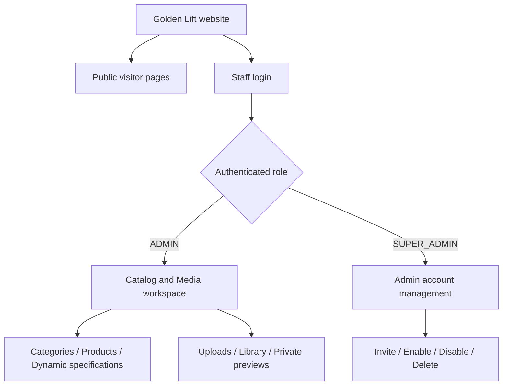
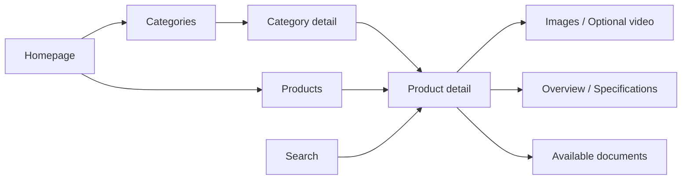
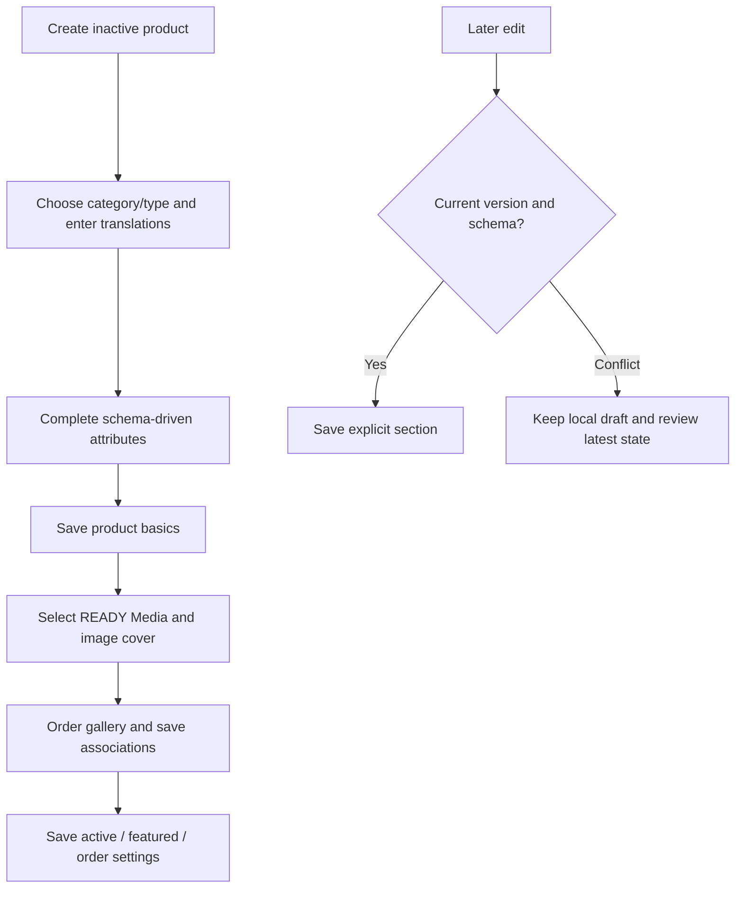
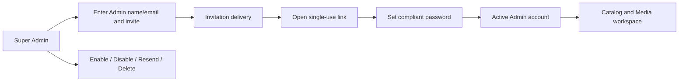

# Golden Lift — Visitor and Administration Design

Updated catalog experience, 2026-10-08: leaf creation includes searchable, ordered group selection. Attributes and groups support multiple memberships and reviewed edits. The recursive category tree remains the browsing context. Product creation needs only a leaf category and Arabic name; generated specifications render each unique attribute once. Visitor detail combines images/videos in one gallery and exposes ancestors, Back to Category, eligible same-category Previous/Next and More from this Category.

Earlier Category-model reports retain their dated migration-foundation scope; current relationships and runtime authority are described above.

The [Admin CRUD modal phase](implementation/admin-crud-modal-fix-completed-work.md) keeps collection context while creating or editing reusable configuration and category metadata. Create actions remain visible when a record is selected. Small forms use responsive, accessible modals with dirty-close warnings; the full product editor, category tree, Media grid and reviewed relationships retain their workspaces. Product creation uses a minimal category/Arabic-name overlay before client-side editor navigation. See [decision 014](decisions/014-admin-crud-modals.md) for concurrency, cache and contract tradeoffs.

Updated: 2026-10-07.

Category administration now uses a 350px recursive catalog tree beside selected-category details, with logical 20px nesting, 40px rows, subtle gold selection, disclosure separate from selection and contextual overflow ordering. Below 900px, Browse Categories opens a full-height drawer. Search retains ancestors, keyboard arrows follow locale direction, and in-memory expansion survives SPA navigation and CRUD. Root and subcategory creation have distinct actions and fixed parent context. See [decision 016](decisions/016-category-tree-workspace.md) and the [desktop workspace](assets/category-tree/workspace-desktop.png), [mobile details](assets/category-tree/detail-mobile.png), [Arabic tree](assets/category-tree/tree-mobile-ar.png) and [Sorani tree](assets/category-tree/tree-mobile-ckb.png). Leaf group assignments are implemented in creation and reviewed editing.

Normal visitor pages now load real Gateway/Catalog data, including category covers, bounded collections, search, dynamic public filters, eligible gallery/video associations and permitted technical-source PDFs. Demo content is an explicit fixture mode. The workspace composition below is retained, with shared hover/focus/pressed/selected states, keyboard overflow menus and reduced motion. Native local upload and delivery acceptance is recorded in the [functional integration report](implementation/functional-integration-completed-work.md); production provider gates remain separate.

This guide illustrates the interface implemented in the repository: the public visitor website, the Admin workspace and the Super Admin workspace. It describes the current design and behavior; the diagrams are simplified layouts, not additional screens or future features.

## 1. Who uses each interface?

| Audience | Main task | Entry point | Access |
| --- | --- | --- | --- |
| Visitor | Explore categories, products, media and specifications | `/` | Public; no login |
| Admin | Maintain catalog content, dynamic specifications and Media | `/admin/login` → `/admin` | Authenticated ADMIN |
| Super Admin | Invite and manage Admin accounts | `/admin/login` → `/super-admin/admins` | Authenticated SUPER_ADMIN |

Admin and Super Admin have different responsibilities. Super Admin manages staff accounts and has no Catalog/Media permission. Admin manages content and cannot access Super Admin account management. Backend authorization enforces these boundaries as well as the interface.



## 2. Shared visual identity

The design uses architectural charcoal, light surfaces, metallic neutrals and selective gold. The public header and staff sidebar use charcoal; the staff command bar and focused editing canvas use light surfaces. Gold emphasizes primary actions. Destructive actions use red.

| Design element | Implemented choice | Purpose |
| --- | --- | --- |
| Brand gold | `#C9A15B` | Primary buttons and selected accents |
| Charcoal | `#121516` | Dark surfaces and primary text |
| Page background | `#F8F8F6` | Quiet background around content panels |
| Surface | `#FFFFFF` | Cards, forms and readable content areas |
| Warm neutral | `#F7F4ED` | Subtle surface variation |
| Border neutral | `#D1D4D6` | Field, panel and table boundaries |
| Gold text | `#75582E` | Readable small gold-colored text on light surfaces |
| Error/destructive | `#A32626` | Errors and destructive controls |
| English typography | Manrope; Inter for technical values | Brand text and precise technical information |
| Arabic/Sorani typography | IBM Plex Sans Arabic, with Noto Sans Arabic fallback | Readable RTL text and Sorani glyph coverage |
| Spacing | Named scale based on 4px increments | Consistent rhythm across both interfaces |
| Shape and motion | Shared radii, neutral shadows and calm motion | A consistent, restrained appearance |

The geometric wordmark and architectural vector illustrations are demonstration brand assets. Approved photography/logo and verified company content remain separate content work.

## 3. Visitor website

### Overall layout

The public website uses a shared header, page content and footer. Desktop navigation exposes Home, Products, Categories, About and Contact, with integrated search and language controls. On mobile, navigation moves into a drawer.

The content container has a maximum width of 1400px. Wide screens show spacious grids; smaller screens stack detailed content and keep touch controls reachable. Listing grids use one column on mobile, two on tablet, three from 1100px and four only from 1800px. Product imagery dominates the open, minimally framed cards.

```text
VISITOR HOMEPAGE — desktop
84px charcoal header: Brand / Home / Products / Categories / About / Contact / Locale / Search
Full-width 780px hero: 40% heading/actions | 60% architectural image
01 Collection: one tall image panel | two stacked image panels
02 Selected products: large featured system | identity/specifications/actions
                      three supporting image-led products
03 Engineering statement: large heading | numbered principles
04 Conditional technical resources
Dark footer: large brand statement / collection and company links / locale
```

### Public pages

| Route | What visitors see |
| --- | --- |
| `/` | Immersive hero, image-overlay category mosaic, one featured system with supporting products, numbered principles and conditional demo resources |
| `/categories` | Category collection and navigation |
| `/categories/:id` | Category context, breadcrumbs, child categories and the applicable product area |
| `/products` | Product collection with the supported filtering, ordering and pagination presentation |
| `/products/:id` | 60/40 gallery/information split, vertical desktop thumbnail rail, numbered technical dossier, specifications and conditional videos/documents/related products |
| `/search` | Search form, URL-based state, results and clear empty/error states |
| `/about` | Informational brand page; unverified company facts are not invented |
| `/contact` | Informational contact page; no implemented inquiry submission workflow |
| `/component-lab` | Interactive reference for the shared components and their states |

Product detail places the gallery beside the breadcrumb/title/model/description panel on desktop and shows the gallery first on mobile. Aligned technical rows replace floating specification blocks. Collection/search filters are inline on desktop and use a compact drawer on mobile. Specifications are rendered from generic attributes rather than fixed elevator-specific fields. Breadcrumbs keep the visitor oriented while moving between products and categories.



### Current visitor data scope

The default public interface and staff editors use real APIs. Newly published eligible Admin products appear through the same Catalog projection. Explicit demo mode is labeled and independent of staff data; it is never a fallback for API failure.

The public API adapter supports category list/detail/covers, bounded product collection/detail, PostgreSQL search, generic public filters and fresh B5 media authorization. API mode is the default and displays failures explicitly. Demo documents and specifications remain illustrative only in explicitly selected demo mode.

### Versioned visual examples

These versioned screenshots show the implemented public design with demonstration content:

- [English desktop homepage](../tests/frontend.browser.test.ts-snapshots/home-en-desktop-win32.png)
- [Arabic mobile homepage](../tests/frontend.browser.test.ts-snapshots/home-ar-mobile-win32.png)
- [Arabic desktop category](../tests/frontend.browser.test.ts-snapshots/category-ar-desktop-win32.png)
- [Sorani tablet product](../tests/frontend.browser.test.ts-snapshots/product-ckb-tablet-win32.png)
- [Desktop product listing](../tests/frontend.browser.test.ts-snapshots/listing-en-desktop-win32.png)
- [Desktop product detail](../tests/frontend.browser.test.ts-snapshots/product-en-desktop-win32.png)
- [Arabic mobile product detail](../tests/frontend.browser.test.ts-snapshots/product-ar-mobile-win32.png)

## 4. Admin workspace

### Overall layout

Admin uses a 68px sticky light command bar, a 240px charcoal desktop sidebar and a light content area. The top bar contains the brand, staff display name, language switcher and logout. The sidebar groups Overview, Catalog, Media and Account tasks; Super Admin uses Staff and Account groups. RTL places navigation at the corresponding logical side.

Below 1100px, the sidebar becomes a drawer opened by the menu button. Below 768px, the header becomes more compact and forms use a single-column arrangement. Long forms scroll vertically; wide tables can scroll horizontally.

```text
ADMIN — simplified desktop layout shown in English/LTR
┌──────────────────────────────────────────────────────────┐
│ GOLDEN LIFT                 Staff name · Language · Exit │
├──────────────────┬───────────────────────────────────────┤
│ Dashboard        │ Page heading / Breadcrumbs            │
│ Categories       │                                       │
│ Products         │ Filters / Primary action              │
│ Attribute groups │                                       │
│ Attributes       │ Table, form or media library           │
│ Attribute groups │                                       │
│ Units            │ Validation / Conflict feedback        │
│ Media            │                                       │
│ Account          │ Save / Preview / Confirm actions      │
└──────────────────┴───────────────────────────────────────┘
```

### Admin screens and interaction design

| Area | Design and behavior |
| --- | --- |
| Dashboard | One product creation action, quiet operational links, bounded first-page product/Media feeds and actual Media processing information; no invented totals or global recent activity |
| Categories | Inline master/detail workspace with bounded recursive navigation, path breadcrumbs, translation fields, ready image cover, sibling-order controls, move review and branch-deletion preview |
| Products | Bounded server-filtered table, publication/featured information, compact name/model identity, viewport-triggered cover thumbnails, context/status columns and overflow actions |
| Product editor | Three zones: section rail / focused canvas / read-only summary. Overview, Translations, Specifications, Media and Visibility remain mounted; saves retain their existing independent contract boundaries |
| Attributes | NUMBER, BOOLEAN, TEXT and CHOICE definitions; bounds, units, translated help, options and deprecation |
| Attribute groups / Units | Focused editors for reusable grouping and unit metadata |
| Media | Grid-first library, upload drawer with retained transfer state, loaded-page filename search, server kind/status filters and private asset inspector drawer |
| Account | Profile/current-session information, own password change and logout |

### Product editing workflow

Staff select a live leaf category before the optional model code, enter independent Arabic/English/Sorani translations, and fill the form generated from the current backend schema. Arabic is required. Optional translations are not automatically copied or translated.

NUMBER values preserve precision as strings. BOOLEAN controls distinguish unset, true and false. TEXT and CHOICE controls follow backend constraints. Type changes show their impact before confirmation. Publication, basic content and Media have separate saves so one operation does not discard another draft.



### Media editing workflow

The upload drawer displays part-transfer progress and processing states; closing and reopening it retains the in-memory transfer. Navigating away or reloading does not persist grants or transfer state. Staff can resume a transfer in the current view, including recovery when a part was committed but its acknowledgement was lost. Reload/navigation does not persist upload capabilities.

Only eligible ready assets can be selected for associations. Images use derivative previews; videos use poster/playback profiles; PDFs use raster previews and separately authorized original downloads. Private grants expire and refresh near the viewport. Removing a gallery association retains the shared asset; retirement remains a separate guarded action.

### Feedback and safe editing

- Loading, empty, error and success states use shared feedback controls.
- Unsaved edits trigger navigation/close protection.
- Stale record/schema versions preserve the draft and require review.
- Impact-sensitive changes use preview followed by confirmation of the reviewed change.
- Deletion uses explicit confirmation and retains soft-deleted records/files.
- Session expiry or revocation returns staff to login.

## 5. Super Admin workspace

Super Admin uses the same top bar, sidebar/drawer, typography and controls, with a smaller navigation set: Admin accounts and own Account. It does not show category/product/Media editing tools.

| Route | Design and behavior |
| --- | --- |
| `/super-admin/admins` | Focused name/email invitation section and bounded Admin account directory with overflow lifecycle actions |
| `/super-admin/admins/:id` | Account status and reviewed resend, enable, disable or retained-delete actions |
| `/super-admin/account` | Own profile/session, password change and logout |
| `/admin/invitation` | Single-use account activation and password form |
| `/admin/reset-request`, `/admin/password-reset` | Password recovery request and single-use reset form |



Invitation/reset tokens are removed from the URL and retained only in memory during the action. The account chooses a 15–128-character password. Disabled/deleted accounts lose live authorization. Development email is written to the private local mailbox; inbox delivery requires SMTP configuration. Credentials and invitation links are intentionally excluded from this guide.

## 6. Language, responsiveness and accessibility

| Situation | Implemented behavior |
| --- | --- |
| Arabic `ar` | Default/fallback language; RTL |
| English `en` | LTR |
| Kurdish Sorani `ckb` | RTL with appropriate font glyph coverage |
| Locale change | Updates document language/direction and persists the preference |
| Desktop ≥1100px | Wide visitor grids and persistent Admin sidebar |
| Tablet 768–1099px | Adapted grids and drawer-based staff navigation |
| Mobile <768px | Compact headers, stacked detailed content/forms and touch-sized controls |
| Keyboard | Visible focus; supported select/tab keyboard interaction; Escape closes overlays |
| Dialog/drawer | Focus containment and restoration, with background scroll lock |
| Long content | Page scrolling and horizontal table scrolling |
| Reduced motion | Shared animation/movement suppression |

Directional navigation and spacing adapt to RTL. Technical identifiers/numbers remain readable through directional isolation. The design targets WCAG 2.2 AA; a complete external accessibility certification and cross-browser assistive-technology audit are not claimed.

## 7. One shared component system

| Shared package | Responsibility |
| --- | --- |
| `@golden-lift/tokens` | Palette, semantic colors, spacing, typography, layout and motion |
| `@golden-lift/ui` | Buttons, fields, table, headings, breadcrumbs, tabs, modal/drawer and feedback |
| `@golden-lift/icons` | Shared Lucide icon family |
| `@golden-lift/i18n` | Locale, translations and direction |
| `@golden-lift/catalog-ui` | Visitor category/product cards, gallery, documents and specifications |
| `@golden-lift/api` | Typed public/staff API interfaces and validated data boundaries |

The application uses Expo Router, React Native Web and Tamagui. Screen CSS consumes the shared token variables. The current interfaces are web implementations; native applications remain deferred.

## 8. Implementation references and evidence

| Reference | What it explains |
| --- | --- |
| [Design system](design-system.md) | Exact tokens, components, typography and accessibility behavior |
| [Admin dashboard](admin-dashboard.md) | Staff routes, API dependencies, conflicts and Media integration |
| [Admin completion report](implementation/admin-dashboard-completed-work.md) | Implemented workflows and local acceptance scope |
| [Dated Admin validation](validation/admin-dashboard-2026-10-06T12-39-33-944Z.json) | 149 passing tests, execution dates and harness limitations |
| [S1 completion report](s1-completed-work.md) | Visitor design verification and its historical scope |
| [Admin local operations](operations/admin-local.md) | Startup, reviewed database preparation and local mail configuration |

The existing local evidence includes Arabic/Sorani RTL, mobile drawer focus, page scrolling, overflow checks and public screenshot comparisons. It does not establish production deployment or B5 real scanner/codec/broker/S3/Linux acceptance. Technical-sheet editors, Inquiry submission/business workflows and complete public collection/search integration remain outside the current implementation.


## Major redesign — current composition

The [baseline](implementation/major-redesign-baseline.md), [decision 011](decisions/011-major-visual-redesign.md) and [completion report](implementation/major-redesign-completed-work.md) record the current redesign and its verification. Decision 010 and previous refinement reports describe the earlier milestone.

```text
PRODUCT EDITOR — desktop at 1300px and wider
240px dark shell navigation | 160px section rail | flexible white canvas | 250px summary
                           | 01 Overview       | only selected section | actual cover/name
                           | 02 Translations   | mounted hidden drafts | category/type/state
                           | 03 Specifications | independent commands  | valid field count
                           | 04 Media          | feedback/version      | Media count/version
                           | 05 Visibility     |                       |
```

Below 1300px, Product summary opens as a read-only drawer. Below 1100px, shell navigation uses a drawer. Below 768px, section navigation is horizontal, fields stack and tables retain bounded horizontal scrolling. The public mobile header uses a 64px command row and 36px locale row; neither overlaps the demo notice. Arabic/Sorani preserve logical placement and field direction. Technical identifiers use directional isolation.

Category navigation stays in the main canvas; focused modals handle creation and metadata editing. Move/delete impact reviews stay focused confirmations. Attributes, groups and units use bounded tables, focused editing and optional usage inspectors, with permanent Create actions and focused creation/metadata overlays. Relationship edits use ordered multi-select dialogs and captured impact review. These workspaces retain existing save, schema-impact and lifecycle rules.

Media drag/drop and earlier/later actions both operate on the actual global association order. Removing an association retains shared bytes. The library's filename search applies only to the loaded page, as its label states. Private grants, readiness/security checks and owner authorization remain authoritative.

### Before/after examples

| View | Before | After |
| --- | --- | --- |
| Homepage | [Desktop](assets/major-redesign/before/home-1440.png) | [Desktop](assets/major-redesign/after/home-1440.png) |
| Listing | [Desktop](assets/major-redesign/before/listing-1440.png) | [Desktop](assets/major-redesign/after/listing-1440.png) |
| Product detail | [Desktop](assets/major-redesign/before/product-1440.png) | [Desktop](assets/major-redesign/after/product-1440.png) |
| Product editor | [Long form](assets/major-redesign/before/admin-product-editor.png) | [Section workspace](assets/major-redesign/after/admin-product-overview.png) |
| Category editor | [Modal](assets/major-redesign/before/admin-category-editor.png) | [Inline canvas](assets/major-redesign/after/admin-category-editor.png) |
| Media | [Previous composition](assets/major-redesign/before/admin-media-library.png) | [Grid-first library](assets/major-redesign/after/admin-media-library.png) |

Historical redesign visitor captures use labeled demo content; staff captures use disposable real HTTP/PostgreSQL fixtures. The redesign itself changed no backend/database/API. The subsequent functional phase adds public collection/search/filter contracts and actual native scanner/codec/PDF acceptance with signed local event relays; its live product captures are in `assets/functional-integration`. Production mail/RabbitMQ/S3/Linux isolation remain separate gates. Global totals, separate short-description fields and public specification group labels remain outside current contracts.
